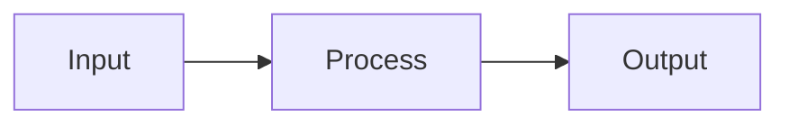

# CLAUDE.md

This file provides guidance to Claude Code (claude.ai/code) when working with code in this repository.

## Project Overview

**AI Playbook** is a static documentation site built with **Astro 5.5.6** + **Starlight 0.32.6** (Astro's docs theme). It's a personal reference for AI & LLM knowledge with cheatsheets, guides, diagrams, slide decks, and a quiz system. Content is 100% Markdown/MDX files that live in Git, deployed to Cloudflare Pages (auto-deploys on push to `main`).

**Key tech stack:**
- Astro 5.5.6 (static site generator)
- Starlight 0.32.6 (docs theme with dark mode, search, nav)
- MDX + Markdown content
- Mermaid 10 for diagrams (client-side rendering)
- KaTeX for math equations
- Custom CSS (Paperclip-inspired design system)
- Pagefind for full-text search
- Cloudflare Pages + Functions for chatbot

## Development Workflow

### Common Commands

```bash
# Start dev server with hot reload (localhost:4321)
npm run dev
npm run start  # alias

# Build static site → ./dist/
npm run build

# Preview production build locally
npm run preview

# Run astro CLI directly (for advanced use)
npm run astro
```

**Important:** After a successful `npm run dev`, the site auto-reloads when you edit `.md` or `.mdx` files. No restart needed.

### Node.js Requirement

Requires **Node.js 20+**. Check with `node --version`. The project uses ES modules (`"type": "module"` in package.json).

## Project Structure & Content Organization

### Directory Layout

```
ai-playbook/
├── astro.config.mjs          # Starlight config, sidebar, plugins, pagefind ranking
├── package.json              # Dependencies + prebuild script for search index
├── tsconfig.json
├── CLAUDE.md                 # Guidance for AI coding tools working in this repo
├── public/                   # Static files served as-is
│   ├── chat-widget.js        # AI chatbot widget (floating chat bubble)
│   ├── search-index.json     # Auto-generated search index (prebuild)
│   ├── quiz-bank.json        # Pre-generated quiz questions (645 questions)
│   ├── cheatsheets/          # Printable cheatsheet PDFs (llm-primer.html, etc.)
│   ├── decks/                # Exported Slidev/Reveal HTML
│   └── mindmaps/             # Exported Markmap HTML + source .md
├── scripts/
│   ├── build-search-index.mjs  # Prebuild script — chunks content for chatbot search
│   ├── check-model-consistency.mjs  # Prebuild guard — flags model price/cutoff drift vs models.ts
│   └── generate-quiz-bank.mjs  # Generates quiz questions via Groq
├── functions/
│   ├── api/chat.js           # Cloudflare Pages Function — chatbot backend
│   └── admin/logs.js         # Chatbot query log dashboard
├── .github/
│   ├── workflows/            # GitHub Actions: link check, stale content, checklist
│   ├── ISSUE_TEMPLATE/       # Templates: bug, content, outdated, question, help-wanted
│   └── PULL_REQUEST_TEMPLATE/
├── src/
│   ├── assets/
│   │   ├── logo.svg
│   │   └── infographics/     # SVG infographics imported into MDX pages
│   ├── components/           # Interactive Astro components
│   │   ├── BenchmarkViz.astro      # Sortable/filterable benchmark explorer
│   │   ├── Breadcrumb.astro        # Navigation breadcrumb
│   │   ├── ContentAudit.astro      # Auto-generated page audit table
│   │   ├── ContentOverride.astro   # Metadata row (reading time, tags, pill dropdowns)
│   │   ├── ContributorsList.astro  # Contributor cards
│   │   ├── CostCalculator.astro    # Interactive API cost calculator (14 models)
│   │   ├── DesignArenaLeaderboards # Design Arena leaderboard cards
│   │   ├── FeedbackWidget.astro    # Thumbs up/down feedback
│   │   ├── FooterOverride.astro    # Combines SeeAlso + feedback + default footer
│   │   ├── ModelCompare.astro      # Model specs table from models.ts
│   │   ├── ModelMatrix.astro       # Model capability heatmap (9×9)
│   │   ├── ModelSelector.astro     # Interactive model filter by use case
│   │   ├── PathSelector.astro      # Role-based path cards (Quick Start)
│   │   ├── ProgressTracker.astro   # Learning path progress (localStorage)
│   │   ├── Quiz.astro              # Knowledge quiz component
│   │   ├── SearchOverride.astro    # Search bar with recent searches
│   │   ├── SeeAlso.astro           # Auto-generated related content links
│   │   ├── ToolComparison.astro    # Sortable tool comparison tables
│   │   └── TrendingWidget.astro    # Latest AI trends card grid
│   ├── content.config.ts     # Extended schema (tags, glossaryLinks, tldr, seeAlso)
│   ├── data/                 # Structured data files
│   │   ├── benchmarks.ts     # Benchmark scores (30+ entries, 7 families)
│   │   ├── capabilities.ts   # Model capability ratings (1-5)
│   │   ├── models.ts         # Model entries (name, company, pricing, context)
│   │   ├── trends.ts         # Trending topics (10 entries)
│   │   └── contributors.ts   # Contributor entries
│   ├── content/docs/         # ALL MARKDOWN CONTENT (~110 pages)
│   │   ├── learn/            # Beginner, Builder, Researcher, Interview Prep, Quiz
│   │   ├── decide/           # Tools Guide, Models Guide, Frameworks, Cost Calculator
│   │   ├── reference/        # Glossary, Cheatsheets, Confusions, Principles, Benchmarks
│   │   ├── research/         # What's New, Open-Source Models, Trends, History
│   │   ├── deep-dive/        # 12 deep dives (How LLMs Work, RAG, Agents, Agent Skills, etc.)
│   │   ├── community/        # Contributing, audit, help-wanted, contributors
│   │   └── resources/        # Papers, communities, templates, case studies, automations
│   └── styles/
│       └── custom.css        # Paperclip-inspired design system (640+ lines)
```

### URL Routing (Critical Pattern)

**Starlight routes by folder/filename.** A file at `src/content/docs/tools.md` becomes `/tools/`. A file at `src/content/docs/decide/models/guide.mdx` becomes `/decide/models/guide/`.

**Sidebar is manually configured** in `astro.config.mjs` (lines 217-376):
- Main pages have explicit `{ label, slug }` entries
- Subfolders (cheatsheets, case studies, templates) use `autogenerate` to auto-populate

**When you add a new page**, either:
1. Create a file in a folder with `autogenerate` — it auto-appears in the sidebar
2. Create a file outside autogenerated folders and manually add a sidebar link in `astro.config.mjs`

## Content Authoring

### Frontmatter (YAML Header)

Every `.md` and `.mdx` file must start with:

```yaml
---
title: Page Title (shown in nav, browser tab, h1)
description: One-line summary (used for SEO and preview cards)
sidebar:
  order: 2            # Lower number = higher in sidebar
  badge:
    text: New
    variant: tip      # Optional: shows a colored badge
tags:                 # Used by SeeAlso for auto-related content
  - reference
glossaryLinks:        # Optional: links to glossary terms
  - llm
  - token
lastUpdated: 2026-05-16  # Update when refreshing content
nextVerificationDue: 2026-08-16
---
```

### Markdown vs MDX

- **`.md`** — Plain Markdown (tables, code blocks, headings). Fast.
- **`.mdx`** — Markdown + imported React components. Use for interactive content or Starlight components.

**Starlight components** (available in `.mdx`):
```mdx
import { Card, CardGrid, Badge } from '@astrojs/starlight/components';

<Card title="Myth: X" icon="warning">
  Content here.
</Card>

<CardGrid>
  <Card title="A" icon="user">Text</Card>
  <Card title="B" icon="target">Text</Card>
</CardGrid>
```

See `confusions.mdx`, `follow.mdx`, and `principles.mdx` for examples.

### Mermaid Diagrams (Inline)

Mermaid renders at build time. Include in any `.md` or `.mdx`:

````md

````

Mermaid theme (light/dark) syncs with Starlight's theme toggle automatically via JavaScript in `astro.config.mjs`.

### Math Equations (KaTeX)

Inline: `$E = mc^2$`

Block:
```
$$
\frac{\partial}{\partial t} \Psi = -\frac{\hbar^2}{2m} \nabla^2 \Psi + V \Psi
$$
```

KaTeX stylesheet is **self-hosted** at `public/vendor/katex/` (loaded in `astro.config.mjs`). Avoid unmatched `$` signs — they break rendering.

**Offline-friendly assets:** KaTeX (CSS + fonts), Mermaid (self-hosted UMD, lazy-loaded only on pages with diagrams), and the web fonts (Inter / Instrument Serif / JetBrains Mono) are all vendored under `public/vendor/` — so content pages render fully offline (no CDN). Exceptions that still need the network: the AI chatbot + playground (call Groq), and the two Markmap mindmaps (`public/mindmaps/*.html` still load d3/markmap from jsdelivr).

### SVG Infographics

1. Design in Figma/Excalidraw → export as SVG
2. Place in `src/assets/infographics/`
3. Import and render in an `.mdx` page:
   ```mdx
   import img from '../../../assets/infographics/diagram.svg';
   
   ```

### Mind Maps (Markmap)

1. Write outline in `public/mindmaps/my-map.md`
2. Export once:
   ```bash
   npx markmap-cli public/mindmaps/my-map.md -o public/mindmaps/my-map.html --no-open
   ```
3. Embed in an `.mdx` page:
   ```mdx
   <iframe src="/mindmaps/my-map.html" width="100%" height="600"></iframe>
   ```

### Slide Decks (Slidev)

1. Install Slidev:
   ```bash
   npm i -g @slidev/cli
   ```
2. Author deck:
   ```bash
   slidev decks/my-deck/slides.md
   ```
3. Export for embedding:
   ```bash
   slidev build decks/my-deck/slides.md \
     --base /decks/my-deck/ \
     --out public/decks/my-deck
   ```
4. Create wrapper `.md` in `src/content/docs/slides/`:
   ```markdown
   ---
   title: My Deck
   description: ...
   ---
   <iframe src="/decks/my-deck/index.html" width="100%" height="600"></iframe>
   ```

## Key Configuration Files

### `astro.config.mjs`

- **Lines 8–10:** Site URL (currently `https://ai-playbook-9y9.pages.dev`)
- **Lines 12–15:** Markdown plugins (remark-math, rehype-katex)
- **Lines 74–376:** Starlight integration
  - **Lines 76–80:** Component overrides (Footer, MarkdownContent, Search)
  - **Lines 218–375:** Sidebar structure (manual links + autogenerate directives)
  - Added section: `pagefind: { ranking: { pageLength: 0.3, termFrequency: 0.2 } }`

### `src/content.config.ts`

Wires the docs collection into Starlight with extended schema (tags, glossaryLinks, tldr, seeAlso, nextVerificationDue).

### `src/styles/custom.css`

Comprehensive Paperclip-inspired design system (680+ lines):
- Color palette (warm tones in light mode, deep charcoal in dark mode)
- Typography: Instrument Serif (h1/h2), Inter (body), JetBrains Mono (code)
- Glassmorphism header, card hover effects (gated `@media (hover: hover)`), table borders/zebra/rounded corners
- Right sidebar removed — replaced by pill toggle buttons in metadata row
- Sidebar scrollbar styling (thin, themed)
- Pagefind search modal styling (Paperclip-themed)
- Sidebar icons + L1/L3/L4 visual hierarchy
- Mobile: 44px touch targets, content h3 specificity override, pagination stacking, card active state
- Large-screen: `.main-frame { max-width: 1400px; margin: 0 auto }` at ≥1600px caps and centers the page frame on wide monitors

### Design Version Tag

A Git tag **`pre-paperclip-theme`** (commit `a5ccc74`) captures the state before the Paperclip design upgrade. To revert:
```bash
git checkout pre-paperclip-theme
git push origin pre-paperclip-theme:main -f
```

## Important Patterns & Gotchas

### Frontmatter Indentation

YAML indentation matters. `sidebar` block must be properly nested:
```yaml
---
title: Title
description: Desc
sidebar:
  order: 1
lastUpdated: 2026-05-16
---
```

**Gotcha:** If `lastUpdated` is indented under `sidebar`, you get "bad indentation of a mapping entry" errors. Keep it at root level.

### Git & Deployment

- **Deployment:** Cloudflare Pages auto-builds on push to `main`. Build command: `npm run build`, output: `dist/`
- **Site URL:** `https://ai-playbook-9y9.pages.dev` (set in `astro.config.mjs`)
- **package-lock.json:** Keep in sync; don't regenerate on wrong architecture or deployments will fail.

### Sidebar Configuration

The sidebar is **manually configured** in `astro.config.mjs`. If you:
- **Add a file outside autogenerate folders** → manually add a `{ label, slug }` entry
- **Add a file in an autogenerate folder** (cheatsheets, case studies, templates) → auto-appears

### Component Imports in MDX

If you use Starlight components or custom Astro components, always import at the top:
```mdx
import { Card, CardGrid } from '@astrojs/starlight/components';
import Breadcrumb from '../../../components/Breadcrumb.astro';
```

This only works in `.mdx` files, not `.md` files.

## Development Workflow Tips

1. **Local iteration:** Run `npm run dev`, edit `.md` files, refresh browser (or it auto-reloads)
2. **Build locally before pushing:** Run `npm run build` to catch errors, then `npm run preview` to inspect production bundle
3. **Git workflow:** Commit content changes only; don't commit `node_modules/` or `dist/`
4. **Search:** Starlight uses Pagefind for full-text search. Indexed at build time. Not available in dev mode.
5. **Hot reload:** Edits to `.md`, `.mdx`, `astro.config.mjs`, and `custom.css` trigger hot reload. Edits to `package.json` or dependencies require restart.

## Deployment Notes

- **Cloudflare Pages:** Free, global CDN, auto-deploys on push to `main`. Build takes ~10-15 seconds.
- **Environment variables:** `GROQ_API_KEY` (required), `SERPER_API_KEY` (optional), `CHAT_LOGS` (KV binding)
- **Build command:** `npm run build` → outputs to `dist/`
- **Build platform:** Linux x64. Keep `package-lock.json` compatible.

## Common Editing Tasks

### Create a new page

1. Create file: `src/content/docs/path/to/page.md` or `.mdx`
2. Add YAML frontmatter with `title`, `description`, `sidebar.order`, `tags`, `lastUpdated`, `nextVerificationDue`
3. If not in an autogenerate folder, add sidebar entry in `astro.config.mjs`
4. Write content, save, verify with `npm run build`

### Update existing content

1. Edit the file
2. Update `lastUpdated` to today's date
3. Save, verify locally with `npm run dev`
4. Commit, push to `main`

### Add a cheatsheet

1. Create `src/content/docs/reference/cheatsheets/name.md`
2. Add frontmatter with `sidebar: { order: N }`
3. Appears automatically in sidebar (autogenerate)

### Add an automation recipe

1. Create `src/content/docs/resources/automations/name.md`
2. Add frontmatter with `sidebar: { order: N }`, follow the recipe shape (What it does / flow / n8n steps / prompt / Zapier alt / cost)
3. Appears automatically in sidebar (autogenerate under Resources → Automations)

### Add a Mermaid diagram

Just include a ` ```mermaid ``` ` block in any `.md` or `.mdx` file. Renders at build time.

### Update model pricing / add a model

1. Edit `src/data/models.ts` (the single source of truth) — never hardcode prices in pages
2. Bump `modelsLastVerified` to today's date
3. Run `npm run check:models` to find any prose pages that now contradict the change, and fix them
4. `npm run build` — all model-driven UI (homepage comparison, calculator, selector, ToolComparison Models tab, etc.) updates automatically

### Fix styling

Edit `src/styles/custom.css`. Changes hot-reload in dev mode.

### Add a quiz topic

1. Edit `scripts/generate-quiz-bank.mjs` to add new topic
2. Regenerate: `npm run build` (runs prebuild script)

## Troubleshooting

| Issue | Solution |
|-------|----------|
| Dev server won't start | Kill existing process (`lsof -i :4321`), ensure Node 20+, run `npm install` |
| Hot reload not working | Restart `npm run dev`, check file is in `src/content/docs/` |
| Page not appearing in sidebar | Check `astro.config.mjs` sidebar config; manually add if not in autogenerate folder |
| Mermaid not rendering | Check syntax, refresh browser, look for console errors |
| YAML frontmatter errors | Proper indentation (2 spaces); don't nest `lastUpdated` under `sidebar` |
| Chatbot returning errors | Check `GROQ_API_KEY` and `SERPER_API_KEY` in Cloudflare Pages env vars |
| Chat widget not appearing | Verify Footer component override in `astro.config.mjs` |
| Search index stale | Run `npm run build` which triggers prebuild script |
| Quiz questions not showing | Regenerate: `rm public/quiz-bank.json && npm run build` |

---

## AI Chatbot

### Architecture

```
User question → chat-widget.js → Cloudflare Function → Groq API (Llama 3.3 70B) → answer
                      ↕                    ↕                      ↕
                search-index.json    Serper.dev (web)       KV: CHAT_LOGS (logs)
```

The chatbot uses a multi-step pipeline:
1. **Query rewriting** — Llama 3.1 8B generates 3 search queries from user question, resolving pronouns from conversation history
2. **Playbook search** — Each query runs TF-IDF against `search-index.json`, results merged via RRF (k=60). No threshold.
3. **Web search** — Always runs in parallel via Serper.dev when API key is configured
4. **Prompt construction** — Playbook context + web results + **current-page context** (title/URL/section headings sent by the widget) combined in system prompt; the bot resolves "this"/"this page" against it
5. **Groq inference (streamed)** — Llama 3.3 70B, temperature 0.3, max 800 tokens, `stream: true`. The function relays Groq's SSE as **newline-delimited JSON (NDJSON)** frames over the response body: `{type:'sources'}` first → `{type:'delta',text}` per token → `{type:'done',source}` (or `{type:'error'}`). `Content-Type: application/x-ndjson`. The widget falls back to one-shot rendering if it ever receives a plain JSON body.
6. **Source tracking** — Post-checks answer for playbook links → "playbook", "web", or "model"; also returns the deduped list of playbook pages actually retrieved (`sources: [{title, url}]`, sent in the first NDJSON frame) for the widget's source chips
7. **KV logging** — Every query logged to `CHAT_LOGS` KV namespace via `waitUntil` after the stream completes

### Key Files

| File | Purpose |
|---|---|
| `public/chat-widget.js` | Chat widget UI (all JS + CSS inline). 544x544 panel. Streams NDJSON; renders markdown via vendored marked+DOMPurify with a regex fallback. |
| `public/vendor/marked.min.js`, `public/vendor/purify.min.js` | Self-hosted markdown renderer + HTML sanitizer (pinned: marked 14.1.4, DOMPurify 3.2.4), loaded by the widget |
| `public/search-index.json` | Auto-generated search index (~700+ chunks) |
| `scripts/build-search-index.mjs` | Prebuild script — chunks content for search |
| `functions/api/chat.js` | Cloudflare Pages Function — query rewrite + search + inference |
| `functions/admin/logs.js` | Admin dashboard for chatbot query logs |
| `src/data/models.ts` | Structured model data for search index and pricing components. Includes `flagship: true` for top model per company |

### Chat Widget Features
- **Model attribution** — header reads "Powered by Llama 3.3 70B · Groq" (transparent open-model choice; the site recommends flagships but the bot honestly runs a free open model)
- **Streaming responses** — answers render token-by-token as they arrive (NDJSON frames; ~0.5s to first token)
- Markdown rendering via **marked + DOMPurify** (self-hosted in `public/vendor/`), with the legacy regex parser as a graceful fallback; links forced to `target=_blank rel=noopener`
- Source badges: green (playbook), blue (web), orange (model knowledge)
- **Source chips** — clickable links to the playbook pages actually retrieved for the answer (from the API's `sources` array)
- **Page-aware copilot** — sends current page title/URL/headings with each request; quick actions "Explain this page" / "Quiz me on this page"
- Key term highlighting (MMLU, HumanEval, SWE-bench, RLHF, LoRA)
- Conversation memory (last 5 exchanges) **persisted to `sessionStorage`** — survives page navigation within the tab; cleared by "New chat"
- Suggested questions, copy button, timestamps, new chat
- Auto-resizing textarea input — Enter sends, **Shift+Enter** inserts a newline
- 544x544 panel, full-screen on mobile

### Environment Variables

| Variable | Required | Source | Notes |
|---|---|---|---|
| `GROQ_API_KEY` | ✅ | https://console.groq.com | Free tier, rate-limited |
| `SERPER_API_KEY` | ❌ | https://serper.dev | 2500 free searches/month |
| `CHAT_LOGS` | ❌ (KV binding) | Cloudflare KV namespace | Logs all chatbot queries; also the fallback store for playground rate-limiting |
| `RATE_LIMIT` | ❌ (KV binding) | Cloudflare KV namespace | Per-IP playground rate-limit counters; falls back to `CHAT_LOGS` if unbound |

### Search Index

Built automatically during `npm run build` via the `prebuild` script (which also runs the model-consistency guard):
```bash
node scripts/build-search-index.mjs && node scripts/check-model-consistency.mjs
```

Indexes (~700+ chunks):
- All `.md`/`.mdx` files in `src/content/docs/` (chunked into ~300-token segments)
- Structured model data from `src/data/models.ts`
- Comparison chunks (top-5 by context window, pricing, parameters)
- MDX imports stripped; absolute URLs included

### Admin Dashboard

URL: `/admin/logs` — reviews all logged queries with source badges, filtering, and search. No password currently.

---

## API Playground

In-page interactive sandbox: type a prompt → run a **real, streamed** completion → see token usage + per-model cost estimates. The goal is hands-on practice instead of static reading.

| File | Purpose |
|---|---|
| `src/components/Playground.astro` | UI (textareas, model select, output, cost table). Streams NDJSON; cost estimates rendered from `models.ts` via `define:vars`. Wire-once guard supports multiple instances per page. |
| `functions/api/playground.js` | Generic completion proxy (no RAG). Streams Groq with `stream:true` + `stream_options.include_usage`; relays NDJSON `{delta}* → {done, usage}`. |

**Guardrails (in `playground.js`):** server-side **model allowlist** (Groq open models only — `llama-3.3-70b-versatile`, `llama-3.1-8b-instant`), prompt/system length caps, `max_tokens` cap, and **best-effort per-IP rate limiting** (30/hour) via KV — uses `env.RATE_LIMIT` if bound, else falls back to `env.CHAT_LOGS`; if no KV is bound it relies on Groq's own limits. Inference runs on Groq's free open models; the cost table estimates what the same token counts would cost on the listed API models.

**Embedded on:** prompt-engineering deep-dive (prompt sandbox), rag-architecture deep-dive (grounded-answering demo), and all four template pages (chat-api, single-agent, rag-system, multi-agent-crew) with context-tailored default prompts.

---

## Quiz System

### Architecture

```
Quiz bank: public/quiz-bank.json (pre-generated, 645 questions)
Component: src/components/Quiz.astro (680+ lines)
Script:    scripts/generate-quiz-bank.mjs
Fixer:     scripts/fix-quiz-quality.mjs
Page:      /learn/quiz
```

Questions are pre-generated via Groq and stored as static JSON — no runtime API calls. 24 topic/difficulty sets across 12 topics.

**Frontend Features (Implemented Phase 3 Upgrades):**
- **Dynamic Option Shuffling**: Shuffles options per-render using a Fisher-Yates shuffle and dynamically remaps the correct answer letter to eliminate option position bias (the "Always Pick B" exploit).
- **Keyboard Navigation**: Native arrow key navigation inside options container, auto-focusing the first option on render and auto-focusing the "Next →" button upon selection.
- **Resilient History Labels**: Fallback lookup checks the `<select id="quiz-topic">` options before querying the JSON bank, so history loads instantly and accurately.
- **Scrollable History Drawer**: Lists the last 20 attempts inside a custom scrollable container styled with thin scrollbars.
- **Smooth Transitions**: Score bar transition width is initialized to `0%` and animated inside a `requestAnimationFrame` callback.

### Regenerating Quiz Questions

```bash
# Regenerate all sets
npm run generate-quiz

# Regenerate single topic & difficulty
node scripts/generate-quiz-bank.mjs [topic-id] [easy|hard]

# Fix quality issues (all-of-above, length bias, generic distracters)
node scripts/fix-quiz-quality.mjs

# Dry-run to preview what would be fixed
node scripts/fix-quiz-quality.mjs --dry-run
```

**Environment Key Storage:**
The `GROQ_API_KEY` is persistently saved in your shell profile at `~/.zshrc`.

**Groq Free-Tier Rate Limits & Architecture:**
The free tier has a **6,000 TPM** (tokens-per-minute) limit per request. To stay within this:
- Each generation is split into **two sequential batches of 15 questions** per topic/difficulty set.
- Content context is capped at `3,500` characters (~900 tokens) to minimise prompt size.
- Each API call requests `max_tokens: 2200` — giving ~3,400 total tokens per call, safely under the 6,000 TPM cap.
- A mandatory `sleep(65000)` (65-second gap) runs between each batch call.

**Quality Maintenance:**
Run `fix-quiz-quality.mjs` after any regeneration to catch:
- "All of the above" / "None of the above" options (quiz anti-pattern)
- Answer length bias (correct answer notably longer than wrong options — a giveaway)
- Generic filler distracters ("To improve accuracy", "To reduce cost" etc.)

---

## Interactive Components

| Component | File | Page |
|---|---|---|
| **BenchmarkViz** | `BenchmarkViz.astro` | `/reference/benchmarks` |
| **Breadcrumb** | `Breadcrumb.astro` | Deep-dive pages |
| **ContentAudit** | `ContentAudit.astro` | `/community/audit` |
| **ContentOverride** | `ContentOverride.astro` | All pages (Starlight override) |
| **ContributorsList** | `ContributorsList.astro` | `/community/contributors` |
| **CostCalculator** | `CostCalculator.astro` | `/decide/cost-calculator` (14 models) |
| **DesignArenaLeaderboards** | `DesignArenaLeaderboards.astro` | `/reference/benchmarks` |
| **FeedbackWidget** | `FeedbackWidget.astro` | All pages (footer) |
| **FooterOverride** | `FooterOverride.astro` | All pages (override) |
| **ModelCompare** | `ModelCompare.astro` | `/decide/models/guide` (from models.ts) |
| **ModelMatrix** | `ModelMatrix.astro` | `/decide/models/guide` (9×9 heatmap) |
| **ModelSelector** | `ModelSelector.astro` | `/decide/models/guide` |
| **PathSelector** | `PathSelector.astro` | `/ (homepage)`, `/start/quick-start` |
| **Playground** | `Playground.astro` | prompt-engineering & rag-architecture deep-dives + all 4 template pages (live completions via `/api/playground`) |
| **ProgressTracker** | `ProgressTracker.astro` | `/learn/beginner`, `/learn/interview-prep` |
| **Quiz** | `Quiz.astro` | `/learn/quiz` |
| **SearchOverride** | `SearchOverride.astro` | Header search bar (with recent searches) |
| **SeeAlso** | `SeeAlso.astro` | Auto-injected on all pages (tag-based) |
| **ConversationalCompare** | `ConversationalCompare.astro` | `/` (homepage) — top conversational-AI table; model specs (context, cutoff, pricing, reasoning, vision) from models.ts |
| **ToolComparison** | `ToolComparison.astro` | `/decide/tools/comparison`, `/decide/tools/guide` — Models tab renders from models.ts; other tabs hand-curated |
| **TrendingWidget** | `TrendingWidget.astro` | Homepage, `/research/whats-new` |

All use Astro components with inline vanilla JS for interactivity (no React/Vue dependencies).

---

## Data Files

| File | Content |
|---|---|
| `src/data/benchmarks.ts` | Benchmark scores (30+ entries, 7 model families) |
| `src/data/capabilities.ts` | Model capability ratings (9 models × 9 tasks) |
| `src/data/models.ts` | **Single source of truth for model facts** — 35 models (name, company, pricing, context, `cutoff`, capabilities, flagship). Also exports `modelsLastVerified` (date stamp). All model-driven UI renders from here; prose is policed against it (see Model Data below) |
| `src/data/trends.ts` | Trending topics (10 entries with links) |
| `src/data/contributors.ts` | Contributor entries (name, GitHub, contribution types) |

### Model Data — Single Source of Truth

`src/data/models.ts` is the canonical source for every model fact (name, pricing, context, knowledge `cutoff`, capabilities, `flagship`). **Edit it there — never hardcode a model's price/context/name in a page or component.**

**Renders from `models.ts` (auto-update, never drift):** homepage `ConversationalCompare` table, `ModelTiers` (homepage company sections), `CostCalculator`, `ModelSelector`, `ModelMatrix`, `ModelCompare`, the `ToolComparison` **Models** tab, and the `Playground` cost estimates.

**Consistency guard — `scripts/check-model-consistency.mjs`:** keeps the (legitimately hand-written) prose in sync with `models.ts`. Two passes:
1. **Provider tables** — verifies each current model's canonical price/context appears on its vendor `models.md` page.
2. **Prose contradictions** — scans all content pages for inline `$A/$B per 1M` rates next to a model name and flags any that disagree (skips batch/cached rates and variant suffixes like "mini"/"Instant").

Runs in `prebuild` (**warn only**, never breaks the build) and as `npm run check:models` (**`--strict`**, exits non-zero — use in CI). When you change a price in `models.ts`, run the guard; it tells you which prose pages still need updating.

---

## GitHub Actions

| Workflow | File | Schedule |
|---|---|---|
| **Link Checker** | `.github/workflows/check-links.yml` | Weekly (Monday) |
| **Stale Content** | `.github/workflows/stale-content.yml` | Weekly (Monday) |
| **Weekly Checklist** | `.github/workflows/weekly-checklist.yml` | Weekly (Monday) |

All workflows auto-create GitHub Issues with reports/checklists.

---

## Issue & PR Templates

| Template | File |
|---|---|
| Bug Report | `.github/ISSUE_TEMPLATE/01-bug.yml` |
| New Content | `.github/ISSUE_TEMPLATE/02-content.yml` |
| Outdated Info | `.github/ISSUE_TEMPLATE/03-outdated.yml` |
| Question | `.github/ISSUE_TEMPLATE/04-question.yml` |
| Help Wanted | `.github/ISSUE_TEMPLATE/05-help-wanted.yml` |
| PR Template | `.github/PULL_REQUEST_TEMPLATE/pull-request.md` |

---

## Sidebar Structure

The sidebar is manually configured in `astro.config.mjs`. Current sections (~110 pages):

### Start Here
Welcome → Quick Start → The AI Landscape

### Learn (collapsed)
Beginner Path → Builder Path → Researcher Path → Workflows → Interview Prep (collapsed: Overview, LLM Engineering, Quantitative Analytics, Machine Learning, System Design, Behavioral, AI Product) → Knowledge Quiz

### Decide (collapsed)
Tools Guide → Tool Comparison → Models Guide → Frameworks Guide → Cost Calculator

### Reference (collapsed)
Glossary → Cheatsheets (collapsed) → Who to Follow → Confusions → Principles → Benchmarks → Economics of AI

### Research (collapsed)
What's New → Open-Source Models → Chinese AI Ecosystem → Trends → History → Vocabulary

### Deep Dives (collapsed)
- **Core Architecture:** How LLMs Work → Neural Networks → Reasoning Models → Multimodal AI → Quantitative Methods
- **Techniques & Methods:** RAG Architecture → Agents & Frameworks → Agent Skills (+ Sub-Agents) → Training & Fine-tuning → Prompt Engineering
- **Production & Operations:** Inference Optimization → Production LLMOps → Evaluation & Testing → LLM Backend Engineering → Observability & Tracing → Safety & Security

### Resources (collapsed)
Overview & Downloads → Papers → Build an LLM from Scratch → Communities → Tools & Frameworks → Interview Prep (collapsed: Overview, LLM Engineering, Quantitative Analytics, Machine Learning, System Design, Behavioral, AI Product, AI Data Scientist) → Case Studies → Templates → Automations

### Claude (uncollapsed)
Ecosystem Overview → Claude Models → API & SDKs → Claude Code → Agent Skills → MCP Protocol → Cowork & Dispatch → Workflows & Best Practices → Enterprise & Deployment

### OpenAI (uncollapsed)
Ecosystem Overview → GPT Models → API & SDKs → Codex → Agent Skills → MCP & Integrations → Realtime, Image & Media → Workflows & Best Practices → Enterprise & Deployment

### Google DeepMind (uncollapsed)
Ecosystem Overview → Gemini Models → Gemini API & AI Studio → Antigravity & Flow → Media & Creative → Gemma — Open Models → Science & Research → Workflows & Best Practices → Enterprise & Deployment

### DeepSeek (uncollapsed)
Ecosystem Overview → DeepSeek Models → API & SDKs → Agent Integrations → Open-Weight & Self-Hosting → Comparison & Migration → Workflows & Best Practices → Research & Community

### Community (collapsed)
Contributing → Report Outdated → Help Wanted → Content Audit → Analytics → Contributors
