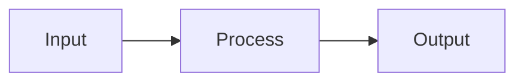

# CLAUDE.md

This file provides guidance to Claude Code (claude.ai/code) when working with code in this repository.

## Project Overview

**AI Playbook** is a static documentation site built with **Astro 5.5.6** + **Starlight 0.32.6** (Astro's docs theme). It's a personal reference for AI & LLM knowledge with cheatsheets, guides, diagrams, and slide decks. Content is 100% Markdown/MDX files that live in Git, deployed to Cloudflare Pages (auto-deploys on push to `main`).

**Key tech stack:**
- Astro 5.5.6 (static site generator)
- Starlight 0.32.6 (docs theme with dark mode, search, nav)
- MDX + Markdown content
- Mermaid 10 for diagrams (client-side rendering)
- KaTeX for math equations
- Custom CSS for theme tweaks

## Development Workflow

### Common Commands

```bash
# Start dev server with hot reload (localhost:4321)
npm run dev
npm run start  # alias

# Build static site → ./dist/
npm run build

# Preview production build locally
npm run preview

# Run astro CLI directly (for advanced use)
npm run astro
```

**Important:** After a successful `npm run dev`, the site auto-reloads when you edit `.md` or `.mdx` files. No restart needed.

### Node.js Requirement

Requires **Node.js 20+**. Check with `node --version`. The project uses ES modules (`"type": "module"` in package.json).

## Project Structure & Content Organization

### Directory Layout

```
ai-playbook/
├── astro.config.mjs          # Starlight config, sidebar definition, plugins
├── package.json              # Dependencies: astro, @astrojs/starlight, @astrojs/mdx
├── tsconfig.json
├── src/
│   ├── assets/
│   │   ├── logo.svg
│   │   └── infographics/     # SVG graphics imported into MDX pages
│   ├── content.config.ts     # Configures Astro content collection
│   ├── content/docs/         # ALL MARKDOWN CONTENT LIVES HERE
│   │   ├── index.md          # Home/Welcome page
│   │   ├── tools.md          # AI tools landscape
│   │   ├── workflows.md      # AI workflows by use case
│   │   ├── agents.md         # Agentic AI systems
│   │   ├── open-source.md    # Open-weight models
│   │   ├── glossary.mdx      # 60+ AI terms with component imports
│   │   ├── history.mdx       # Timeline with Mermaid diagrams
│   │   ├── confusions.mdx    # 30+ misconceptions (uses Card/CardGrid)
│   │   ├── follow.mdx        # Researchers & practitioners (uses Card)
│   │   ├── principles.mdx    # 7 guiding principles (uses Card/CardGrid)
│   │   ├── guides/
│   │   │   └── how-it-works.md
│   │   ├── cheatsheets/      # 11 interview prep & reference cards
│   │   ├── diagrams/         # Mermaid-only pages
│   │   ├── mind-maps/        # Markmap embed pages
│   │   ├── slides/           # Slidev/Reveal embed pages
│   │   └── infographics/     # SVG-based narrative pages
│   └── styles/
│       └── custom.css        # Minor theme overrides (1300px max-width)
├── public/
│   ├── decks/                # Exported Slidev/Reveal HTML for embedding
│   └── mindmaps/             # Exported Markmap HTML + source .md
└── dist/                     # Build output (gitignored)
```

### URL Routing (Critical Pattern)

**Starlight routes by folder/filename.** A file at `src/content/docs/tools.md` becomes `/tools/`. A file at `src/content/docs/cheatsheets/ai-product-interview.md` becomes `/cheatsheets/ai-product-interview/`.

**Sidebar is manually configured** in `astro.config.mjs` (lines 70–133):
- Main pages (tools, open-source, glossary, etc.) have explicit `{ label, link }` entries
- Subfolders use `autogenerate: { directory: 'cheatsheets' }` to auto-populate from files

**When you add a new page**, either:
1. Create a file in a folder with `autogenerate` — it auto-appears in the sidebar
2. Create a file outside autogenerated folders and manually add a sidebar link in `astro.config.mjs`

## Content Authoring

### Frontmatter (YAML Header)

Every `.md` and `.mdx` file must start with:

```yaml
---
title: Page Title (shown in nav, browser tab, h1)
description: One-line summary (used for SEO and preview cards)
sidebar:
  order: 2            # Lower number = higher in sidebar
  badge:
    text: New
    variant: tip      # Optional: shows a colored badge
lastUpdated: 2026-05-08  # Update this when refreshing content
---
```

### Markdown vs MDX

- **`.md`** — Plain Markdown (tables, code blocks, headings). Fast.
- **`.mdx`** — Markdown + imported React components. Use for interactive content or Starlight components.

**Starlight components** (available in `.mdx`):
```mdx
import { Card, CardGrid, Badge } from '@astrojs/starlight/components';

<Card title="Myth: X" icon="warning">
  Content here.
</Card>

<CardGrid>
  <Card title="A" icon="user">Text</Card>
  <Card title="B" icon="target">Text</Card>
</CardGrid>
```

See `confusions.mdx`, `follow.mdx`, and `principles.mdx` for examples.

### Mermaid Diagrams (Inline)

Mermaid renders at build time. Include in any `.md` or `.mdx`:

````md

````

Mermaid theme (light/dark) syncs with Starlight's theme toggle automatically via JavaScript in `astro.config.mjs` (lines 40–67).

### Math Equations (KaTeX)

Inline: `$E = mc^2$`

Block:
```
$$
\frac{\partial}{\partial t} \Psi = -\frac{\hbar^2}{2m} \nabla^2 \Psi + V \Psi
$$
```

KaTeX stylesheet is loaded via CDN in `astro.config.mjs`.

### SVG Infographics

1. Design in Figma/Excalidraw → export as SVG
2. Place in `src/assets/infographics/`
3. Import and render in an `.mdx` page:
   ```mdx
   import img from '../../../assets/infographics/diagram.svg';
   
   ```

### Mind Maps (Markmap)

1. Write outline in `public/mindmaps/my-map.md`
2. Export once:
   ```bash
   npx markmap-cli public/mindmaps/my-map.md -o public/mindmaps/my-map.html --no-open
   ```
3. Embed in an `.mdx` page:
   ```mdx
   <iframe src="/mindmaps/my-map.html" width="100%" height="600"></iframe>
   ```

### Slide Decks (Slidev)

1. Install Slidev:
   ```bash
   npm i -g @slidev/cli
   ```
2. Author deck:
   ```bash
   slidev decks/my-deck/slides.md
   ```
3. Export for embedding:
   ```bash
   slidev build decks/my-deck/slides.md \
     --base /decks/my-deck/ \
     --out public/decks/my-deck
   ```
4. Create wrapper `.md` in `src/content/docs/slides/`:
   ```markdown
   ---
   title: My Deck
   description: ...
   ---
   <iframe src="/decks/my-deck/index.html" width="100%" height="600"></iframe>
   ```

## Key Configuration Files

### `astro.config.mjs`

- **Lines 8–10:** Site URL (update when deploying to custom domain)
- **Lines 12–15:** Markdown plugins (remark-math, rehype-katex for equations; Mermaid loaded via script in head)
- **Lines 17–135:** Starlight integration
  - **Lines 70–133:** Sidebar structure (manual links + autogenerate directives)
  - **Lines 30–68:** KaTeX + Mermaid client-side initialization
  - **Line 69:** Custom CSS file

### `src/content.config.ts`

Wires the docs collection into Starlight. Don't modify unless adding a new collection type.

### `src/styles/custom.css`

Comprehensive Paperclip-inspired design system:
- Color palette (warm tones in light mode, deep charcoal in dark mode)
- Typography: Instrument Serif (h1/h2), Inter (body), JetBrains Mono (code)
- Glassmorphism header, card hover effects, table borders/zebra/rounded corners
- Heading hierarchy (h2 bottom border, h3 body-size bold, h4 tiny uppercase)
- Right sidebar removed — replaced by pill toggle buttons in metadata row
- Sidebar icons + L1/L3/L4 visual hierarchy

### Design Version Tag

A Git tag **`pre-paperclip-theme`** (commit `a5ccc74`) captures the state before the Paperclip design upgrade. To revert to the old design:
```bash
git checkout pre-paperclip-theme
git push origin pre-paperclip-theme:main -f   # deploy old version
```
To switch back to current:
```bash
git checkout main
```

## Important Patterns & Gotchas

### Frontmatter Indentation

YAML indentation matters. `sidebar` block must be properly nested:
```yaml
---
title: Title
description: Desc
sidebar:
  order: 1
  badge:
    text: New
    variant: tip
lastUpdated: 2026-05-08
---
```

**Gotcha:** If `lastUpdated` is indented under `sidebar`, you get "bad indentation of a mapping entry" errors. Keep it at root level.

### Git & Deployment

- **Deployment:** Cloudflare Pages auto-builds on push to `main`. Build command: `npm run build`, output: `dist/`
- **SSH in Sandbox:** If running in Claude's sandboxed bash environment, SSH keys aren't available. **Commit changes locally, but push from your machine** with configured SSH keys.
- **package-lock.json:** Generated on your machine's architecture (arm64 Mac or x64 Linux). Cloudflare's builder expects x64. Keep lock file in sync; don't regenerate on the wrong architecture or deployments will fail.

### Sidebar Configuration

The sidebar is **manually configured** in `astro.config.mjs` because Starlight doesn't auto-generate for root-level files. If you:
- **Add a root `.md` file** → manually add a line to `astro.config.mjs` sidebar
- **Add a file in an autogenerate folder** (cheatsheets, guides, diagrams, etc.) → it auto-appears; no manual sidebar edit needed

### Content Updates

When refreshing existing content:
1. Update the `lastUpdated: YYYY-MM-DD` field (currently May 2026)
2. Keep descriptions short and SEO-friendly
3. For cards using `Card`/`CardGrid`, the first line is the title, content follows
4. Commit, push to `main`, Cloudflare deploys in ~30 seconds

### Component Imports in MDX

If you use Starlight components, always import at the top:
```mdx
import { Card, CardGrid, Badge } from '@astrojs/starlight/components';
```

This only works in `.mdx` files, not `.md` files.

## Development Workflow Tips

1. **Local iteration:** Run `npm run dev`, edit `.md` files, refresh browser (or it auto-reloads)
2. **Build locally before pushing:** Run `npm run build` to catch errors, then `npm run preview` to inspect production bundle
3. **Git workflow:** Commit content changes only; don't commit `node_modules/` or `dist/`
4. **Search:** Starlight uses PageFind for full-text search; indexed at build time automatically
5. **Hot reload:** Edits to `.md`, `.mdx`, `astro.config.mjs`, and `custom.css` trigger hot reload. Edits to `package.json` or dependencies require restart

## Deployment Notes

- **Cloudflare Pages:** Deployed at `https://ai-playbook-9y9.pages.dev`. Auto-deploys on push to `main`
- **Vercel / Netlify:** Also supported; use `astro.build` guide for setup
- **Environment:** Builds run on Linux (likely x64). Ensure `package-lock.json` reflects x64 dependencies to avoid "Unsupported platform" errors
- **Build time:** ~10–15 seconds for this playbook size

## Common Editing Tasks

### Add a new cheatsheet
1. Create `src/content/docs/cheatsheets/name.md`
2. Add YAML frontmatter with `sidebar: { order: N }`
3. Write content, save
4. Dev server hot-reloads; appears in sidebar automatically

### Add a root page (like `tools.md`)
1. Create `src/content/docs/name.md`
2. Add YAML frontmatter
3. Manually add to `astro.config.mjs` sidebar (around line 70)
4. Commit, push, deploy

### Update a page with May 2026 content
1. Edit the file
2. Update `lastUpdated: 2026-05-08` in frontmatter
3. Save, verify locally with `npm run dev`
4. Commit, push to `main`

### Add a Mermaid diagram
Just include a ` ```mermaid ``` ` block in any `.md` or `.mdx` file. Renders at build time.

### Fix styling
Edit `src/styles/custom.css`. Changes hot-reload in dev mode.

## Troubleshooting

| Issue | Solution |
|-------|----------|
| Dev server won't start | Kill existing process (`lsof -i :4321`), ensure Node 20+, run `npm install` |
| Hot reload not working | Restart `npm run dev`, check file is in `src/content/docs/` |
| Build fails with "Unsupported platform" | Regenerated `package-lock.json` on wrong architecture. Restore from git or rebuild on x64 Linux |
| Page not appearing in sidebar | Check `astro.config.mjs` sidebar config; manually add if file is not in an autogenerate folder |
| Mermaid diagram not rendering | Check syntax: avoid `>` in edge labels (`\|VIF > 10\|`), avoid unicode chars (→ ✓ Δ subscripts) in node labels — use plain ASCII. Mermaid fails silently and shows raw code. |
| YAML frontmatter errors | Ensure proper indentation (2 spaces, not tabs); don't nest `lastUpdated` under `sidebar` |
| Chatbot returning errors | Check `GROQ_API_KEY` and `SERPER_API_KEY` in Cloudflare Pages environment variables |
| Chat widget not appearing | Verify Footer component override in `astro.config.mjs` |
| Search index stale | Run `npm run build` which triggers `prebuild` script to regenerate `search-index.json` |

---

## AI Chatbot

### Architecture
```
User question → chat-widget.js → Cloudflare Function → Groq API (Llama 3.3 70B) → answer
                                  ↕
                    search-index.json (prebuilt at deploy time)
```

### Key Files

| File | Purpose |
|---|---|
| `public/chat-widget.js` | Chat widget UI (all JS + CSS inline) |
| `functions/api/chat.js` | Cloudflare Pages Function — search + inference |
| `scripts/build-search-index.mjs` | Prebuild script — chunks content for search |
| `public/search-index.json` | Auto-generated search index |
| `src/data/models.ts` | Structured model data for better search matching |

### Chat Widget Features
- Markdown rendering (bold, code blocks, lists, blockquotes)
- Key term highlighting (MMLU, HumanEval, SWE-bench, RLHF, LoRA)
- Conversation memory (last 5 exchanges)
- Suggested questions, copy button, timestamps, new chat, scroll-to-bottom
- Auto-resizing textarea input

### Cloudflare Pages Function

**Endpoint:** `POST /api/chat`
**Request:** `{ "question": "...", "history": [...] }`
**Response:** `{ "answer": "..." }`

The function:
1. Loads `search-index.json` (bundled static asset)
2. TF-IDF scoring finds top 3 relevant chunks (threshold ≥ 80)
3. Sends context + question to Groq API (Llama 3.3 70B)
4. Falls back to model knowledge when no chunks match
5. Web search via Serper.dev when `SERPER_API_KEY` is set

### Environment Variables

| Variable | Required | Source | Free Tier |
|---|---|---|---|
| `GROQ_API_KEY` | ✅ | https://console.groq.com | Free (rate-limited) |
| `SERPER_API_KEY` | ❌ | https://serper.dev | 2500 searches/month |

### Search Index

Built automatically during `npm run build` via the `prebuild` script:
```bash
node scripts/build-search-index.mjs
```

Indexes:
- All `.md`/`.mdx` files in `src/content/docs/` (~400+ chunks)
- Structured model data from `src/data/models.ts` (12 models, 3 comparison groups)
- MDX imports are stripped; content is chunked into ~300-token segments

---

## Interactive Components

| Component | Location | Page |
|---|---|---|
| **BenchmarkViz** | `src/components/BenchmarkViz.astro` | `/reference/benchmarks` |
| **ModelMatrix** | `src/components/ModelMatrix.astro` | `/reference/model-capability-matrix` |
| **CostCalculator** | `src/components/CostCalculator.astro` | `/decide/cost-calculator` |
| **ToolComparison** | `src/components/ToolComparison.astro` | `/decide/tools/comparison` |
| **TrendingWidget** | `src/components/TrendingWidget.astro` | Homepage + `/research/whats-new` |
| **ProgressTracker** | `src/components/ProgressTracker.astro` | `/learn/beginner`, `/learn/interview-prep` |
| **SeeAlso** | `src/components/SeeAlso.astro` | Auto-injected on all pages (tag-based) |
| **ContributorsList** | `src/components/ContributorsList.astro` | `/community/contributors` |
| **ContentAudit** | `src/components/ContentAudit.astro` | `/community/audit` |

All use Astro components with inline vanilla JS for interactivity (no React/Vue dependencies).

---

## Data Files

| File | Content |
|---|---|
| `src/data/benchmarks.ts` | Benchmark scores (30+ entries across 4 categories, 7 model families) |
| `src/data/capabilities.ts` | Model capability ratings (8+ models × 9 tasks, scored 1-5) |
| `src/data/models.ts` | Structured model data (name, company, context, pricing, capabilities) for search index |
| `src/data/trends.ts` | Trending topics (10 entries with links to playbook pages) |
| `src/data/contributors.ts` | Contributor entries (name, GitHub, contribution types) |

---

## GitHub Actions

| Workflow | File | Schedule | What it does |
|---|---|---|---|
| **Link Checker** | `.github/workflows/check-links.yml` | Monday 6am UTC | Runs lychee on all `.md`/`.mdx` files; creates an issue with a broken-links table if any found |
| **Stale Content** | `.github/workflows/stale-content.yml` | Monday 6am UTC | Scans `lastUpdated` / `nextVerificationDue` frontmatter; creates issue listing overdue pages |
| **Weekly Checklist** | `.github/workflows/weekly-checklist.yml` | Monday 7am UTC | Creates a maintenance checklist issue with pricing/link/build tasks |

**Important:** These workflows create GitHub Issues as reminders — they do **not** auto-edit any content files. Content only changes when a human pushes a commit.

### Workflow permissions

All three workflows require `permissions: issues: write` in the YAML **and** the repository must have "Read and write permissions" enabled at **Settings → Actions → General → Workflow permissions**. Without both, issue creation returns a 403.

### Link checker config

`.github/lychee.toml` configures lychee. Only use valid lychee fields — invalid fields cause exit code 1 (config error) and no output file is written. Valid fields include: `exclude`, `accept`, `timeout`, `max_concurrency`, `max_retries`, `retry_wait_time`, `cache`, `max_cache_age`. The `exclude` patterns are **regex**, not globs.

---

## Issue & PR Templates

| Template | File |
|---|---|
| Bug Report | `.github/ISSUE_TEMPLATE/01-bug.yml` |
| New Content | `.github/ISSUE_TEMPLATE/02-content.yml` |
| Outdated Info | `.github/ISSUE_TEMPLATE/03-outdated.yml` |
| Question | `.github/ISSUE_TEMPLATE/04-question.yml` |
| Help Wanted | `.github/ISSUE_TEMPLATE/05-help-wanted.yml` |
| PR Template | `.github/PULL_REQUEST_TEMPLATE/pull-request.md` |

---

## Sidebar Structure

The sidebar is manually configured in `astro.config.mjs`. Current sections:

### Decide
- **Tools Guide** — Feature Matrix (collapsible parent)
  - Feature Matrix (`/decide/tools/guide`)
  - Decision Tree (`/decide/tools/decision-tree`)
- Tool Comparison (`/decide/tools/comparison`)
- Models Guide (`/decide/models/guide`)
- Frameworks Guide (`/decide/frameworks/guide`)
- Cost Calculator (`/decide/cost-calculator`)

### Learn
- Beginner → Builder → Researcher → Interview Prep

### Reference
- Glossary → Cheatsheets (autogenerate) → Confusions → Principles → Benchmarks → Model Specs → Model Capability Matrix

### Research
- What's New → Model Releases → Open-Source Models → Trends → History → Vocabulary

### Deep Dives
- **Core Architecture**: Neural Networks → How LLMs Work → Reasoning Models → Multimodal AI
- **Techniques & Methods**: RAG Architecture → Agents & Frameworks → Training & Fine-tuning → Prompt Engineering
- **Production & Operations**: Inference Optimization → Production LLMOps → Evaluation & Testing → LLM Backend Engineering → Observability & Tracing → Safety & Security
- **Quantitative Methods**: Regression & Quant Methods (18 parts: OLS → variable transformations → regularisation → panel data → time series → PCA → factor models → statistical testing → distribution stats → Gini/inequality → non-parametric → logistic regression → WoE/scorecards → survival analysis → model monitoring → risk metrics/VaR/ECL)

### Resources
- Overview → Papers → Communities → Tools & Frameworks → Case Studies → Templates

### Community
- Contributing → Report Outdated → Help Wanted → Content Audit → Analytics → Contributors

