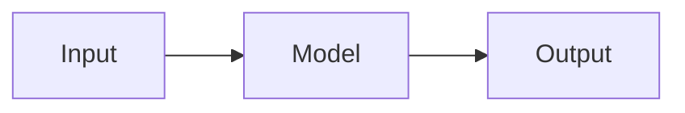

# AI Playbook

A living, opinionated playbook for AI & LLM knowledge — built to be **your** reference first, and shareable as a public site second.

Stack: [**Astro**](https://astro.build) + [**Starlight**](https://starlight.astro.build) (docs theme), Markdown/MDX content, Mermaid diagrams, Markmap mind maps, Slidev decks, and plain SVG infographics. Deploys free to Cloudflare Pages / Vercel / Netlify / GitHub Pages.

---

## Why this stack

You said you're comfortable with **markdown + git**, want something that serves **both you and a public audience**, and plan to include **cheatsheets, diagrams, small slide decks, mind maps, and infographics**. Astro + Starlight is the sweet spot for exactly that:

| Requirement | How Astro + Starlight delivers |
|---|---|
| Professional look, low effort | Starlight ships with a polished docs theme, dark mode, search, and responsive nav out of the box |
| Cheatsheets | Native Markdown tables, callouts, code blocks |
| Diagrams | Mermaid renders from `mermaid` code blocks at build time |
| Mind maps | Markmap exports to HTML; embed via `<iframe>` |
| Slide decks | Slidev (or Reveal) exports to `/public/decks/` and embeds via `<iframe>` |
| Infographics | SVGs imported directly into MDX |
| Easy to maintain | Everything is a Markdown file in Git |
| Public + SEO | Static HTML, fast, indexable |
| Private-first feel | Full-text search, keyboard nav, tagged sidebar |

### Honorable mentions (considered, not picked)

- **Quartz / Obsidian Publish** — best for true "digital garden" vibes with backlinks. Pick if you already write in Obsidian and want graph-style navigation.
- **MkDocs Material** — Python-based, very docs-heavy. Slightly less modern styling out of the box.
- **Docusaurus** — React-based, great for software projects, a bit heavier.
- **Nextra / Next.js + Contentlayer** — max flexibility, more setup.

You can migrate later — the content is just Markdown.

---

## Quickstart

You need Node.js 20+ installed.

```bash
# 1. Install dependencies
npm install

# 2. Start the dev server (hot reload)
npm run dev
# → http://localhost:4321

# 3. Build the static site
npm run build

# 4. Preview the production build locally
npm run preview
```

---

## Project layout

```text
ai-playbook/
├── astro.config.mjs          # Astro + Starlight config (sidebar, plugins, theme)
├── package.json
├── tsconfig.json
├── public/                   # Static files served as-is
│   ├── decks/                # Exported Slidev/Reveal decks → embedded via iframe
│   └── mindmaps/             # Exported Markmap HTML + source .md
├── src/
│   ├── assets/
│   │   ├── logo.svg
│   │   └── infographics/     # SVG infographics imported into MDX pages
│   ├── content.config.ts     # Wires docs collection into Starlight
│   ├── content/docs/
│   │   ├── index.md          # Landing page (splash hero)
│   │   ├── guides/           # Long-form articles
│   │   ├── cheatsheets/      # Quick-reference pages
│   │   ├── diagrams/         # Mermaid-based architecture pages
│   │   ├── mind-maps/        # Markmap pages
│   │   ├── slides/           # Slide-deck wrapper pages
│   │   └── infographics/     # SVG-centric pages
│   └── styles/
│       └── custom.css        # Minor theme tweaks (fonts, accent color)
```

Folders under `src/content/docs/` become sidebar sections automatically (wired in `astro.config.mjs`).

---

## Adding new content

### A new cheatsheet or guide

1. Create a file in the right folder:
   ```
   src/content/docs/cheatsheets/my-new-cheatsheet.md
   ```
2. Add frontmatter:
   ```yaml
   ---
   title: My New Cheatsheet
   description: One-line summary for SEO and previews.
   sidebar:
     order: 3
     badge: { text: New, variant: tip }
   ---
   ```
3. Write Markdown. Save. Dev server hot-reloads.

### A new Mermaid diagram

Inside any `.md` file:

````md

````

### A new mind map (Markmap)

1. Write the outline in `public/mindmaps/my-map.md`.
2. Export once:
   ```bash
   npx markmap-cli public/mindmaps/my-map.md -o public/mindmaps/my-map.html --no-open
   ```
3. Create an `.mdx` page in `src/content/docs/mind-maps/` that embeds the HTML via an `<iframe>`.

### A new slide deck (Slidev)

```bash
npm i -g @slidev/cli

# author in Markdown
slidev decks/my-deck/slides.md

# export to static HTML for embedding
slidev build decks/my-deck/slides.md \
  --base /decks/my-deck/ \
  --out public/decks/my-deck
```

Then create `src/content/docs/slides/my-deck.md` with an `<iframe src="/decks/my-deck/index.html">`.

### A new infographic

1. Design in Figma / Illustrator / Excalidraw → **export as SVG**.
2. Drop it in `src/assets/infographics/`.
3. Create an `.mdx` page that imports and renders it:
   ```mdx
   import img from '../../../assets/infographics/my-graphic.svg';
   
   ```

---

## Deploying

### Cloudflare Pages (recommended — free, fast, global)

1. Push this repo to GitHub.
2. Go to **Cloudflare Pages → Create project → Connect to Git**.
3. Build command: `npm run build`
4. Output directory: `dist`
5. Done. Every push to `main` auto-deploys.

### Vercel

```bash
npx vercel
```

### Netlify

```bash
npx netlify deploy --build --prod
```

### GitHub Pages

Use the [`withastro/action`](https://github.com/withastro/action) GitHub Action — add it under `.github/workflows/deploy.yml`.

---

## Migrating from your existing site

Your current site (`flowing-poplar-z3zy.here.now`) looks like a single `index.html`. To migrate:

1. Copy each section into its own `.md` file under `src/content/docs/`.
2. Keep the **information**, drop the **styling** — Starlight handles the look.
3. Redirect old URLs if you get a domain, using `astro.config.mjs` `redirects`.

Migration is usually a 1–2 hour job for a single-page site.

---

## Roadmap ideas

- [ ] Add a `/prompts/` section with copy-paste prompt templates
- [ ] Enable [pagefind](https://pagefind.app) (Starlight uses it by default) for great search
- [ ] Add an RSS feed for public readers
- [ ] Plug in [Giscus](https://giscus.app) for comments (GitHub-powered)
- [ ] Add a `/changelog/` page auto-generated from git history

---

## License

Content: CC BY 4.0 (attribution required). Code: MIT.
