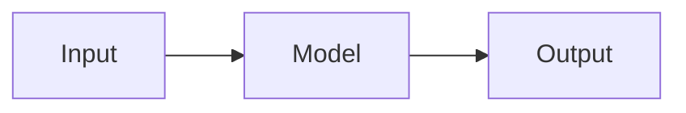

# AI Playbook

A living, opinionated playbook for AI & LLM knowledge — updated through **May 2026** with the latest models, tools, and agentic AI systems. Built to be **your** reference first, and shareable as a public site second.

Stack: [**Astro 5.5.6**](https://astro.build) + [**Starlight 0.32.6**](https://starlight.astro.build) (docs theme), Markdown/MDX content, Mermaid diagrams, Markmap mind maps, Slidev decks, and plain SVG infographics. Deploys free to Cloudflare Pages / Vercel / Netlify / GitHub Pages.

**Current Coverage (May 2026):**
- **Models:** Claude 4.7 (400K context), GPT-5.5 Instant, Gemini 3.1 Pro (1M context), DeepSeek V4 ($0.14/1M tokens), o3 reasoning, Grok 3
- **Agentic AI:** Cursor (78% SWE-bench), Claude Code, Windsurf (75%), CrewAI, AutoGen
- **Real-time AI:** Live video analysis, multimodal streaming, real-time transcription
- **60+ AI terms** with complexity levels, **7 guiding principles**, **30+ misconceptions debunked**, **11 interview cheatsheets**

---

## Why this stack

You said you're comfortable with **markdown + git**, want something that serves **both you and a public audience**, and plan to include **cheatsheets, diagrams, small slide decks, mind maps, and infographics**. Astro + Starlight is the sweet spot for exactly that:

| Requirement | How Astro + Starlight delivers |
|---|---|
| Professional look, low effort | Starlight ships with a polished docs theme, dark mode, search, and responsive nav out of the box |
| Cheatsheets | Native Markdown tables, callouts, code blocks |
| Diagrams | Mermaid renders from `mermaid` code blocks at build time |
| Mind maps | Markmap exports to HTML; embed via `<iframe>` |
| Slide decks | Slidev (or Reveal) exports to `/public/decks/` and embeds via `<iframe>` |
| Infographics | SVGs imported directly into MDX |
| Easy to maintain | Everything is a Markdown file in Git |
| Public + SEO | Static HTML, fast, indexable |
| Private-first feel | Full-text search, keyboard nav, tagged sidebar |

### Honorable mentions (considered, not picked)

- **Quartz / Obsidian Publish** — best for true "digital garden" vibes with backlinks. Pick if you already write in Obsidian and want graph-style navigation.
- **MkDocs Material** — Python-based, very docs-heavy. Slightly less modern styling out of the box.
- **Docusaurus** — React-based, great for software projects, a bit heavier.
- **Nextra / Next.js + Contentlayer** — max flexibility, more setup.

You can migrate later — the content is just Markdown.

---

## Quickstart

You need Node.js 20+ installed.

```bash
# 1. Install dependencies
npm install

# 2. Start the dev server (hot reload at localhost:4321)
npm run dev

# 3. Edit .md or .mdx files in src/content/docs/ — browser auto-reloads

# 4. Build the static site
npm run build

# 5. Preview the production build locally
npm run preview
```

**Tip:** After `npm run dev`, edits to any `.md`, `.mdx`, or `astro.config.mjs` file trigger instant hot reload. No restart needed.

---

## Project layout

```text
ai-playbook/
├── astro.config.mjs          # Starlight config (sidebar, plugins, theme)
├── package.json              # Dependencies: astro, starlight, mdx
├── tsconfig.json
├── CLAUDE.md                 # Guidance for Claude Code working in this repo
├── public/                   # Static files served as-is
│   ├── decks/                # Exported Slidev/Reveal HTML → embedded via iframe
│   └── mindmaps/             # Exported Markmap HTML + source .md
├── src/
│   ├── assets/
│   │   ├── logo.svg
│   │   └── infographics/     # SVG infographics imported into MDX pages
│   ├── content.config.ts     # Wires docs collection into Starlight
│   ├── content/docs/
│   │   ├── index.md          # Welcome page
│   │   ├── tools.md          # AI tools landscape (May 2026)
│   │   ├── workflows.md      # AI workflows by industry
│   │   ├── agents.md         # Agentic AI systems (Cursor, Claude Code, etc.)
│   │   ├── open-source.md    # Open-weight models (Llama, DeepSeek, etc.)
│   │   ├── glossary.mdx      # 60+ AI terms (Beginner→Advanced)
│   │   ├── history.mdx       # Timeline: 1950s → May 2026
│   │   ├── confusions.mdx    # 30+ misconceptions debunked
│   │   ├── follow.mdx        # Researchers, practitioners, newsletters
│   │   ├── principles.mdx    # 7 guiding principles + AI safety/ethics
│   │   ├── guides/           # Long-form articles & how-tos
│   │   ├── cheatsheets/      # 11 interview prep + reference cards
│   │   ├── diagrams/         # Mermaid-based architecture pages
│   │   ├── mind-maps/        # Markmap pages
│   │   ├── slides/           # Slide-deck wrapper pages
│   │   └── infographics/     # SVG-centric narrative pages
│   └── styles/
│       └── custom.css        # Theme tweaks (1300px content width)
```

Folders under `src/content/docs/` become sidebar sections automatically (wired in `astro.config.mjs`).

---

## Adding new content

### A new cheatsheet or guide

1. Create a file in the right folder:
   ```
   src/content/docs/cheatsheets/my-cheatsheet.md
   src/content/docs/guides/my-guide.md
   ```
2. Add frontmatter:
   ```yaml
   ---
   title: My New Cheatsheet
   description: One-line summary for SEO and search.
   sidebar:
     order: 3
     badge:
       text: New
       variant: tip
   lastUpdated: 2026-05-08
   ---
   ```
3. Write Markdown. Save. Dev server hot-reloads instantly.

### A new Mermaid diagram

Inside any `.md` file:

````md

````

### A new mind map (Markmap)

1. Write the outline in `public/mindmaps/my-map.md`.
2. Export once:
   ```bash
   npx markmap-cli public/mindmaps/my-map.md -o public/mindmaps/my-map.html --no-open
   ```
3. Create an `.mdx` page in `src/content/docs/mind-maps/` that embeds the HTML via an `<iframe>`.

### A new slide deck (Slidev)

```bash
npm i -g @slidev/cli

# author in Markdown
slidev decks/my-deck/slides.md

# export to static HTML for embedding
slidev build decks/my-deck/slides.md \
  --base /decks/my-deck/ \
  --out public/decks/my-deck
```

Then create `src/content/docs/slides/my-deck.md` with an `<iframe src="/decks/my-deck/index.html">`.

### A new infographic

1. Design in Figma / Illustrator / Excalidraw → **export as SVG**.
2. Drop it in `src/assets/infographics/`.
3. Create an `.mdx` page that imports and renders it:
   ```mdx
   import img from '../../../assets/infographics/my-graphic.svg';
   
   ```

---

## Deploying

### Cloudflare Pages (recommended — free, fast, global)

1. Push this repo to GitHub.
2. Go to **Cloudflare Pages → Create project → Connect to Git**.
3. Build command: `npm run build`
4. Output directory: `dist`
5. Done. Every push to `main` auto-deploys.

### Vercel

```bash
npx vercel
```

### Netlify

```bash
npx netlify deploy --build --prod
```

### GitHub Pages

Use the [`withastro/action`](https://github.com/withastro/action) GitHub Action — add it under `.github/workflows/deploy.yml`.

---

## How to maintain & extend

### Keep content fresh
- Update `lastUpdated: YYYY-MM-DD` in frontmatter whenever you refresh a page
- Pin specific model pricing/capabilities to dates (e.g., "As of May 2026: Claude 4.7 costs...")
- Add dated sections (e.g., "## May 2026 Updates") when major changes land

### Add to existing sections
- **Glossary:** Add new terms to the appropriate complexity level
- **Confusions:** Add new misconceptions as they surface
- **Principles:** Expand safety sections as agentic AI evolves
- **Cheatsheets:** Add Q&A pairs to interview prep pages

### Contributing your own knowledge
The playbook is open to structure your own reference. You can:
1. Fork or clone this repo
2. Edit content directly in Markdown
3. Push to Cloudflare Pages / Vercel / Netlify
4. Share your version (CC BY 4.0 licensed)

---

## Content & Roadmap (May 2026+)

**What's covered:**
- ✅ Complete May 2026 AI landscape (Claude 4.7, GPT-5.5, DeepSeek, Gemini 3.1 Pro, reasoning models)
- ✅ Agentic AI systems (Cursor, Claude Code, Windsurf, AutoGen, CrewAI)
- ✅ Real-time AI and multimodal systems
- ✅ 11 interview cheatsheets (LLM, product, system design, banking, behavioral)
- ✅ 30+ AI misconceptions debunked
- ✅ 7 guiding principles + deep AI safety/ethics section

**Roadmap ideas:**
- [ ] Add a `/prompts/` section with copy-paste prompt templates by domain
- [ ] Track model releases dynamically (auto-update pricing tables)
- [ ] Add an RSS feed for public readers
- [ ] Plug in [Giscus](https://giscus.app) for GitHub-powered comments
- [ ] Add a `/changelog/` page tracking updates by month
- [ ] Create interactive tool comparison filters (cost, context window, speed)

---

## License

Content: CC BY 4.0 (attribution required). Code: MIT.

## Contributors

Built and maintained by [Shubham Agarwal](https://github.com/shubhamag91). See the [Contributors page](/community/contributors) for a full list.

Contributions welcome — open a PR or [report outdated info](/community/report).
