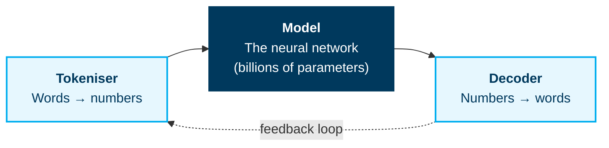
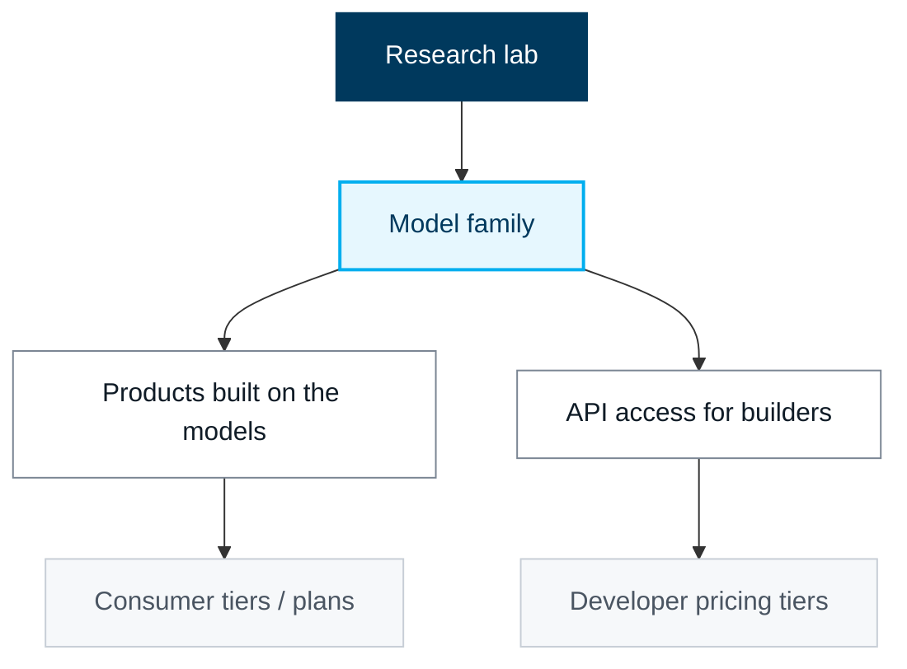
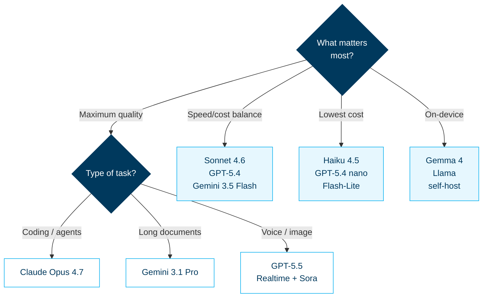

<div class="eyebrow">AI Playbook · Edition I</div>

# Foundations of LLMs

Understand what large language models are, how they work, and what they actually let you do — in 30 minutes.

<div style="position: absolute; bottom: 60px; left: 80px; font-size: 0.8em; opacity: 0.6;">
  Beginner edition · Internal · 2026
</div>

---
layout: default
---

# What we'll cover

<div class="cols-2" style="margin-top: 1em;">

<div class="card">
  <div class="card-title"><span class="pill">01</span> What is an LLM?</div>
  <div class="card-body">Definition, why "large" matters, and the autocomplete analogy that demystifies the whole field.</div>
</div>

<div class="card">
  <div class="card-title"><span class="pill">02</span> How they work</div>
  <div class="card-body">Tokenizer → model → decoder. The next-token loop. Attention, the breakthrough that made it work.</div>
</div>

<div class="card">
  <div class="card-title"><span class="pill">03</span> The vendor landscape</div>
  <div class="card-body">Anthropic, OpenAI, Google, and the open ecosystem. Who makes what, and why it matters.</div>
</div>

<div class="card">
  <div class="card-title"><span class="pill">04</span> Choosing a model</div>
  <div class="card-body">Five tiers, plain-English use cases, and a one-page decision tree.</div>
</div>

<div class="card">
  <div class="card-title"><span class="pill">05</span> What you can build today</div>
  <div class="card-body">Five concrete use cases — writing, learning, coding, automation, analysis — with the right tool for each.</div>
</div>

<div class="card">
  <div class="card-title"><span class="pill">06</span> Real vs hype</div>
  <div class="card-body">What LLMs do well, what they nearly do well, and what they cannot do at all — with reasons.</div>
</div>

</div>

---
class: section
---

## Part 01

# What is an LLM?

The simplest accurate definition is the most useful one.

---
layout: default
---

# An LLM is autocomplete, scaled to the internet

An LLM is software that **predicts the next word in a sentence — billions of times in a row.**

That is the whole mechanism. There is no reasoning step, no fact lookup, no truth check. Just very, very good next-word prediction.

<div class="cols-2" style="margin-top: 1.6em;">

<div>

### The phone analogy

When you type *"What is the weather in…"* your phone suggests *"London"* because it has seen the pattern. ChatGPT does the same thing — trained on **trillions** of those patterns instead of yours alone.

</div>

<div>

### Why this framing matters

If a model is a pattern-matcher, then:

- It will be confident on patterns it has seen
- It will hallucinate when patterns thin out
- It does not "know" anything — it predicts plausible text

</div>

</div>

<div class="callout deep" style="margin-top: 1.4em;">
  <div class="title">Takeaway</div>
  LLMs are tools, not oracles. The whole playbook builds on this one mental model.
</div>

---
layout: default
---

# What "Large" actually means

Three things scaled at once. All three matter.

<div class="cols-3" style="margin-top: 1.8em;">

<div class="metric">
  <div class="num">10T+</div>
  <div class="label">Training tokens</div>
</div>

<div class="metric">
  <div class="num">1.7T</div>
  <div class="label">Parameters (GPT-5.5)</div>
</div>

<div class="metric">
  <div class="num">$100M+</div>
  <div class="label">Training compute cost</div>
</div>

</div>

<div style="margin-top: 1.8em;">

| Scaling axis | What it gives the model | Practical effect for you |
|---|---|---|
| **Data** | Breadth of patterns — books, code, web, science | Wider vocabulary, more topics covered |
| **Parameters** | Capacity to encode subtle patterns | Better nuance, fewer cookie-cutter answers |
| **Compute** | Time and hardware to actually learn the patterns | Better generalisation — works on unseen prompts |

</div>

<div class="callout amber" style="margin-top: 1em;">
  <div class="title">Why prices keep dropping</div>
  Frontier-tier intelligence costs millions to train but pennies per query at scale. Pricing has fallen roughly 10× per year for equivalent quality — a structural shift, not a sale.
</div>

---
class: section
---

## Part 02

# How they actually work

Three components and one loop.

---
layout: default
---

# The three components inside every LLM



<div class="cols-3" style="margin-top: 1.6em;">

<div class="card">
  <div class="card-title">1 · Tokeniser</div>
  <div class="card-body">
    Breaks text into chunks (<em>tokens</em>), each given a number.<br/><br/>
    <code>"Hello, world!"</code> → <code>[15234, 89, 62, 40]</code>
  </div>
</div>

<div class="card">
  <div class="card-title">2 · Model</div>
  <div class="card-body">
    Reads the token sequence and outputs probabilities for the next token.<br/><br/>
    <em>45% "the" · 30% "a" · 15% "is" …</em>
  </div>
</div>

<div class="card">
  <div class="card-title">3 · Decoder</div>
  <div class="card-body">
    Picks a token (usually the most likely), converts back to text, appends it, and the loop runs again.
  </div>
</div>

</div>

---
layout: default
---

# The next-token loop in motion

<div class="cols-2" style="margin-top: 0.4em;">

<div>

```
Input:    "What is the meaning of"
   ↓
Tokenise: [15023, 1234, 89, 5042, 234]
   ↓
Model:    Predicts → token 42 (≈ "life")
   ↓
Decode:   "life"
   ↓
Output:   "What is the meaning of life"
```

The loop then runs **again** with the new sequence, one token at a time, until the model predicts a "stop" token.

</div>

<div>

<div class="callout deep">
  <div class="title">Why responses stream in</div>
  When you see a Claude or ChatGPT reply appear word-by-word, that is the loop running live. Each token is generated, sent to your screen, and the next prediction starts immediately.
</div>

<div class="callout amber">
  <div class="title">The temperature dial</div>
  When the model picks a token, it doesn't always pick the most likely one. A "temperature" parameter controls how much randomness — low = deterministic, high = creative.
</div>

</div>

</div>

---
layout: default
---

# Attention — the breakthrough that made this work

Before 2017, language models could not hold long-range relationships in mind. They forgot the subject of a sentence by the time they reached the verb.

**Attention** is the mechanism that lets the model weigh *which earlier words matter most* when predicting the next one.

<div class="cols-2" style="margin-top: 1.4em;">

<div>

### Worked example

> The CEO of Apple, **Tim Cook**, announced…

When the model predicts the next word, attention learns to *focus on "Tim Cook"* — not "Apple", not "CEO". The pronoun reference, the subject of the verb, the topic — all of it is the attention layer doing its job.

</div>

<div class="callout deep">
  <div class="title">Why this matters historically</div>
  Attention was introduced in <em>"Attention Is All You Need"</em> (Google, 2017) and is the "T" in <strong>GPT</strong> — Generative Pre-trained Transformer. Every modern LLM is a transformer.
</div>

</div>

---
class: section
---

## Part 03

# The vendor landscape

Who makes what, and how the major labs are structured.

---
layout: default
---

# Four labs that matter — and one open ecosystem

<div class="cols-2" style="margin-top: 0.6em;">

<div class="card">
  <div class="card-title"><span class="pill dark">Anthropic</span> Claude</div>
  <div class="card-body">
    Flagship: <strong>Claude Opus 4.7</strong> · Workhorse: Sonnet 4.6 · Speed tier: Haiku 4.5.<br/>
    Reputation: thoughtful reasoning, long-document handling, agentic coding.
  </div>
</div>

<div class="card">
  <div class="card-title"><span class="pill dark">OpenAI</span> GPT</div>
  <div class="card-body">
    Flagship: <strong>GPT-5.5</strong> · Workhorse: GPT-5.4 · Speed tier: GPT-5.4 mini/nano.<br/>
    Reputation: broadest ecosystem, ChatGPT, Codex, Realtime API, image &amp; video.
  </div>
</div>

<div class="card">
  <div class="card-title"><span class="pill dark">Google DeepMind</span> Gemini</div>
  <div class="card-body">
    Latest: <strong>Gemini 3.1 Pro</strong> (preview), <strong>3.5 Flash</strong> (stable).<br/>
    Reputation: long context, native multimodal (Omni), tight Google integration.
  </div>
</div>

<div class="card">
  <div class="card-title"><span class="pill dark">Meta &amp; others</span> Open models</div>
  <div class="card-body">
    Llama (Meta), <strong>Gemma 4</strong> (Google, Apache 2.0), DeepSeek V4, Mistral.<br/>
    Reputation: self-hostable, much cheaper, full control.
  </div>
</div>

</div>

<div class="callout amber" style="margin-top: 1.2em;">
  <div class="title">The 5th option</div>
  Use a <strong>router</strong> (OpenRouter, Vercel AI Gateway) to call all of the above through one API. Useful when you don't want to commit early.
</div>

---
layout: default
---

# How a vendor stack is organised

Every major lab runs the same vertical stack. Learning to read it lets you tell what you're paying for.



<div style="margin-top: 1.2em;">

| Stack layer | Anthropic | OpenAI | Google DeepMind |
|---|---|---|---|
| Research lab | Anthropic | OpenAI | DeepMind |
| Model family | Claude 4.7 / 4.6 / 4.5 | GPT-5.5 / 5.4 / mini / nano | Gemini 3.1 Pro / 3.5 Flash |
| Consumer product | claude.ai, Claude Desktop | ChatGPT | Gemini app |
| Developer surface | Claude API, Claude Code | OpenAI API, Codex | Gemini API, AI Studio, Antigravity |
| Enterprise | Claude for Teams, Bedrock | ChatGPT Enterprise, Azure | Vertex AI |

</div>

---
class: section
---

## Part 04

# Choosing a model

Five tiers cover 95% of real work.

---
layout: default
---

# A one-screen model snapshot

<div style="margin-top: 0.4em;">

| Model | $/1M in | $/1M out | Context | Strongest at |
|---|---|---|---|---|
| **Claude Opus 4.7** | $5 | $25 | 1M | Complex reasoning, agentic coding |
| **Claude Sonnet 4.6** | $3 | $15 | 1M | Balanced speed + intelligence |
| **Claude Haiku 4.5** | $1 | $5 | 200K | Fast, near-frontier at low cost |
| **GPT-5.5** | $5 | $30 | 1M | Broad ecosystem, voice, image, video |
| **GPT-5.4 mini** | $0.75 | $4.50 | 400K | High-volume agents, sub-agents |
| **Gemini 3.1 Pro** (preview) | $2 / $4* | $12 / $18* | Long-ctx tiered | Long documents, multimodal |
| **Gemini 3.5 Flash** | $1.50 | $9 | 1M | Production agents at Flash speed |
| **Gemma 4** (open) | self-hosted | — | up to 256K | On-device, full control, Apache 2.0 |

</div>

<div style="font-size: 0.7em; color: var(--bx-grey-500); margin-top: 0.6em;">
  * Gemini Pro uses long-context tiered pricing: lower rate ≤ 200K tokens, higher rate above. Prices verified May 2026.
</div>

---
layout: default
---

# Which model when — the 30-second decision tree

<div class="cols-2" style="margin-top: 0.4em; grid-template-columns: 2fr 1fr; align-items: start;">

<div style="font-size: 0.65em;">



</div>

<div>

<div class="callout deep">
  <div class="title">Rule of thumb</div>
  Start <strong>one tier above</strong> what you think you need. If the cheaper tier handles the task reliably, downgrade. Most people overpay by defaulting to the flagship.
</div>

<div class="callout amber" style="margin-top: 0.6em;">
  <div class="title">The 95% cut</div>
  Combining <strong>prompt caching</strong> (90% off repeated input) with <strong>Batch API</strong> (50% off async) yields up to <strong>95% savings</strong> on high-volume workloads.
</div>

<div class="callout green" style="margin-top: 0.6em;">
  <div class="title">Test before committing</div>
  Use <strong>OpenRouter</strong> or <strong>Vercel AI Gateway</strong> to A/B test all models through one API key before locking in a vendor.
</div>

</div>

</div>

---
class: section
---

## Part 05

# What you can build today

Five concrete use cases, with the right tool for each.

---
layout: default
---

# The five practical use cases

<div class="cols-2" style="margin-top: 0.4em;">

<div class="card">
  <div class="card-title"><span class="pill green">Writing</span> Replaces Grammarly + draft</div>
  <div class="card-body">
    <em>"Write a professional email declining a job offer, polite but firm."</em><br/><br/>
    <strong>Best tools:</strong> ChatGPT, Claude, Gemini — free tiers all work.
  </div>
</div>

<div class="card">
  <div class="card-title"><span class="pill green">Learning</span> Replaces Google</div>
  <div class="card-body">
    Conversational follow-up: <em>"Explain photosynthesis… now the Calvin cycle… now how it relates to carbon cycling."</em><br/><br/>
    <strong>Best tools:</strong> Claude, ChatGPT, Perplexity (cited sources).
  </div>
</div>

<div class="card">
  <div class="card-title"><span class="pill green">Coding</span> Game-changer for devs</div>
  <div class="card-body">
    Describe what you want; receive working code; iterate.<br/><br/>
    <strong>Best tools:</strong> Claude Code (CLI/IDE), Cursor, GitHub Copilot.
  </div>
</div>

<div class="card">
  <div class="card-title"><span class="pill green">Automation</span> Replaces Zapier for simple text tasks</div>
  <div class="card-body">
    Extract structured data, summarise 100 docs, categorise feedback.<br/><br/>
    <strong>Best tools:</strong> Anthropic / OpenAI API + scripts; n8n; Zapier AI.
  </div>
</div>

<div class="card">
  <div class="card-title"><span class="pill green">Analysis</span> Replaces hours of reading</div>
  <div class="card-body">
    Upload a 100-page report → <em>"Top 5 findings?"</em> Upload customer feedback → <em>"Top complaint categories?"</em><br/><br/>
    <strong>Best tools:</strong> Claude Pro, ChatGPT Plus, NotebookLM.
  </div>
</div>

<div class="card">
  <div class="card-title"><span class="pill amber">Coming next</span> Voice &amp; agents</div>
  <div class="card-body">
    Realtime voice agents (OpenAI Realtime, Gemini Live), and autonomous agents that take actions for you — covered in Editions II &amp; III.
  </div>
</div>

</div>

---
layout: default
---

# Your first experiment — pick one, ten minutes

<div class="cols-3" style="margin-top: 0.6em;">

<div class="card">
  <div class="card-title"><span class="pill">A</span> Writing</div>
  <div class="card-body">
    <ol style="padding-left: 1.2em; margin: 0;">
      <li>Go to <code>chatgpt.com</code></li>
      <li>"Write a funny limerick about a confused programmer"</li>
      <li>Follow up: "Now make it about an AI researcher"</li>
      <li>Try: "Rewrite as a haiku"</li>
    </ol>
    <strong style="display:block; margin-top:8px;">Lesson:</strong> how to iterate.
  </div>
</div>

<div class="card">
  <div class="card-title"><span class="pill">B</span> Learning</div>
  <div class="card-body">
    <ol style="padding-left: 1.2em; margin: 0;">
      <li>Go to <code>claude.ai</code></li>
      <li>"Explain how neural networks learn. Use an analogy."</li>
      <li>Follow up: "How are language models different?"</li>
      <li>"Give me a concrete example that breaks them"</li>
    </ol>
    <strong style="display:block; margin-top:8px;">Lesson:</strong> dig deeper with follow-ups.
  </div>
</div>

<div class="card">
  <div class="card-title"><span class="pill">C</span> Analysis</div>
  <div class="card-body">
    <ol style="padding-left: 1.2em; margin: 0;">
      <li>Copy-paste a news paragraph</li>
      <li>"Summarise this in one sentence"</li>
      <li>"What are the key assumptions in this argument?"</li>
      <li>"Who would disagree with this perspective?"</li>
    </ol>
    <strong style="display:block; margin-top:8px;">Lesson:</strong> LLMs analyse faster than you read.
  </div>
</div>

</div>

<div class="callout deep" style="margin-top: 1.2em;">
  <div class="title">Four prompting habits worth keeping forever</div>
  Be <strong>specific</strong> · <strong>iterate</strong> · explain the <strong>context</strong> · ask <strong>follow-ups</strong>. These four habits cover 80% of advanced prompt engineering.
</div>

---
class: section
---

## Part 06

# Real vs hype

What LLMs actually do — separated from what the headlines claim.

---
layout: default
---

# The honesty matrix

<div class="cols-3" style="margin-top: 0.8em;">

<div class="callout green">
  <div class="title">✓ Real — works today</div>
  <ul style="margin: 0.4em 0; padding-left: 1.2em;">
    <li>Writing &amp; editing (often better than the average person)</li>
    <li>Explaining concepts clearly</li>
    <li>Coding assistance — hours of work in minutes</li>
    <li>Brainstorming &amp; idea generation</li>
    <li>Text analysis (find patterns, extract info)</li>
  </ul>
</div>

<div class="callout amber">
  <div class="title">~ Improving — partially real</div>
  <ul style="margin: 0.4em 0; padding-left: 1.2em;">
    <li>Maths — better with reasoning models, but verify</li>
    <li>Factual accuracy — hallucination rate dropping; not zero</li>
    <li>Real-time info — needs web tools (Perplexity, Gemini)</li>
    <li>Specialised domains — improves with retrieval &amp; fine-tuning</li>
  </ul>
</div>

<div class="callout red">
  <div class="title">✗ Hype — not (yet) real</div>
  <ul style="margin: 0.4em 0; padding-left: 1.2em;">
    <li>"AGI" / human-equivalent reasoning</li>
    <li>Replacing domain experts</li>
    <li>Guaranteed truthfulness</li>
    <li>Acting fully autonomously without supervision</li>
    <li>Knowing anything after the training cutoff date</li>
  </ul>
</div>

</div>

<div class="callout" style="margin-top: 1.2em;">
  <div class="title">The reality check</div>
  An LLM is a <strong>tool</strong>, not an oracle. Treat it like Google: incredibly fast, often helpful, sometimes wrong — verify what matters.
</div>

---
layout: default
---

# Five takeaways to remember

<div class="cols-2" style="margin-top: 0.6em;">

<div>

<div class="callout deep">
  <div class="title">01 · Pattern matching, not magic</div>
  LLMs predict the next word from learned patterns. That single fact explains both their power and their limits.
</div>

<div class="callout deep" style="margin-top: 0.8em;">
  <div class="title">02 · Different models, different jobs</div>
  Five tiers cover almost everything. Start one tier above what you think you need.
</div>

<div class="callout deep" style="margin-top: 0.8em;">
  <div class="title">03 · Iterate — don't one-shot</div>
  Question → reply → follow-up beats a single perfectly-worded mega-prompt almost every time.
</div>

</div>

<div>

<div class="callout deep">
  <div class="title">04 · They're tools, not experts</div>
  Brilliant assistants for people who already think well. Not replacements for human judgement on consequential decisions.
</div>

<div class="callout deep" style="margin-top: 0.8em;">
  <div class="title">05 · The trajectory is the story</div>
  Cheaper, faster, more capable, more integrated. Every six months the boundary of "what's possible" moves materially.
</div>

<div class="callout amber" style="margin-top: 0.8em;">
  <div class="title">Next up</div>
  <strong>Edition II</strong> — Builder track: prompting patterns, RAG, agents, APIs.<br/>
  <strong>Edition III</strong> — Deep dive: transformers, training, inference, evaluation.
</div>

</div>

</div>

---
class: cover
---

<div>

<div class="eyebrow">Questions &amp; discussion</div>

# Thank you

<p style="font-size: 1.1em; margin-top: 0.6em;">Full playbook · <strong>ai-playbook-9y9.pages.dev</strong></p>

<p style="margin-top: 1.4em; font-size: 0.85em; opacity: 0.7; max-width: 600px;">
  This deck is a condensed view of the Beginner Path. For depth on any topic, head to the corresponding section in the playbook.
</p>

<p style="margin-top: 2em; font-size: 0.75em; opacity: 0.5;">
  Next: <strong>Edition II — Builder</strong> · <strong>Edition III — Deep Dive</strong>
</p>

</div>
