<div>

<div class="eyebrow">AI Playbook · Edition III</div>

# Deep Dive

The maths, mechanics, and engineering behind modern LLMs — transformers, training, inference, RAG architecture, agents, evaluation, observability, safety, and production operations.

<div style="position: absolute; bottom: 60px; left: 80px; font-size: 0.8em; opacity: 0.6;">
  Deep Dive edition · Internal · 2026
</div>

</div>

---
layout: default
---

# Roadmap — eleven parts

<div class="cols-3" style="margin-top: 0.4em;">

<div class="card"><div class="card-title"><span class="pill">01</span> Neural networks</div><div class="card-body">From perceptrons to backprop — the mechanics every LLM is built on.</div></div>
<div class="card"><div class="card-title"><span class="pill">02</span> Transformers</div><div class="card-body">Attention, positional encoding, embeddings, layer norm. The architecture.</div></div>
<div class="card"><div class="card-title"><span class="pill">03</span> Training &amp; fine-tuning</div><div class="card-body">Pre-training, SFT, RLHF, DPO, LoRA. The full training stack.</div></div>
<div class="card"><div class="card-title"><span class="pill">04</span> Reasoning models</div><div class="card-body">Test-time compute, thinking modes, RL on reasoning, adaptive thinking.</div></div>
<div class="card"><div class="card-title"><span class="pill">05</span> Multimodal AI</div><div class="card-body">Vision, audio, video. Encoders, tokenisers, unified architectures.</div></div>
<div class="card"><div class="card-title"><span class="pill">06</span> Inference optimisation</div><div class="card-body">KV cache, batching, speculative decoding, quantisation, FlashAttention.</div></div>
<div class="card"><div class="card-title"><span class="pill">07</span> RAG architecture</div><div class="card-body">Hybrid retrieval, re-ranking, knowledge graphs, agentic RAG, eval.</div></div>
<div class="card"><div class="card-title"><span class="pill">08</span> Agents &amp; skills</div><div class="card-body">Loops, orchestration, sub-agents, SKILL.md, MCP, computer use.</div></div>
<div class="card"><div class="card-title"><span class="pill">09</span> Eval &amp; testing</div><div class="card-body">Benchmarks, golden sets, LLM-as-judge, regression, red-teaming.</div></div>
<div class="card"><div class="card-title"><span class="pill">10</span> Production &amp; observability</div><div class="card-body">LLMOps, tracing, cost governance, capacity planning, incident response.</div></div>
<div class="card"><div class="card-title"><span class="pill">11</span> Safety, security &amp; quant</div><div class="card-body">Prompt injection, jailbreaks, alignment, regulation, quant methods.</div></div>

</div>

---
class: section
---

## Part 01

# Neural networks

The substrate. Every LLM is a giant neural network with attention.

---
layout: default
---

# The perceptron — one neuron

A neuron takes inputs, weights them, sums, applies a non-linearity, outputs one number.

```
       w₁
  x₁ ──────┐
       w₂   \
  x₂ ──────→ Σ → f(·) → y
       w₃   /
  x₃ ──────┘
              ↑
              bias b
```

$$
y = f\!\left(\sum_{i=1}^{n} w_i x_i + b\right)
$$

<div class="cols-3" style="margin-top: 0.6em;">

<div class="callout green">
  <div class="title">Weights w</div>
  Learned. How strongly each input matters.
</div>

<div class="callout green">
  <div class="title">Bias b</div>
  Learned. Shifts the activation threshold.
</div>

<div class="callout green">
  <div class="title">Activation f</div>
  Non-linear. ReLU / GELU / SwiGLU. Without it, the network collapses to linear regression.
</div>

</div>

---
layout: default
---

# Stacking neurons — feed-forward layers

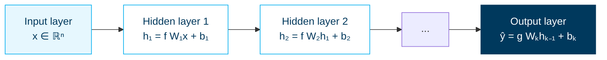

<div class="cols-2" style="margin-top: 0.4em;">

<div class="callout deep">
  <div class="title">Width vs depth</div>
  <strong>Width</strong> = more neurons per layer (more parallel features). <strong>Depth</strong> = more layers (more abstraction). LLMs are both wide (4096+ hidden dim) and deep (24–120 layers).
</div>

<div class="callout deep">
  <div class="title">Universal approximation</div>
  A sufficiently wide network with one hidden layer can approximate <em>any</em> continuous function. In practice, depth gives the same expressivity far more efficiently.
</div>

</div>

---
layout: default
---

# Learning = backpropagation + gradient descent

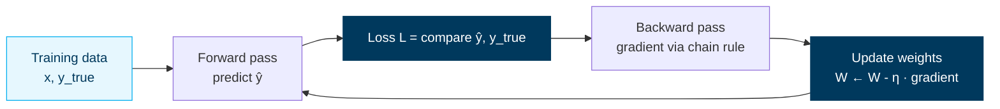

<div class="cols-3" style="margin-top: 0.4em;">

<div class="callout green">
  <div class="title">Loss function</div>
  Measures how wrong the prediction is. LLMs use <strong>cross-entropy</strong> over the next-token distribution.
</div>

<div class="callout green">
  <div class="title">Backprop</div>
  Computes gradient of loss w.r.t. every weight, via the chain rule. Numerically efficient (reverse-mode autodiff).
</div>

<div class="callout green">
  <div class="title">Optimiser</div>
  <strong>AdamW</strong> is the default for LLMs. Adapts the learning rate per-parameter and adds weight decay.
</div>

</div>

<div class="callout deep" style="margin-top: 0.4em;">
  <div class="title">Why LLM training is hard</div>
  Hundreds of billions of parameters · trillions of tokens · gradient instabilities · vanishing / exploding gradients · numerical precision (FP8/BF16) · distributed across thousands of GPUs.
</div>

---
class: section
---

## Part 02

# Transformers

The 2017 paper that powers GPT, Claude, Gemini, Llama, and everything that came after.

---
layout: default
---

# The transformer block

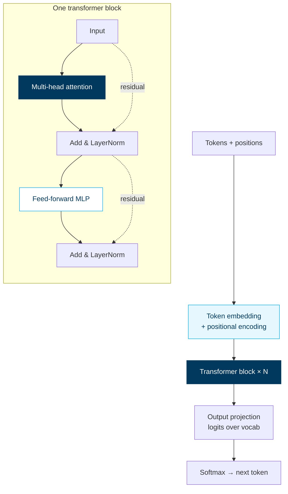

<div class="callout deep" style="margin-top: 0.4em;">
  <div class="title">What changes between models</div>
  Attention variant (full / grouped-query / multi-query / sliding-window) · MLP shape (SwiGLU is common) · normalisation placement (pre-norm wins) · positional encoding (RoPE everywhere now) · layer count and width.
</div>

---
layout: default
---

# Self-attention — the mechanism

For each token, attention computes a weighted sum of all other tokens. The weights say *which tokens matter for this prediction*.

$$
\text{Attention}(Q, K, V) = \text{softmax}\!\left(\frac{Q K^{\top}}{\sqrt{d_k}}\right) V
$$

<div class="cols-3" style="margin-top: 0.6em;">

<div class="callout green">
  <div class="title">Q (queries)</div>
  "What am I looking for?"<br/>One vector per token, derived from input × W_Q.
</div>

<div class="callout green">
  <div class="title">K (keys)</div>
  "What do I have to offer?"<br/>One vector per token, input × W_K.
</div>

<div class="callout green">
  <div class="title">V (values)</div>
  "What's my content?"<br/>One vector per token, input × W_V.
</div>

</div>

<div class="callout deep" style="margin-top: 0.6em;">
  <div class="title">In plain English</div>
  Each token "asks" every other token via dot-product similarity (Q·K). The softmax turns those similarities into a probability distribution. The output is a weighted blend of every token's value vector. <strong>Multi-head</strong> = run N versions of this in parallel and concatenate, letting different heads specialise (one tracks syntax, one tracks coreference, etc.).
</div>

---
layout: default
---

# Why attention is O(n²) — and what's done about it

Each token attends to every other token → for sequence length *n*, that's *n²* dot products. At 1M tokens, that's 1 trillion ops per layer.

<div class="cols-2" style="margin-top: 0.4em;">

<div>

### The full attention bottleneck

| Seq length | Attention ops |
|---|---|
| 4K | 16M |
| 32K | 1B |
| 200K | 40B |
| 1M | 1T |

Memory grows with the **KV cache**: storing K, V for every token, every layer, for use during generation.

</div>

<div>

<div class="callout deep">
  <div class="title">The optimisations</div>
  <ul style="margin: 0.3em 0; padding-left: 1.2em;">
    <li><strong>FlashAttention</strong> — tile attention into SRAM, never materialise the full matrix. 2-4× speedup, no quality loss</li>
    <li><strong>Grouped-query attention (GQA)</strong> — share K/V heads across Q heads. ~10× memory reduction</li>
    <li><strong>Sliding window</strong> — each token attends to last W tokens. Linear in n</li>
    <li><strong>Mamba / SSMs</strong> — replace attention with state-space models. O(n) but different trade-offs</li>
  </ul>
</div>

</div>

</div>

---
layout: default
---

# Positional encoding — telling the model about order

Self-attention is permutation-invariant by design. Without positional encoding, "dog bites man" = "man bites dog".

<div class="cols-2" style="margin-top: 0.4em;">

<div>

### The evolution

| Scheme | Used by | Trick |
|---|---|---|
| Sinusoidal | GPT-2, original transformer | Fixed sine/cosine. Doesn't extrapolate. |
| Learned absolute | BERT | Embedding table per position. Hard cap at training length. |
| ALiBi | BLOOM | Linear bias on attention. Extrapolates. |
| **RoPE** | GPT-4, Claude, Llama, Gemini | **Rotary** — rotates Q,K by angle ∝ position. State of the art. |

</div>

<div>

<div class="callout deep">
  <div class="title">Why RoPE won</div>
  Encodes <strong>relative position</strong> (token i vs token j) inside the dot product itself. Extrapolates to longer sequences than seen at training (with techniques like YaRN, NTK-aware scaling). Every frontier model uses it.
</div>

<div class="callout amber" style="margin-top: 0.5em;">
  <div class="title">Long-context magic</div>
  How Claude 4 / GPT-5 / Gemini 3 reach 1M tokens: RoPE base frequency scaling + continued pre-training on long sequences. Not just a bigger context buffer — a different training recipe.
</div>

</div>

</div>

---
class: section
---

## Part 03

# Training & fine-tuning

How an LLM goes from random weights to something useful. Four stages.

---
layout: default
---

# The training pipeline

```mermaid
flowchart LR
  D[Raw text<br/>web, books, code<br/>trillions of tokens] --> PT[Pre-training<br/>next-token prediction<br/>weeks on 10K+ GPUs]
  PT --> Base[Base model<br/>knows lots, can't follow instructions]
  Base --> SFT[Supervised fine-tuning<br/>~100K human demos]
  SFT --> Inst[Instruction-tuned model]
  Inst --> RL[RLHF / DPO / RLAIF<br/>preference data]
  RL --> Final[Aligned model<br/>= what you call via API]

  style D fill:#E6F7FE,stroke:#00AEEF,color:#00395D
  style PT fill:#00395D,stroke:#00395D,color:#FFFFFF
  style RL fill:#00395D,stroke:#00395D,color:#FFFFFF
  style Final fill:#FFFFFF,stroke:#00AEEF,color:#00395D
```

<div class="cols-2" style="margin-top: 0.4em;">

<div class="callout deep">
  <div class="title">Where the bill goes</div>
  Pre-training is <strong>95%+ of total cost</strong>. SFT and RL are pennies by comparison. Once a base model exists, dozens of fine-tunes can be made cheaply.
</div>

<div class="callout deep">
  <div class="title">Why bases are released</div>
  Meta (Llama), Mistral, Google (Gemma) release base models. Anyone can SFT/RL them. This is the entire open-weights ecosystem.
</div>

</div>

---
layout: default
---

# Pre-training — autoregressive next-token prediction

<div class="cols-2" style="margin-top: 0.4em;">

<div>

### The objective

$$
\mathcal{L} = -\sum_{t=1}^{T} \log p_\theta(x_t \mid x_{<t})
$$

For every position *t* in the corpus, the model predicts the next token given everything before. Loss is cross-entropy. That's it.

### The recipe at scale

| Component | Frontier scale (2026) |
|---|---|
| Parameters | 100B–2T |
| Training tokens | 10–30T |
| GPUs | 10,000–100,000 (H100/B200) |
| Wall-clock | 2–4 months |
| Cost | $50M–$500M |

</div>

<div>

<div class="callout deep">
  <div class="title">Why the next token?</div>
  Because that single task forces the model to learn <strong>everything</strong>: grammar, facts, reasoning patterns, code, maths, common sense. Predicting the next word in "The capital of France is ___" requires knowing geography.
</div>

<div class="callout deep" style="margin-top: 0.5em;">
  <div class="title">Chinchilla scaling law</div>
  For a given compute budget, the optimal ratio is roughly <strong>20 tokens per parameter</strong>. 70B model → ~1.4T training tokens. Frontier models in 2026 train on much more (compute-suboptimal but better at inference).
</div>

</div>

</div>

---
layout: default
---

# SFT — teaching the model to follow instructions

The base model knows language. SFT teaches it the *chat* shape.

<div class="cols-2" style="margin-top: 0.4em;">

<div>

### Data shape

```json
[
  {
    "role": "system",
    "content": "You are a helpful assistant."
  },
  {
    "role": "user",
    "content": "Explain photosynthesis simply."
  },
  {
    "role": "assistant",
    "content": "Plants take in sunlight..."
  }
]
```

~50K–500K human-written examples covering instruction following, refusal, format compliance, multi-turn.

</div>

<div>

<div class="callout deep">
  <div class="title">Same loss, different data</div>
  SFT uses the <strong>same next-token loss</strong> as pre-training. Only the data changes — curated demonstrations instead of random web text.
</div>

<div class="callout amber" style="margin-top: 0.5em;">
  <div class="title">The "alignment tax"</div>
  SFT can <em>narrow</em> the base model's capabilities (it learns to be polite at the cost of some creativity). Modern recipes mix in pre-training data during SFT to mitigate this.
</div>

<div class="callout green" style="margin-top: 0.5em;">
  <div class="title">Result</div>
  Instruction-tuned model. Follows directions, returns clean format, refuses obvious misuse. Still misaligned on nuance — that's what RL is for.
</div>

</div>

</div>

---
layout: default
---

# RLHF, DPO, RLAIF — preference-based alignment

The model needs to learn *which response is better*, not just any plausible response.

<div class="cols-3" style="margin-top: 0.4em;">

<div class="card">
  <div class="card-title"><span class="pill">RLHF</span> Original</div>
  <div class="card-body">
    Train a <strong>reward model</strong> from human preference pairs (A vs B, which is better?). Then <strong>PPO</strong> the LLM to maximise that reward.<br/><br/>
    Powerful but unstable, expensive, infrastructure-heavy.
  </div>
</div>

<div class="card">
  <div class="card-title"><span class="pill">DPO</span> Direct Preference Optimisation</div>
  <div class="card-body">
    Skip the reward model. Optimise directly on preference pairs with a simple classification loss.<br/><br/>
    Used by Llama 3+, Mistral, many open models. Almost as good as RLHF, far simpler.
  </div>
</div>

<div class="card">
  <div class="card-title"><span class="pill">RLAIF</span> Constitutional AI</div>
  <div class="card-body">
    Use <strong>another LLM</strong> (or a written constitution) to label preferences instead of humans.<br/><br/>
    Pioneered by Anthropic. Scales preference data infinitely. Mixed with human labels in practice.
  </div>
</div>

</div>

<div class="callout deep" style="margin-top: 0.6em;">
  <div class="title">What "alignment" actually buys you</div>
  Helpfulness · honesty (less hallucination) · harmlessness · format compliance · refusal calibration. The base model can do all this <em>sometimes</em>; alignment makes it the default.
</div>

---
layout: default
---

# Fine-tuning the small way — LoRA &amp; QLoRA

You usually don't need to retrain a model. **LoRA** adds tiny trainable matrices on top of frozen weights.

<div class="cols-2" style="margin-top: 0.4em;">

<div>

### How LoRA works

Instead of updating a giant weight matrix W (e.g. 4096×4096 = 16M params), train two small matrices A and B (e.g. 4096×8 and 8×4096 = 64K params total) such that:

$$
W' = W + B A
$$

The original W is frozen. Only A and B are trained. After training, $BA$ can be merged into $W$ for zero inference overhead.

</div>

<div>

<div class="callout green">
  <div class="title">Why it works</div>
  Empirically, fine-tuning updates are <em>low rank</em> — the actual change to W has rank ~8–64. LoRA matches full fine-tuning quality at 1% the parameters and ~1% the GPU memory.
</div>

<div class="callout deep" style="margin-top: 0.5em;">
  <div class="title">QLoRA</div>
  Quantise the frozen base to 4-bit. Train LoRA adapters in 16-bit. Fine-tune a 70B model on a single 48GB GPU. Standard practice now.
</div>

<div class="callout amber" style="margin-top: 0.5em;">
  <div class="title">When to fine-tune at all</div>
  Only when prompt engineering + RAG + few-shot don't get you there. Most "we need fine-tuning" problems dissolve with better prompts.
</div>

</div>

</div>

---
class: section
---

## Part 04

# Reasoning models

When inference-time compute beats more parameters.

---
layout: default
---

# Test-time compute — the new scaling axis

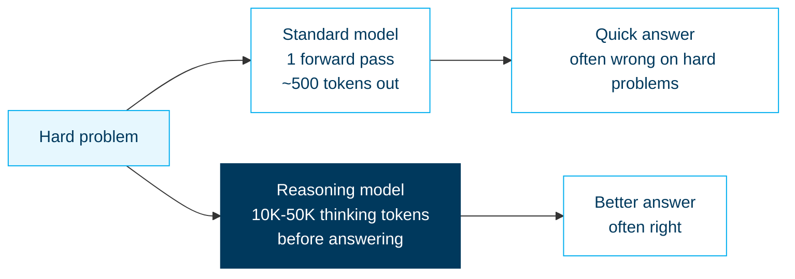

<div class="callout deep" style="margin-top: 0.4em;">
  <div class="title">The trade — and why it works</div>
  <strong>Reasoning models spend more compute at inference time</strong> (generating internal thinking tokens) to produce a better final answer. Demonstrated to scale on competition maths, complex coding, and science problems — often beating much larger non-reasoning models.
</div>

---
layout: default
---

# How reasoning models are built

<div class="cols-2" style="margin-top: 0.4em;">

<div>

### Training recipe

1. Start with a strong base model
2. Generate **chain-of-thought** rollouts on problems with verifiable answers (maths, code)
3. **Reinforce** the chains that lead to correct answers (RL)
4. Distil into a model that produces long reasoning traces by default

The breakthrough (o1, DeepSeek-R1, Claude 4 thinking): the model *learns to reason longer when the problem is harder*.

</div>

<div>

<div class="callout deep">
  <div class="title">Two control modes</div>
  <strong>Extended thinking</strong> — caller sets a token budget (Claude Sonnet/Haiku 4.5+, OpenAI reasoning effort). Deterministic cost.<br/><br/>
  <strong>Adaptive thinking</strong> — model decides itself (Claude Opus 4.7). Variable cost, often better outcome.
</div>

<div class="callout amber" style="margin-top: 0.5em;">
  <div class="title">When NOT to use a reasoning model</div>
  Simple Q&amp;A, chat, fast UX. Reasoning models are 3–10× slower and pricier. Reserve for problems where wrongness costs more than the extra compute.
</div>

</div>

</div>

---
class: section
---

## Part 05

# Multimodal AI

When text isn't enough. Vision, audio, video — same transformer, different tokeniser.

---
layout: default
---

# Multimodal = different tokenisers, shared core

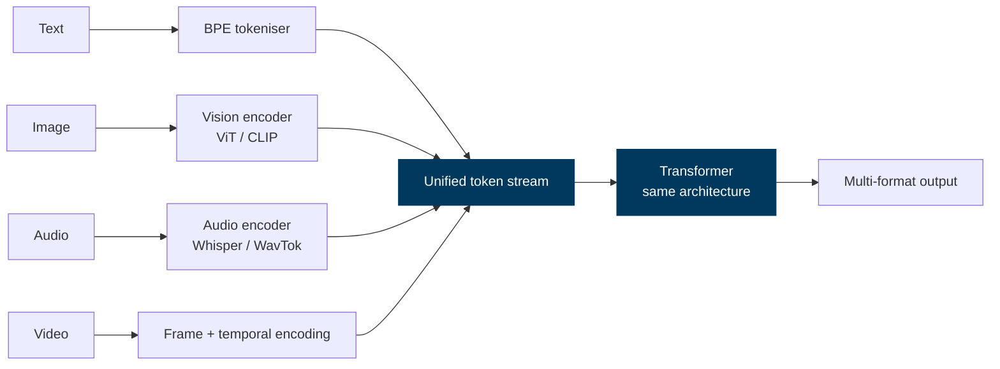

<div class="callout deep" style="margin-top: 0.4em;">
  <div class="title">The unification trick</div>
  Every modality gets converted to a sequence of tokens. The transformer doesn't care if they came from text, pixels, or audio samples — it just sees vectors. Modern frontier models (Gemini Omni, GPT-5.5, Claude with vision) train on interleaved multi-modal sequences from day one.
</div>

---
layout: default
---

# Vision encoders — turning pixels into tokens

<div class="cols-2" style="margin-top: 0.4em;">

<div>

### ViT — Vision Transformer

1. Split image into patches (e.g. 14×14 pixels)
2. Linearly project each patch to a vector — these are the "tokens"
3. Add positional embeddings (2D)
4. Feed into a standard transformer
5. Output features for downstream tasks

For multimodal LLMs, the ViT output is concatenated with text tokens. The text transformer then attends across both.

</div>

<div>

<div class="callout deep">
  <div class="title">CLIP — contrastive image-text</div>
  Trained on 400M image-text pairs from the web. Learns a <em>shared embedding space</em> where matching images and captions are near each other. The foundation for image search, generation guidance, and most multimodal LLMs.
</div>

<div class="callout amber" style="margin-top: 0.5em;">
  <div class="title">Native multimodal vs adapter</div>
  <strong>Native</strong> (Gemini, GPT-4o, Claude 4): trained on multi-modal from scratch. Best quality.<br/><strong>Adapter</strong> (LLaVA): bolt a vision encoder onto an existing text LLM. Cheaper, decent quality.
</div>

</div>

</div>

---
class: section
---

## Part 06

# Inference optimisation

Where the cost is. Where the latency is. Where the engineering matters most.

---
layout: default
---

# The two phases of inference

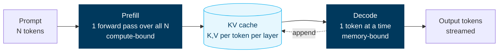

<div class="cols-2" style="margin-top: 0.4em;">

<div class="callout deep">
  <div class="title">Prefill — compute-bound</div>
  Process the whole prompt in parallel. Hits FLOPS peak. Optimised by FlashAttention, fused kernels. TTFT depends here.
</div>

<div class="callout deep">
  <div class="title">Decode — memory-bound</div>
  One token at a time. Bottleneck is <strong>reading the KV cache from HBM</strong>, not maths. Tokens/sec depends here. Why H100 → H200 → B100 matters: more memory bandwidth.
</div>

</div>

---
layout: default
---

# The optimisation toolkit

<div class="cols-2" style="margin-top: 0.4em;">

<div>

<div class="callout deep">
  <div class="title">FlashAttention</div>
  Tile the attention computation into GPU SRAM. Avoids materialising the n² matrix in HBM. 2–4× faster prefill, no quality loss. Standard.
</div>

<div class="callout deep" style="margin-top: 0.4em;">
  <div class="title">Continuous batching</div>
  Don't wait for the longest request in a batch to finish — swap in new requests as soon as one ends. 5–10× throughput. (vLLM, TGI, TensorRT-LLM.)
</div>

<div class="callout deep" style="margin-top: 0.4em;">
  <div class="title">Speculative decoding</div>
  Use a small "draft" model to predict 4-8 tokens ahead. Verify with the big model in one pass. ~2× decode speed when draft accuracy is high.
</div>

</div>

<div>

<div class="callout deep">
  <div class="title">KV cache management</div>
  <strong>PagedAttention</strong> (vLLM) — manage KV like virtual memory pages, no fragmentation. <strong>Prompt caching</strong> — share KV across requests with same prefix. 10× cost reduction on shared prompts.
</div>

<div class="callout deep" style="margin-top: 0.4em;">
  <div class="title">Quantisation</div>
  Run inference in lower precision. FP16 → FP8 → INT8 → INT4. Each step halves memory and roughly doubles throughput. Quality drops at INT4 unless you use <strong>AWQ</strong> / <strong>GPTQ</strong>.
</div>

<div class="callout deep" style="margin-top: 0.4em;">
  <div class="title">Distillation</div>
  Train a small model to mimic a big one's outputs. Haiku 4.5 is roughly "distilled Sonnet 4.6" — near-frontier quality at 5–10× lower cost.
</div>

</div>

</div>

---
layout: default
---

# Latency vs throughput vs cost — the inference trilemma

<div style="margin-top: 0.4em;">

| Goal | What you trade | Mechanism |
|---|---|---|
| **Low latency** (TTFT &lt; 500ms) | Higher cost per token | Smaller batch, dedicated capacity, smaller model |
| **High throughput** (max tokens/sec/GPU) | Higher latency | Big batches, continuous batching, vLLM |
| **Low cost per token** | Higher latency | Batch API (24h), Flex tier, smaller model, distilled model |

</div>

<div class="cols-2" style="margin-top: 0.4em;">

<div class="callout green">
  <div class="title">Interactive chat</div>
  Optimise for <strong>low latency</strong>. Stream. Use prompt caching aggressively. Pay the premium.
</div>

<div class="callout green">
  <div class="title">Bulk processing</div>
  Optimise for <strong>cost</strong>. Batch API. Cheap model. Run overnight.
</div>

</div>

<div class="callout amber" style="margin-top: 0.4em;">
  <div class="title">A practical heuristic</div>
  Interactive UX → flagship + caching + streaming, accept high cost. Backend pipeline → mini/nano model + batch + caching, ~95% cost savings.
</div>

---
class: section
---

## Part 07

# RAG architecture

The retrieval system is where most production AI quality lives.

---
layout: default
---

# The RAG architecture in full

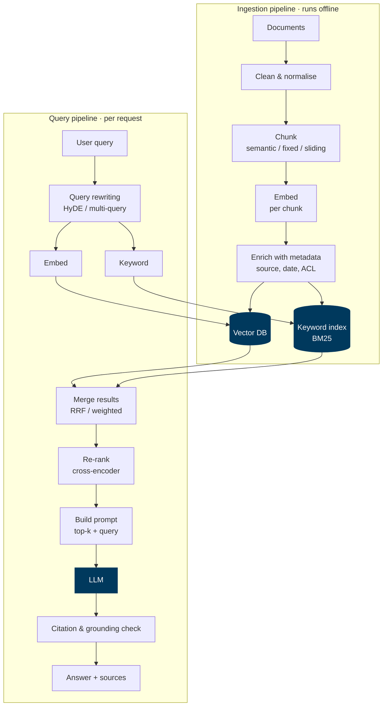

---
layout: default
---

# Chunking strategies — beyond "fixed size"

<div style="margin-top: 0.4em;">

| Strategy | How | When |
|---|---|---|
| **Fixed-size** | Split every N tokens with overlap | Baseline. Simple, works OK. |
| **Sentence / paragraph** | Respect natural boundaries | Better recall for prose |
| **Semantic chunking** | Embed and split on similarity dips | Best for documents with topic shifts |
| **Recursive** | Try section → para → sentence | Standard in LlamaIndex / LangChain |
| **Layout-aware** | Use PDF structure (headings, tables) | Critical for technical docs / contracts |
| **Hierarchical** | Store both chunks AND parent docs | Retrieve chunk, return parent for context |
| **Late chunking** | Embed whole doc, chunk the embeddings | Newer — preserves long-range context |

</div>

<div class="callout deep" style="margin-top: 0.4em;">
  <div class="title">No single right answer</div>
  Chunking is the #1 quality lever in RAG. Always test 2–3 strategies on your eval set before committing. Differences of 10-20% on recall@k are common.
</div>

---
layout: default
---

# Hybrid retrieval + re-rank — the modern default

<div class="cols-2" style="margin-top: 0.4em;">

<div>

### Hybrid search

| Method | Catches |
|---|---|
| **Vector (dense)** | Semantic similarity ("car" ≈ "automobile") |
| **BM25 (sparse)** | Exact terms (product codes, names) |

Combine via **Reciprocal Rank Fusion**:

$$
\text{RRF}(d) = \sum_{r \in \text{retrievers}} \frac{1}{k + \text{rank}_r(d)}
$$

k=60 is the standard. Always within 5% of optimal.

</div>

<div>

<div class="callout deep">
  <div class="title">Why re-rank</div>
  Retrievers are fast but imprecise. A <strong>cross-encoder re-ranker</strong> (Cohere Rerank, Voyage Rerank) reads each (query, candidate) pair together and scores. Slow but precise.<br/><br/>
  Pattern: retrieve top-50 (cheap, fast) → rerank to top-5 (precise) → feed top-5 to LLM.
</div>

<div class="callout green" style="margin-top: 0.5em;">
  <div class="title">Typical lift</div>
  Vector-only → +hybrid: <strong>5-10%</strong>.<br/>+ re-rank: another <strong>5-15%</strong>.<br/>The two together routinely double end-to-end accuracy.
</div>

</div>

</div>

---
layout: default
---

# Advanced patterns — when basic RAG isn't enough

<div class="cols-2" style="margin-top: 0.4em;">

<div>

<div class="callout deep">
  <div class="title">HyDE — Hypothetical Document Embeddings</div>
  Have the LLM generate a fake answer to the query. Embed that. Search with it. Often retrieves better than embedding the query alone (the fake answer looks more like the target document).
</div>

<div class="callout deep" style="margin-top: 0.4em;">
  <div class="title">Multi-query</div>
  Generate 3–5 paraphrases of the user query. Retrieve for each. Merge with RRF. Catches paraphrased phrasings the user didn't use.
</div>

<div class="callout deep" style="margin-top: 0.4em;">
  <div class="title">Agentic RAG</div>
  Let the LLM <em>choose</em> when to retrieve, what to retrieve, and when it has enough. Multi-step: retrieve → reflect → maybe retrieve more → answer.
</div>

</div>

<div>

<div class="callout deep">
  <div class="title">GraphRAG</div>
  Build a knowledge graph over your corpus (entities + relations) during ingestion. Query traverses the graph + retrieves chunks. Best for relationship-heavy questions ("who reports to whom", "which trades touched account X").
</div>

<div class="callout deep" style="margin-top: 0.4em;">
  <div class="title">Contextual retrieval</div>
  Anthropic technique: at ingestion, ask the LLM to add a 1-2 sentence context to each chunk explaining its role in the document. Dramatically improves retrieval on long documents.
</div>

<div class="callout amber" style="margin-top: 0.4em;">
  <div class="title">Don't reach for these first</div>
  Get hybrid + re-rank working with great chunking before adding these. Most teams discover their basic pipeline was the problem.
</div>

</div>

</div>

---
class: section
---

## Part 08

# Agents, skills, MCP

How LLMs go from chat to *doing things*.

---
layout: default
---

# Agent loop — anatomy

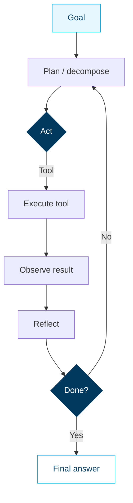

<div class="cols-2" style="margin-top: 0.4em;">

<div class="callout deep">
  <div class="title">Three failure modes — guard against each</div>
  <strong>Loops forever</strong> → max-iteration cap.<br/>
  <strong>Hallucinates tool results</strong> → schema-validate every tool call.<br/>
  <strong>Wanders off-task</strong> → re-anchor with goal in every system prompt.
</div>

<div class="callout amber">
  <div class="title">Where agents shine vs not</div>
  Shine: tasks with <strong>verifiable subgoals</strong> (compile, test pass, query returns rows). Struggle: open-ended creative tasks where "done" is subjective.
</div>

</div>

---
layout: default
---

# Sub-agents &amp; multi-agent orchestration

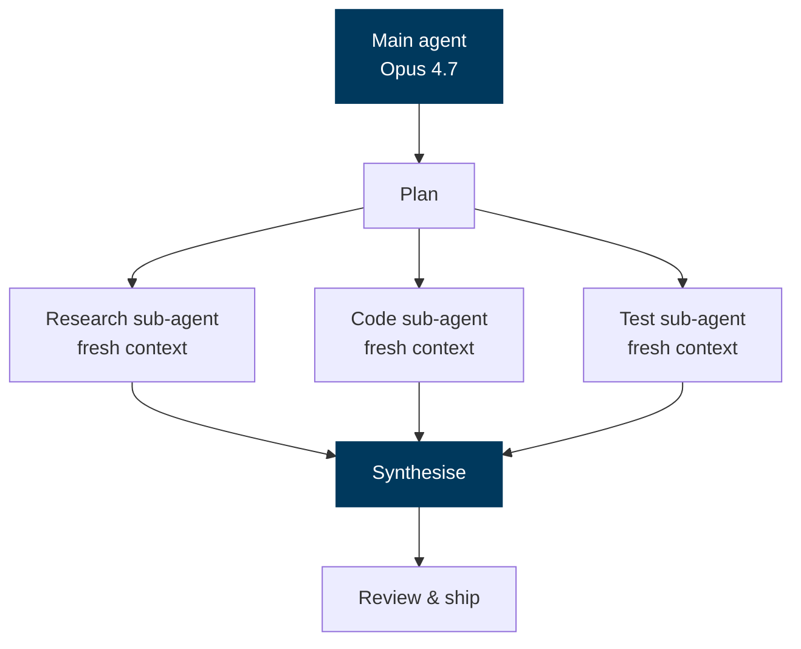

<div class="cols-3" style="margin-top: 0.4em;">

<div class="callout green">
  <div class="title">Context isolation</div>
  Each sub-agent gets a clean context window. Parent's window stays focused on coordination.
</div>

<div class="callout green">
  <div class="title">Parallel execution</div>
  Run sub-agents concurrently. Total wall-clock often closer to slowest sub-agent than sum.
</div>

<div class="callout green">
  <div class="title">Specialisation</div>
  Different sub-agents can have different system prompts, tool sets, even different models.
</div>

</div>

<div class="callout amber" style="margin-top: 0.4em;">
  <div class="title">The hidden cost</div>
  Multi-agent spend can be <strong>10–100× single-call</strong>. Worth it for hours of expert work, foolish for things one LLM call can answer.
</div>

---
layout: default
---

# Agent Skills — packaged playbooks

SKILL.md is an open standard for teaching agents how to approach specific tasks. Started in Claude Code (Oct 2025), opened to ecosystem (Dec 2025), now in 32+ tools.

<div class="cols-2" style="margin-top: 0.4em;">

<div>

```markdown
---
name: review-pr
description: Review a pull request for
  correctness, style, and missing tests.
---

## Process
1. Read the PR diff (`gh pr diff $PR`)
2. Identify changed files; read related tests
3. Check: correctness, edge cases, test
   coverage, security, perf regressions
4. Post inline comments on findings
5. Set "approved" or "request changes"

## Tools
- gh (GitHub CLI)
- read, grep, run-tests
```

</div>

<div>

<div class="callout deep">
  <div class="title">Skills vs tools vs MCP</div>
  <strong>Skill</strong> — playbook (process knowledge, markdown).<br/>
  <strong>Tool</strong> — single callable function (one turn).<br/>
  <strong>MCP server</strong> — bundle of related tools + resources.<br/>
  Compose: a skill orchestrates, an MCP delivers data, tools execute.
</div>

<div class="callout green" style="margin-top: 0.5em;">
  <div class="title">Why this matters</div>
  Encodes <strong>tribal knowledge</strong> ("how we review PRs here") into a portable artifact. Onboard new devs in a day. Update the skill once, every agent improves.
</div>

</div>

</div>

---
layout: default
---

# MCP — wire protocol for everything

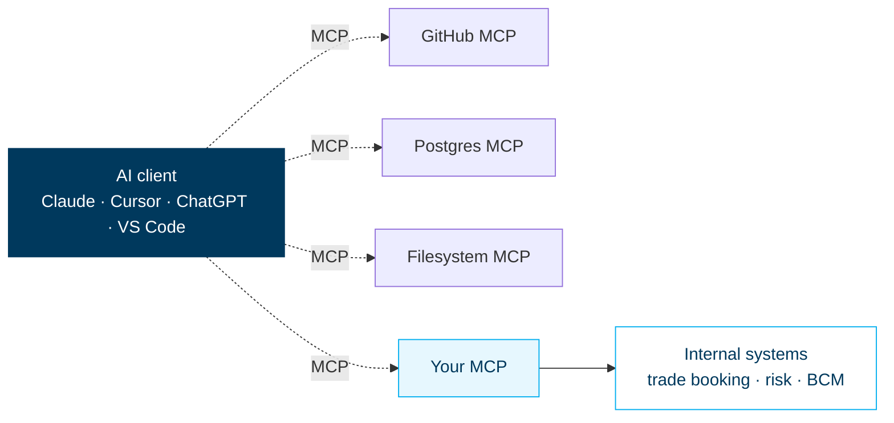

<div class="cols-2" style="margin-top: 0.4em;">

<div class="callout deep">
  <div class="title">Why it matters at scale</div>
  Write one MCP server → all your AI clients gain that capability. Solves the <strong>N clients × M tools</strong> integration explosion.
</div>

<div class="callout deep">
  <div class="title">Capabilities exposed</div>
  <strong>Tools</strong> (callable functions), <strong>resources</strong> (read-only data like docs), <strong>prompts</strong> (templated workflows), <strong>sampling</strong> (let the server call back to the LLM).
</div>

</div>

---
layout: default
---

# Computer use — agents that drive the screen

The frontier: let the agent take screenshots, click, type, scroll. No API needed — anywhere a human can work, the agent can.

<div class="cols-2" style="margin-top: 0.4em;">

<div>

### How it works

1. Agent gets a goal ("file my expense report")
2. Take a screenshot
3. Vision model parses what's on screen
4. LLM decides: click here, type this, scroll
5. Execute the action via OS-level driver
6. New screenshot → loop

Available via **Claude Computer Use**, **OpenAI Operator/CUA**, **Google Project Mariner**.

</div>

<div>

<div class="callout amber">
  <div class="title">Reality check</div>
  Impressive demos, brittle reality. Success rate ~50-70% on real-world tasks today. Expect rapid improvement through 2026-2027. Watch for it; don't bet a business on it yet.
</div>

<div class="callout red" style="margin-top: 0.5em;">
  <div class="title">Security implications</div>
  An agent that can use your computer can <strong>also be tricked</strong> into doing bad things via a malicious webpage. Always run in sandbox / VM. Treat any prompt-injection-reachable surface as untrusted.
</div>

</div>

</div>

---
class: section
---

## Part 09

# Evaluation & testing

You ship what you measure. If you don't measure, you ship vibes.

---
layout: default
---

# The evaluation pyramid

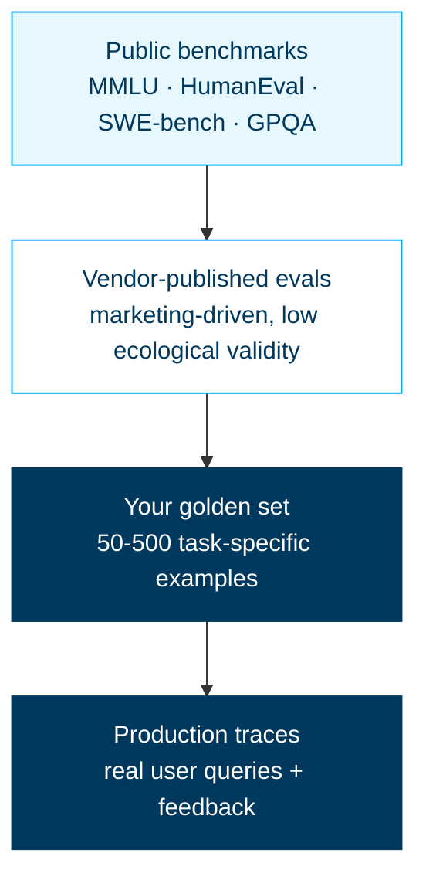

<div class="callout deep" style="margin-top: 0.4em;">
  <div class="title">The bottom of the pyramid is what actually matters</div>
  Public benchmarks tell you which model is generally better. <strong>Your golden set</strong> tells you which model is better <em>for your job</em>. Production traces tell you what's actually happening in the wild. Build all three.
</div>

---
layout: default
---

# Building a golden set

<div class="cols-2" style="margin-top: 0.4em;">

<div>

### The recipe

1. **Sample 100-500 real queries** from production logs (or, if pre-launch, write them)
2. **Stratify** — easy, medium, hard. Common topics + edge cases.
3. **Label** ideal responses (or ideal *behaviour*: "should refuse", "should ask clarifying question")
4. **Lock the set** — don't change it casually. If you change it, version it.
5. **Run on every prompt change, every model swap, every release**

</div>

<div>

<div class="callout deep">
  <div class="title">Eval design tips</div>
  <ul style="margin: 0.3em 0; padding-left: 1.2em;">
    <li>Mix deterministic ("returns this JSON") with rubric-based ("answer is accurate and concise, 1-5")</li>
    <li>Include refusal cases (model should refuse this)</li>
    <li>Include "ambiguous" cases (model should clarify)</li>
    <li>Track per-query score over time, not just averages — averages hide regressions on specific slices</li>
  </ul>
</div>

<div class="callout green" style="margin-top: 0.5em;">
  <div class="title">Tools</div>
  <strong>Braintrust · LangSmith · Phoenix · Promptfoo</strong> — all do this well. Pick one, integrate with CI, alert on regressions.
</div>

</div>

</div>

---
layout: default
---

# LLM-as-judge — at scale, with caveats

<div class="cols-2" style="margin-top: 0.4em;">

<div>

### The pattern

```python
judge_prompt = """
Grade the assistant's response (1-5):
- Accuracy
- Completeness
- Tone

Query: {query}
Assistant response: {answer}
Reference answer: {gold}

Return JSON: {scores: {...}, reasoning: "..."}
"""
```

Run a different vendor's model as judge (Sonnet judging GPT-5 output, or vice versa) to reduce same-model bias.

</div>

<div>

<div class="callout amber">
  <div class="title">Known biases</div>
  <ul style="margin: 0.3em 0; padding-left: 1.2em;">
    <li><strong>Length bias</strong> — judges prefer longer answers. Calibrate or normalise.</li>
    <li><strong>Self-preference</strong> — model prefers its own outputs. Use a different vendor as judge.</li>
    <li><strong>Position bias</strong> — in A/B comparisons, position matters. Randomise.</li>
    <li><strong>Drift</strong> — when the judge model updates, scores shift. Pin the judge version.</li>
  </ul>
</div>

<div class="callout red" style="margin-top: 0.5em;">
  <div class="title">Always have a human in the loop</div>
  Sample 10% of judgements weekly. Have a human grade them. If judge-vs-human agreement drops below 80%, retire that rubric.
</div>

</div>

</div>

---
class: section
---

## Part 10

# Production & observability

What changes when you go from notebook to platform.

---
layout: default
---

# The LLMOps stack

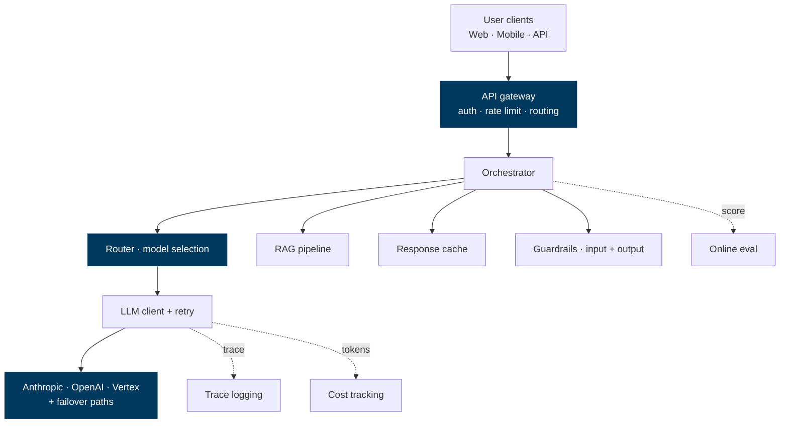

---
layout: default
---

# Tracing — OpenTelemetry, but for LLMs

Every request spawns a tree of spans: the orchestrator → retrieval → re-rank → LLM call → tool calls → final response. Each span has tokens, latency, cost, status.

<div class="cols-2" style="margin-top: 0.4em;">

<div>

### Per-span fields

<ul style="font-size: 0.78em; padding-left: 1em;">
  <li>request_id, parent_span_id, kind (retrieval / llm / tool)</li>
  <li>model, prompt_version, system_hash</li>
  <li>input_tokens, output_tokens, cache_read_tokens</li>
  <li>latency_ms, TTFT_ms</li>
  <li>cost_usd</li>
  <li>finish_reason (end_turn, tool_use, max_tokens, refusal)</li>
  <li>full prompt, full completion (sampled 1-5% in prod)</li>
</ul>

</div>

<div>

<div class="callout deep">
  <div class="title">Standards converging</div>
  OpenTelemetry GenAI semantic conventions (2024-2025) gave us a vendor-neutral schema. <strong>Langfuse</strong>, <strong>Arize Phoenix</strong>, <strong>LangSmith</strong>, <strong>Helicone</strong> all support it.
</div>

<div class="callout deep" style="margin-top: 0.5em;">
  <div class="title">Why it pays off</div>
  Debug "why was this answer bad?" by walking the trace. Aggregate to find regressions ("p95 retrieval latency doubled after the embedding model swap"). Bill-back to business units by tracking cost-per-tenant.
</div>

</div>

</div>

---
layout: default
---

# Cost governance — five guardrails

<div class="cols-2" style="margin-top: 0.4em;">

<div>

<div class="callout deep">
  <div class="title">1 · Per-tenant budgets</div>
  Hard cap per user/team/month. Block once exceeded — or downgrade silently to cheaper tier.
</div>

<div class="callout deep" style="margin-top: 0.4em;">
  <div class="title">2 · Anomaly detection</div>
  Alert when daily cost &gt;3σ above 30-day mean. Catches runaway loops, prompt bloat, infinite retries.
</div>

<div class="callout deep" style="margin-top: 0.4em;">
  <div class="title">3 · Cost dashboards by dimension</div>
  Slice by tenant, by feature, by model, by prompt-version. Find the 5% of traffic burning 50% of budget.
</div>

</div>

<div>

<div class="callout deep">
  <div class="title">4 · Cache-hit rate KPI</div>
  Track and alert. If your cache-hit rate drops below 60% on a workload that should be 90%, something changed in the prompt prefix.
</div>

<div class="callout deep" style="margin-top: 0.4em;">
  <div class="title">5 · Eval-gated prompt deploys</div>
  Every prompt change runs the golden set in CI. Must beat or match production on quality <strong>and</strong> stay within 10% of cost baseline.
</div>

<div class="callout green" style="margin-top: 0.4em;">
  <div class="title">The rule</div>
  If you can't show me the cost-per-feature dashboard, you're not in production — you're in beta.
</div>

</div>

</div>

---
layout: default
---

# Capacity planning — TPM, RPM, and bursts

<div class="cols-2" style="margin-top: 0.4em;">

<div>

### What vendors actually limit

| Limit | What | Typical default |
|---|---|---|
| **TPM** | Tokens-per-minute (input + output combined) | 400K-2M depending on tier |
| **RPM** | Requests-per-minute | 5K-50K |
| **TPD** | Tokens-per-day | varies |
| **Concurrent** | In-flight requests | 100-1000 |

Hit any of these → **429**. Your retry strategy decides whether users notice.

</div>

<div>

<div class="callout deep">
  <div class="title">For guaranteed throughput</div>
  <strong>Anthropic Priority Tier</strong> · <strong>OpenAI Scale Tier</strong> · <strong>OpenAI Reserved Capacity</strong> · <strong>Vertex Provisioned Throughput</strong>. Pay a premium for committed capacity — essential for SLA-bound workloads.
</div>

<div class="callout amber" style="margin-top: 0.5em;">
  <div class="title">Forecast quarterly</div>
  Token volume grows non-linearly with user adoption. Forecast 90 days out. Pre-negotiate Scale/Priority tier capacity 30-60 days before you need it.
</div>

</div>

</div>

---
class: section
---

## Part 11

# Safety, security &amp; quant methods

The "won't get you fired" content.

---
layout: default
---

# The threat model — six attack surfaces

<div class="cols-3" style="margin-top: 0.4em;">

<div class="callout red">
  <div class="title">1 · Prompt injection</div>
  Attacker hides instructions in data the LLM reads (email body, web page, PDF). Model follows them.
</div>

<div class="callout red">
  <div class="title">2 · Jailbreaks</div>
  Crafted user input that gets the model to violate its policies (roleplay, encoding tricks, multi-turn manipulation).
</div>

<div class="callout red">
  <div class="title">3 · Data exfiltration</div>
  Trick the model into outputting secrets it shouldn't (system prompts, retrieval contents, tool results).
</div>

<div class="callout red">
  <div class="title">4 · Tool abuse</div>
  Get the agent to call destructive tools (delete file, send email, transfer funds) it shouldn't.
</div>

<div class="callout red">
  <div class="title">5 · Hallucinated authority</div>
  Model confidently states wrong things. Users act on them. Especially dangerous in regulated contexts.
</div>

<div class="callout red">
  <div class="title">6 · Supply-chain risk</div>
  Compromised MCP server, malicious skill, poisoned fine-tune data.
</div>

</div>

---
layout: default
---

# Defences — layered

<div class="cols-2" style="margin-top: 0.4em;">

<div>

### Input controls

<ul style="font-size: 0.82em; padding-left: 1em;">
  <li><strong>PII scrubbing</strong> on logs (Presidio, custom regex)</li>
  <li><strong>Prompt-injection classifier</strong> (Lakera, Prompt Guard) on retrieved chunks <em>before</em> they reach the LLM</li>
  <li><strong>Length caps</strong> — block token bombs</li>
  <li><strong>Categorical filters</strong> — block disallowed topics pre-LLM</li>
  <li><strong>RAG source ACLs</strong> — only retrieve docs the requesting user can read</li>
</ul>

</div>

<div>

### Output controls

<ul style="font-size: 0.82em; padding-left: 1em;">
  <li><strong>Schema validation</strong> (Pydantic / Zod) — reject malformed output</li>
  <li><strong>Citation enforcement</strong> — reject RAG answers without citations</li>
  <li><strong>Content moderation</strong> on output (OpenAI Moderation API, custom)</li>
  <li><strong>Confirm before destructive tools</strong> — deterministic confirmation step for irreversible actions</li>
  <li><strong>Audit log everything</strong> — full prompt + completion for forensic review</li>
</ul>

</div>

</div>

<div class="callout deep" style="margin-top: 0.4em;">
  <div class="title">Defence-in-depth</div>
  No single defence is bulletproof. Stack input filters + model alignment + output filters + monitoring. Assume the model will eventually be tricked — design so that being tricked doesn't cause real harm.
</div>

---
layout: default
---

# Alignment &amp; constitutional AI

<div class="cols-2" style="margin-top: 0.4em;">

<div>

### What "alignment" means in practice

The model should be **helpful, honest, and harmless** — in roughly that order, but with hard limits on harm.

<ul style="font-size: 0.85em; padding-left: 1em;">
  <li>Follow user instructions where reasonable</li>
  <li>Refuse when reasonable</li>
  <li>Express uncertainty rather than hallucinate</li>
  <li>Refuse to help with clear misuse (CSAM, bioweapons, CBRN)</li>
  <li>Calibrate refusals — don't refuse benign requests just because they touch a sensitive topic</li>
</ul>

</div>

<div>

<div class="callout deep">
  <div class="title">Constitutional AI (Anthropic)</div>
  Use a written "constitution" of principles. During training, the model critiques its own outputs against the constitution and revises. Scales human preference data via self-supervision.
</div>

<div class="callout deep" style="margin-top: 0.5em;">
  <div class="title">Where alignment is hard</div>
  Dual-use research, jurisdictional differences in what's legal, sensitive but legitimate topics (security research, harm reduction, regulated advice). Different vendors draw lines differently — test for your use case.
</div>

</div>

</div>

---
layout: default
---

# Regulation landscape — what to track

<div style="margin-top: 0.4em;">

| Regime | Status | What it means for builders |
|---|---|---|
| **EU AI Act** | In force (phased: 2025-2027) | Risk classification. "High-risk" AI (HR, credit, education) needs conformity assessment, data governance, transparency. |
| **US Executive Order on AI** | Active (rev 2024-2025) | Frontier model reporting, safety testing, supply chain security |
| **UK AI Safety Institute** | Active | Pre-deployment evals on frontier models. Sector-by-sector approach. |
| **NIST AI Risk Management Framework** | Voluntary US standard | The de facto baseline for enterprise governance |
| **ISO 42001** | International standard | AI management system, like ISO 27001 for security |
| **Sector-specific** (financial, medical, legal) | Varies | Existing regulators (FCA, PRA, FDA, etc.) are issuing AI-specific guidance |

</div>

<div class="callout amber" style="margin-top: 0.4em;">
  <div class="title">Tactical advice</div>
  Map every LLM-powered feature to its risk tier under EU AI Act <em>before</em> launch. Most internal-use cases fall in "limited risk" (transparency obligations only). External customer-facing in regulated industries needs more work.
</div>

---
layout: default
---

# Quantitative methods — when LLMs meet stats

The non-obvious technical layer: making sense of LLM behaviour using classical statistics.

<div class="cols-2" style="margin-top: 0.4em;">

<div>

### Where stats shows up

<ul style="font-size: 0.85em; padding-left: 1em;">
  <li><strong>A/B testing prompt changes</strong> — paired t-test on score deltas across a golden set. Beware multiple comparisons.</li>
  <li><strong>Win-rate analysis</strong> — bootstrap CIs on pairwise model preferences. Bradley-Terry models for &gt;2 models.</li>
  <li><strong>Power analysis</strong> — how many samples do you need to detect a 2% quality drop?</li>
  <li><strong>Calibration plots</strong> — does the model's confidence match its accuracy?</li>
  <li><strong>Causal inference</strong> — did the prompt change <em>cause</em> the lift, or was it the seasonality?</li>
</ul>

</div>

<div>

<div class="callout deep">
  <div class="title">Why eyeballing isn't enough</div>
  LLM outputs are noisy. Two runs of the same model on the same prompt vary. Without statistical rigour, you'll mistake noise for signal — promote a "better" prompt that's actually within sampling error.
</div>

<div class="callout green" style="margin-top: 0.5em;">
  <div class="title">The minimum bar</div>
  Every A/B prompt test: <strong>n ≥ 50</strong>, paired (same queries through both prompts), report effect size + 95% CI. If you can't reject H₀ (no difference) at p &lt; 0.05, ship the cheaper option.
</div>

</div>

</div>

---
class: section
---

## Part 12

# Synthesis

What to remember from all of this.

---
layout: default
---

# Twelve principles to take away

<div class="cols-2" style="margin-top: 0.4em;">

<div>

<div class="callout deep">
  <div class="title">01 · Transformers are tokens + attention + MLP</div>
  Everything else is engineering. Understand the core, the rest is detail.
</div>

<div class="callout deep" style="margin-top: 0.35em;">
  <div class="title">02 · RoPE + GQA + FlashAttention</div>
  The three reasons frontier models can do 1M context economically. Watch their successors.
</div>

<div class="callout deep" style="margin-top: 0.35em;">
  <div class="title">03 · Pre-training is 95% of the cost</div>
  Everything after — SFT, RLHF, LoRA — is comparatively cheap.
</div>

<div class="callout deep" style="margin-top: 0.35em;">
  <div class="title">04 · Reasoning models scale test-time compute</div>
  More inference compute → better answers on hard problems. New scaling axis.
</div>

<div class="callout deep" style="margin-top: 0.35em;">
  <div class="title">05 · Multimodal = same transformer, more tokenisers</div>
  Architecture is unified. The advance is the data and the tokenisers.
</div>

<div class="callout deep" style="margin-top: 0.35em;">
  <div class="title">06 · Decode is memory-bound</div>
  Memory bandwidth, not FLOPS, sets your tokens-per-second ceiling.
</div>

</div>

<div>

<div class="callout deep">
  <div class="title">07 · Hybrid retrieval + re-rank is the default</div>
  Vector alone is amateur hour. Combine, then cross-encoder rerank.
</div>

<div class="callout deep" style="margin-top: 0.35em;">
  <div class="title">08 · Agents need budgets &amp; verifiable subgoals</div>
  Cap iterations. Have a way to know "done". Otherwise: chaos.
</div>

<div class="callout deep" style="margin-top: 0.35em;">
  <div class="title">09 · Skills + MCP + tools compose</div>
  Skills are playbooks · MCP is data · tools execute. Don't conflate.
</div>

<div class="callout deep" style="margin-top: 0.35em;">
  <div class="title">10 · No production without observability</div>
  Tracing, cost dashboards, eval-gated deploys, alerts. Non-negotiable.
</div>

<div class="callout deep" style="margin-top: 0.35em;">
  <div class="title">11 · Defence-in-depth</div>
  Input filters + alignment + output filters + audit. Single layers fail.
</div>

<div class="callout deep" style="margin-top: 0.35em;">
  <div class="title">12 · Stats on every prompt change</div>
  n ≥ 50, paired, effect size + CI. Otherwise you're shipping noise.
</div>

</div>

</div>

---
class: cover
---

<div>

<div class="eyebrow">Questions &amp; discussion</div>

# Thank you

<p style="font-size: 1.1em; margin-top: 0.6em;">Full playbook · <strong>ai-playbook-9y9.pages.dev</strong></p>

<p style="margin-top: 1.4em; font-size: 0.85em; opacity: 0.7; max-width: 600px;">
  Edition III is the technical depth layer. For day-to-day use, return to <strong>Edition I — Foundations</strong>. For building systems, see <strong>Edition II — Builder</strong>. For breaking changes and "what's new", the playbook's <em>Research</em> section is updated continuously.
</p>

</div>
