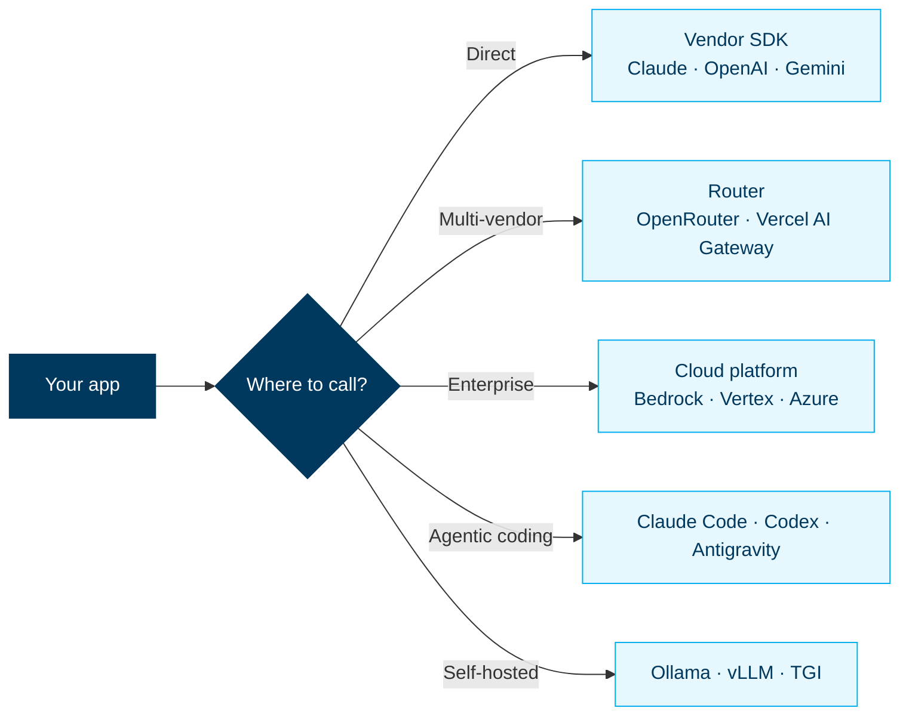
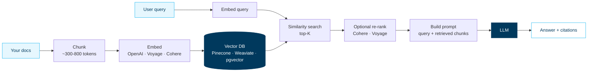
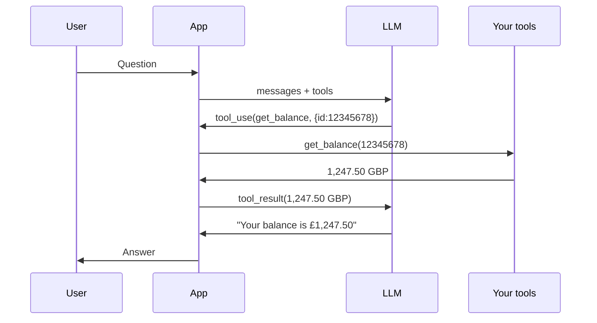
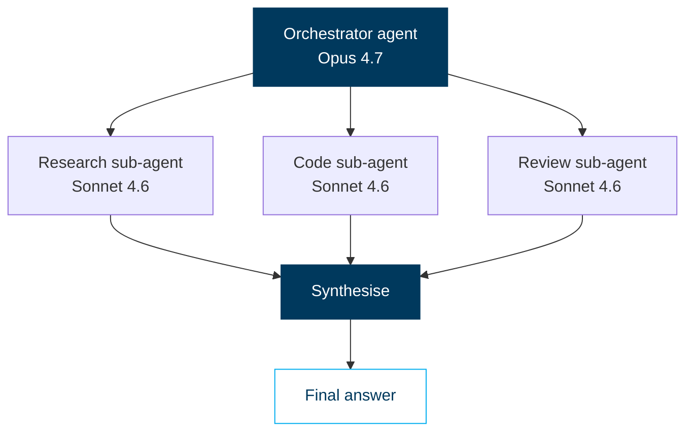
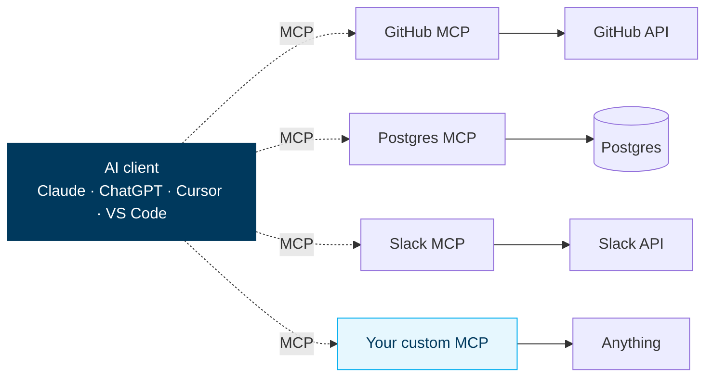
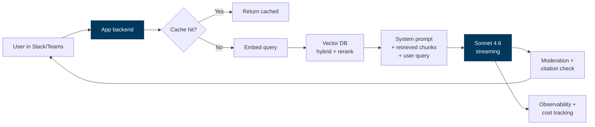
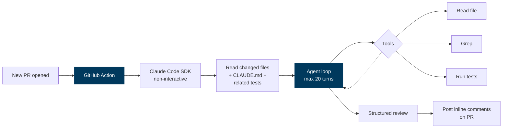
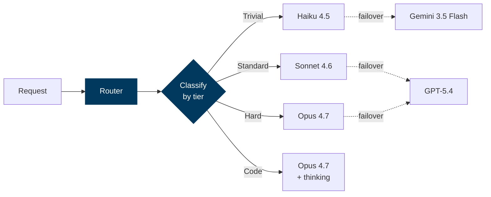

<div>

<div class="eyebrow">AI Playbook · Edition II</div>

# Building with LLMs

Beyond chat. How to architect, prompt, retrieve, orchestrate, and ship LLM-powered systems that actually hold up in production.

<div style="position: absolute; bottom: 60px; left: 80px; font-size: 0.8em; opacity: 0.6;">
  Intermediate edition · Internal · 2026
</div>

</div>

---
layout: default
---

# What we'll cover

<div class="cols-3" style="margin-top: 0.6em;">

<div class="card">
  <div class="card-title"><span class="pill">01</span> The builder stack</div>
  <div class="card-body">APIs, SDKs, routers. Pick the right surface for your problem.</div>
</div>

<div class="card">
  <div class="card-title"><span class="pill">02</span> Prompt engineering</div>
  <div class="card-body">System prompts, few-shot, structure, chain-of-thought, output constraints.</div>
</div>

<div class="card">
  <div class="card-title"><span class="pill">03</span> Context economy</div>
  <div class="card-body">Tokens, context windows, prompt caching, batch &amp; flex tiers.</div>
</div>

<div class="card">
  <div class="card-title"><span class="pill">04</span> Retrieval (RAG)</div>
  <div class="card-body">Chunking, embeddings, vector DBs, hybrid search, re-ranking.</div>
</div>

<div class="card">
  <div class="card-title"><span class="pill">05</span> Tools &amp; function calling</div>
  <div class="card-body">Letting the model call your code. Schema design, error handling.</div>
</div>

<div class="card">
  <div class="card-title"><span class="pill">06</span> Agents &amp; orchestration</div>
  <div class="card-body">Single-shot vs loops vs multi-agent. Skills, sub-agents, when to use what.</div>
</div>

<div class="card">
  <div class="card-title"><span class="pill">07</span> MCP &amp; integrations</div>
  <div class="card-body">Open standard for connecting AI to tools, data, and services.</div>
</div>

<div class="card">
  <div class="card-title"><span class="pill">08</span> Frameworks</div>
  <div class="card-body">LangChain, LlamaIndex, DSPy, Vercel AI SDK. When to use, when to skip.</div>
</div>

<div class="card">
  <div class="card-title"><span class="pill">09</span> Production &amp; cost</div>
  <div class="card-body">Streaming, observability, eval, cost optimisation, rate limits.</div>
</div>

</div>

---
class: section
---

## Part 01

# The builder stack

Five surfaces. Pick the one that matches your problem.

---
layout: default
---

# Five places to call an LLM



<div class="callout deep" style="margin-top: 0.6em;">
  <div class="title">Default recommendation</div>
  Start with a <strong>vendor SDK</strong> (Anthropic Python, OpenAI Python). Add a <strong>router</strong> when you outgrow one vendor. Move to <strong>cloud platform</strong> when compliance/procurement requires it. Self-host only when privacy or cost demands it.
</div>

---
layout: default
---

# SDK starter — three vendors, one shape

<div class="cols-3" style="margin-top: 0.4em;">

<div>

### Claude (Python)

```python
from anthropic import Anthropic

client = Anthropic()
msg = client.messages.create(
    model="claude-sonnet-4-6",
    max_tokens=1024,
    messages=[
        {"role": "user",
         "content": "Hello"}
    ],
)
print(msg.content[0].text)
```

</div>

<div>

### OpenAI (Python)

```python
from openai import OpenAI

client = OpenAI()
resp = client.responses.create(
    model="gpt-5.4",
    input="Hello",
)
print(resp.output_text)
```

</div>

<div>

### Gemini (Python)

```python
from google import genai

client = genai.Client()
resp = client.models.generate_content(
    model="gemini-3.5-flash",
    contents="Hello",
)
print(resp.text)
```

</div>

</div>

<div class="callout amber" style="margin-top: 0.8em;">
  <div class="title">Shape, not syntax</div>
  All three are <strong>request/response with a model ID</strong>. Once you understand the shape — messages, system prompt, tools, streaming — switching vendors is a 30-minute job. Don't over-invest in abstraction libraries early.
</div>

---
class: section
---

## Part 02

# Prompt engineering

Five techniques that move the needle. The rest is folklore.

---
layout: default
---

# The five techniques that compound

<div class="cols-2" style="margin-top: 0.4em;">

<div>

<div class="callout deep">
  <div class="title">1 · System prompt = persistent instructions</div>
  Sets the model's role, tone, constraints, and output format <strong>once</strong>. Cached automatically — costs ~10× less than putting it in every user turn.
</div>

<div class="callout deep" style="margin-top: 0.5em;">
  <div class="title">2 · Few-shot examples &gt; descriptions</div>
  Showing 2-5 input/output examples beats <em>describing</em> the desired behaviour in 200 words. Models pattern-match faster than they follow instructions.
</div>

<div class="callout deep" style="margin-top: 0.5em;">
  <div class="title">3 · Structured output</div>
  Use JSON schema (Anthropic <code>tool_use</code>, OpenAI <code>response_format</code>, Gemini <code>responseSchema</code>) instead of asking for JSON in plain English. 100% schema-valid, no regex parsing.
</div>

</div>

<div>

<div class="callout deep">
  <div class="title">4 · Chain-of-thought / thinking modes</div>
  For complex reasoning, ask the model to <em>think step by step</em> or enable <strong>extended thinking</strong> (Claude) / <strong>reasoning effort</strong> (GPT-5). Slower &amp; pricier — only for problems that need it.
</div>

<div class="callout deep" style="margin-top: 0.5em;">
  <div class="title">5 · Negative examples</div>
  "Don't do X — here's what wrong looks like" beats just "do Y". Models calibrate the boundary more reliably than they internalise a positive description.
</div>

<div class="callout amber" style="margin-top: 0.5em;">
  <div class="title">What doesn't compound</div>
  Magic phrases ("you are an expert", "take a deep breath"), prompt-engineering "tricks" from 2023, obsessing over wording when a worked example would solve it.
</div>

</div>

</div>

---
layout: default
---

# Anatomy of a production prompt

```text
┌─ System ──────────────────────────────────────────────────────┐
│ You are a SQL analyst for an investment bank.                 │
│ Output: a single PostgreSQL query, no commentary.             │
│ Constraints: use only the schemas in <schema>...</schema>.    │
│ If the request is ambiguous, return a clarifying question     │
│ inside <clarify>...</clarify> tags.                           │
│                                                                │
│ <schema>{{schema_xml}}</schema>                               │
│                                                                │
│ <examples>                                                     │
│ User: top 10 counterparties by exposure                       │
│ Assistant: SELECT counterparty, SUM(exposure) ...             │
│ </examples>                                                    │
└────────────────────────────────────────────────────────────────┘
┌─ User ────────────────────────────────────────────────────────┐
│ trades over $10m last week, grouped by desk                   │
└────────────────────────────────────────────────────────────────┘
```

<div class="cols-3" style="margin-top: 0.6em;">

<div class="callout green">
  <div class="title">Role first</div>
  Tells the model what hat to wear. Highest-leverage line.
</div>

<div class="callout green">
  <div class="title">Output format upfront</div>
  Removes ambiguity. Saves a turn of "now in JSON please".
</div>

<div class="callout green">
  <div class="title">XML tags for sections</div>
  All three vendors recognise XML-style tags. More reliable than markdown headings.
</div>

</div>

---
class: section
---

## Part 03

# Context economy

Tokens are money. Context is a budget — spend it well.

---
layout: default
---

# What fits in 1M tokens

<div class="cols-3" style="margin-top: 0.6em;">

<div class="metric">
  <div class="num">~750K</div>
  <div class="label">English words</div>
</div>

<div class="metric">
  <div class="num">~3,000</div>
  <div class="label">Pages of text</div>
</div>

<div class="metric">
  <div class="num">~200K</div>
  <div class="label">Lines of code</div>
</div>

</div>

<div style="margin-top: 1em;">

| Workload | Tokens needed | Fits in… |
|---|---|---|
| One chat turn | ~500 | Anything |
| One research paper (PDF) | 8,000–20,000 | All tiers |
| Full API documentation (Stripe) | ~80,000 | Anything but Haiku-200K |
| Whole novel (War & Peace) | ~580,000 | 1M only |
| Mid-size codebase | 200,000–800,000 | Sonnet 4.6, Opus 4.7, Gemini 3 |
| Day's worth of meeting transcripts | 100,000–500,000 | Sonnet/Opus/Gemini |
| Multi-document RAG context | 5,000–50,000 | All tiers (recommended) |

</div>

<div class="callout amber" style="margin-top: 0.6em;">
  <div class="title">"Just put it all in context"</div>
  Tempting because it works. But <strong>long context degrades attention</strong>: facts in the middle get missed ("lost in the middle" effect). RAG with 5K-token contexts often beats 500K-token dump for retrieval accuracy.
</div>

---
layout: default
---

# The three cost levers — combined, up to 95% off

<div class="cols-3" style="margin-top: 0.6em;">

<div class="card">
  <div class="card-title"><span class="pill">1</span> Prompt caching</div>
  <div class="card-body">
    Cache reads cost <strong>10% of input price</strong> (90% off). Best for repeated system prompts, schema, or long documents shared across calls.<br/><br/>
    <strong>When:</strong> any time the same prefix is sent twice within ~5 min.
  </div>
</div>

<div class="card">
  <div class="card-title"><span class="pill">2</span> Batch API</div>
  <div class="card-body">
    Async processing at <strong>50% off</strong> all token costs. Completes within 24h.<br/><br/>
    <strong>When:</strong> non-urgent workloads — overnight backfills, bulk classification, eval runs.
  </div>
</div>

<div class="card">
  <div class="card-title"><span class="pill">3</span> Model routing</div>
  <div class="card-body">
    Use a <strong>nano/mini</strong> for easy turns, flagship only when needed. Often 30–70% saved.<br/><br/>
    <strong>When:</strong> chatbots with mixed complexity, classify-then-route pipelines.
  </div>
</div>

</div>

<div class="callout green" style="margin-top: 0.8em;">
  <div class="title">Stacking example</div>
  System prompt 50K tokens, batch run of 10K conversations:<br/>
  <strong>List price:</strong> $25/M × 50K × 10K = $12,500.<br/>
  <strong>With caching (90%) + Batch (50%):</strong> ~$625. <strong>95% saved.</strong>
</div>

---
class: section
---

## Part 04

# Retrieval-augmented generation

Give the model relevant context at query time.

---
layout: default
---

# RAG in one diagram



<div class="callout deep" style="margin-top: 0.5em;">
  <div class="title">When to choose RAG over long context</div>
  RAG wins when: docs change frequently, corpus is &gt;1M tokens, you need citations, you need source filtering by metadata (date, author, security clearance).
</div>

---
layout: default
---

# RAG quality lives in the chunks

The retrieval step is where most RAG systems fail. Three knobs decide quality.

<div class="cols-3" style="margin-top: 0.6em;">

<div class="card">
  <div class="card-title"><span class="pill">A</span> Chunk size</div>
  <div class="card-body">
    <strong>Too small (&lt;100 tokens):</strong> loses context.<br/>
    <strong>Too big (&gt;1500):</strong> dilutes relevance, harder to retrieve.<br/>
    <strong>Sweet spot:</strong> 300–800 tokens. Overlap 50–100.
  </div>
</div>

<div class="card">
  <div class="card-title"><span class="pill">B</span> Embedding model</div>
  <div class="card-body">
    Don't default to <code>text-embedding-3-small</code>. Test <strong>Voyage</strong> (best general), <strong>Cohere v4</strong> (multilingual), or <strong>BGE-M3</strong> (open). 5–15% retrieval accuracy gap is common.
  </div>
</div>

<div class="card">
  <div class="card-title"><span class="pill">C</span> Hybrid + re-rank</div>
  <div class="card-body">
    Combine <strong>vector search</strong> with <strong>BM25/keyword</strong> (hybrid). Re-rank top-50 down to top-5 with a cross-encoder (Cohere Rerank). Almost always worth it.
  </div>
</div>

</div>

<div class="callout amber" style="margin-top: 0.6em;">
  <div class="title">Evaluate retrieval before generation</div>
  Build a small set of (question → ideal source chunks) pairs. Measure <strong>recall@5</strong> for retrieval <em>before</em> debugging the LLM's answer. 80% of "the LLM hallucinated" is "the retrieval missed".
</div>

---
layout: default
---

# Vector DB selection — the short list

<div style="margin-top: 0.4em;">

| Database | Best for | Hosted? | Cost shape |
|---|---|---|---|
| **pgvector** (Postgres extension) | Already use Postgres, &lt; 10M vectors | Self-host or managed PG | Existing infra — almost free |
| **Pinecone** | Fast time-to-prod, &lt; 100M vectors | Fully managed | Per-pod/serverless |
| **Weaviate** | Hybrid search built-in, multimodal | Self-host or cloud | Generous open source |
| **Qdrant** | Self-host, Rust-fast, filters | Self-host or cloud | Open source |
| **Milvus** | Billion-scale | Self-host | Open source, complex ops |
| **Turbopuffer** | Cheapest at scale, S3-backed | Managed | Per-namespace, very low |
| **Vespa** | Web-scale ranking | Self-host | Yahoo-grade, steep learning |

</div>

<div class="callout deep" style="margin-top: 0.6em;">
  <div class="title">Default pick</div>
  <strong>pgvector</strong> if you have Postgres and &lt; 5M vectors. <strong>Pinecone</strong> serverless if not. Migrate later if you outgrow either — most teams never do.
</div>

---
class: section
---

## Part 05

# Tools & function calling

Let the model call your code — safely.

---
layout: default
---

# Tools = JSON schema + your function

```python
tools = [{
  "name": "get_account_balance",
  "description": "Retrieve current balance for a given account ID",
  "input_schema": {
    "type": "object",
    "properties": {
      "account_id": {"type": "string", "description": "8-digit account ID"},
      "currency": {"type": "string", "enum": ["GBP","USD","EUR"]}
    },
    "required": ["account_id"]
  }
}]

msg = client.messages.create(
    model="claude-sonnet-4-6",
    tools=tools,
    messages=[{"role":"user","content":"What's balance on 12345678 in GBP?"}],
)
# msg.content[0] → ToolUseBlock(name='get_account_balance', input={...})
```

<div class="cols-2" style="margin-top: 0.6em;">

<div class="callout green">
  <div class="title">What works</div>
  Tight schemas · descriptive names · enum-constrained args · 5–20 tools per request.
</div>

<div class="callout red">
  <div class="title">What breaks</div>
  Vague descriptions · overlapping tools · 50+ tools (the model gets lost) · free-text args where an enum would do.
</div>

</div>

---
layout: default
---

# Tool-use loop — the actual pattern



<div class="cols-2" style="margin-top: 0.4em;">

<div class="callout deep">
  <div class="title">Multi-tool turns</div>
  The model can call <strong>multiple tools in one turn</strong> (Claude/GPT-5 do this well). Run them in parallel, return all results, loop. Cuts latency materially.
</div>

<div class="callout amber">
  <div class="title">Stop conditions matter</div>
  Always cap loop depth (e.g. 10 turns). Always set a budget (max tokens, max wall-clock). Without these, a confused model will loop forever and bankrupt you.
</div>

</div>

---
class: section
---

## Part 06

# Agents & orchestration

When a single call isn't enough. Three patterns, in order of complexity.

---
layout: default
---

# The three orchestration patterns

<div class="cols-3" style="margin-top: 0.4em;">

<div class="card">
  <div class="card-title"><span class="pill">1</span> Single call + tools</div>
  <div class="card-body">
    One LLM call with tools. Model decides which tools to use, you execute, return results, model writes final answer.<br/><br/>
    <strong>Use for:</strong> Q&amp;A with data lookup, simple workflows.<br/>
    <strong>Cost:</strong> 1–3 LLM calls. Predictable.
  </div>
</div>

<div class="card">
  <div class="card-title"><span class="pill">2</span> Loop / ReAct agent</div>
  <div class="card-body">
    Model loops: think → act → observe → think… until done. You set a max-iterations cap.<br/><br/>
    <strong>Use for:</strong> coding agents, research agents, browsing.<br/>
    <strong>Cost:</strong> 5–50 LLM calls. Variable. Budget required.
  </div>
</div>

<div class="card">
  <div class="card-title"><span class="pill">3</span> Multi-agent / orchestrator</div>
  <div class="card-body">
    Parent agent spawns specialised sub-agents (one for research, one for coding, one for review). Coordinates results.<br/><br/>
    <strong>Use for:</strong> complex projects, parallel work.<br/>
    <strong>Cost:</strong> 50–500+ LLM calls. Most expensive, most powerful.
  </div>
</div>

</div>

<div class="callout deep" style="margin-top: 0.7em;">
  <div class="title">Start at #1 — escalate only when measurably needed</div>
  Most "agent" problems are pattern #1 in disguise. Don't reach for multi-agent until you've built and measured #1 and #2 first. Multi-agent introduces coordination failure modes you'll be debugging for weeks.
</div>

---
layout: default
---

# Skills = packaged playbooks for agents

Agent Skills (SKILL.md) is an open standard for teaching coding agents how to approach specific tasks. Started in Claude Code, now supported by 32+ tools.

<div class="cols-2" style="margin-top: 0.4em;">

<div>

```markdown
---
name: generate-migration
description: Generate database migration
  files for schema changes
---

## Process
1. Read the schema change request
2. Check existing migrations for
   naming convention
3. Generate the up/down migration files
4. Run `npm run migrate:check`
5. Commit with message:
   "migration: {description}"
```

</div>

<div>

<div class="callout deep">
  <div class="title">Skills vs MCP vs Tools</div>
  <strong>Skills</strong> = playbooks (process knowledge — markdown). <strong>MCP</strong> = verbs (live data + actions — code). <strong>Tools</strong> = single function calls within one turn. They compose: a skill orchestrates, an MCP delivers, a tool executes.
</div>

<div class="callout amber" style="margin-top: 0.5em;">
  <div class="title">Where they live</div>
  Project-level: <code>.claude/skills/</code> (shared via git).<br/>
  User-level: <code>~/.claude/skills/</code> (your machine).<br/>
  Same convention works for OpenAI Codex (<code>.codex/skills/</code>).
</div>

</div>

</div>

---
layout: default
---

# Sub-agents — when one mind isn't enough

A sub-agent is a child LLM instance spawned by an orchestrator. Each gets its own fresh context window.

<div class="cols-2" style="margin-top: 0.4em;">

<div>



</div>

<div>

<div class="callout deep">
  <div class="title">Why spawn?</div>
  <ul style="margin: 0.3em 0; padding-left: 1.2em;">
    <li><strong>Context isolation</strong> — sub-agent's noise doesn't pollute the parent's window</li>
    <li><strong>Parallel work</strong> — fan out research / code / tests simultaneously</li>
    <li><strong>Specialisation</strong> — different system prompts, different tool sets</li>
  </ul>
</div>

<div class="callout amber" style="margin-top: 0.5em;">
  <div class="title">Cost reality</div>
  Multi-agent spend can be <strong>10–20× single-call</strong>. Worth it for hours of expert work, foolish for things one LLM call can answer.
</div>

</div>

</div>

---
class: section
---

## Part 07

# MCP — Model Context Protocol

The open standard for connecting AI to your tools, data, and services.

---
layout: default
---

# What MCP is, in one slide

MCP is a **wire protocol** (Anthropic, Nov 2024 — now open, multi-vendor). Your AI client talks to MCP servers; servers expose tools, resources, and prompts.



<div class="cols-2" style="margin-top: 0.4em;">

<div class="callout green">
  <div class="title">Why it matters</div>
  Write integration once → works across <strong>all MCP-supporting clients</strong>. Stops the N×M integration explosion.
</div>

<div class="callout deep">
  <div class="title">Existing ecosystem</div>
  100+ public MCP servers: GitHub, GitLab, Slack, Notion, Linear, Figma, Filesystem, Postgres, BigQuery, AWS, Stripe.
</div>

</div>

---
layout: default
---

# Building your own MCP server — 30 lines

```python
from mcp.server.fastmcp import FastMCP

mcp = FastMCP("trade-lookup")

@mcp.tool()
def lookup_trade(trade_id: str) -> dict:
    """Look up a trade by ID."""
    return db.query("SELECT * FROM trades WHERE id = ?", trade_id)

@mcp.tool()
def list_trades(desk: str, since: str) -> list:
    """List trades for a desk since a date (YYYY-MM-DD)."""
    return db.query(
        "SELECT * FROM trades WHERE desk=? AND ts >= ?",
        desk, since
    )

if __name__ == "__main__":
    mcp.run()
```

<div class="callout deep" style="margin-top: 0.6em;">
  <div class="title">Wire it up</div>
  Add to <code>claude_desktop_config.json</code> (or equivalent). The model now has these two tools available — across Claude Desktop, Claude Code, Cursor, ChatGPT, and any other MCP-aware client.
</div>

---
class: section
---

## Part 08

# Frameworks

When to use one. When you don't need one.

---
layout: default
---

# The framework landscape

<div style="margin-top: 0.4em;">

| Framework | Strength | Use when… | Watch out |
|---|---|---|---|
| **Vercel AI SDK** | TS-first, streaming, React hooks | Building a Next.js/Remix UI with chat | Less batteries-included than Python |
| **LangChain** | Most integrations, biggest ecosystem | You need a quick prototype across many vendors/tools | Heavy abstractions, frequent breaking changes |
| **LlamaIndex** | RAG-first, data connectors, query engines | Data-heavy RAG with diverse sources | Less general-purpose than LangChain |
| **DSPy** | Compile prompts as programs, optimise via metrics | You want to <em>optimise</em> prompts not write them | Steeper learning curve, smaller community |
| **Haystack** | Production NLP, pipelines | Search-heavy, enterprise NLP pipelines | Less LLM-first than peers |
| **Pydantic AI** | Type-safe agents in Python | You want strong typing + minimal magic | Newer, smaller ecosystem |
| **None (raw SDK)** | Full control, zero abstraction | Most production systems past v1 | You write more boilerplate |

</div>

<div class="callout amber" style="margin-top: 0.6em;">
  <div class="title">Common pattern</div>
  Prototype with a framework (fast). Re-write hot paths in raw SDK (clearer, smaller deps, easier to debug). Most mature production systems use the SDK plus a thin internal wrapper.
</div>

---
class: section
---

## Part 09

# Production & cost

What changes when you go past your laptop.

---
layout: default
---

# Streaming, retries, and rate limits

<div class="cols-2" style="margin-top: 0.4em;">

<div>

### Streaming

```python
with client.messages.stream(
    model="claude-sonnet-4-6",
    max_tokens=1024,
    messages=[{"role":"user","content":"..."}],
) as stream:
    for text in stream.text_stream:
        print(text, end="", flush=True)
```

Stream by default for any user-facing UI — perceived latency drops by 5–10×.

</div>

<div>

<div class="callout deep">
  <div class="title">Retries — be specific</div>
  Retry on <strong>429 (rate limit)</strong> with exponential backoff. Retry on <strong>5xx</strong> with jitter. <em>Don't</em> retry on 400 — your request is malformed.
</div>

<div class="callout amber" style="margin-top: 0.5em;">
  <div class="title">Rate limit reality</div>
  Per-tenant: tokens-per-minute (TPM) and requests-per-minute (RPM). Plan capacity upfront. Use Anthropic <strong>Priority Tier</strong> or OpenAI <strong>Scale Tier</strong> for guaranteed throughput.
</div>

<div class="callout red" style="margin-top: 0.5em;">
  <div class="title">Don't share keys</div>
  One API key per service / per environment. Rotate quarterly. Use a secrets manager — never <code>.env</code> in production.
</div>

</div>

</div>

---
layout: default
---

# Observability — what to log, what to alert on

<div class="cols-2" style="margin-top: 0.4em;">

<div>

### Log per request

<ul style="font-size: 0.78em; padding-left: 1em;">
  <li>Request ID, user ID, model, prompt-version hash</li>
  <li>Input tokens, output tokens, total cost</li>
  <li>Latency (TTFT, total), streaming chunks</li>
  <li>Tool calls made, tool errors</li>
  <li>Finish reason (end_turn, tool_use, max_tokens, refusal)</li>
  <li>Full prompt + completion (sample 1-5% in prod)</li>
</ul>

### Tools

<ul style="font-size: 0.78em; padding-left: 1em;">
  <li><strong>LangSmith</strong> — LangChain-native, generous free tier</li>
  <li><strong>Helicone</strong> — proxy-based, fast install</li>
  <li><strong>Langfuse</strong> — open source, self-hostable</li>
  <li><strong>Arize / Phoenix</strong> — eval-first observability</li>
  <li><strong>Vendor consoles</strong> — Anthropic, OpenAI, Vertex all have one</li>
</ul>

</div>

<div>

### Alert on

<div class="callout red" style="margin-top: 0;">
  <div class="title">P95 latency &gt; SLO</div>
  Usually a vendor-side issue. Failover to backup model.
</div>

<div class="callout red" style="margin-top: 0.4em;">
  <div class="title">Error rate &gt; 1%</div>
  Investigate by error code. 429s = capacity. 400s = prompt regression.
</div>

<div class="callout red" style="margin-top: 0.4em;">
  <div class="title">Cost per user &gt; budget</div>
  Usually runaway agent loops or a regression that doubled context size.
</div>

<div class="callout amber" style="margin-top: 0.4em;">
  <div class="title">Refusal rate spike</div>
  Model update changed safety thresholds. May need to revise system prompt.
</div>

</div>

</div>

---
layout: default
---

# Evals — the only way to ship safely

Without evals you are flying blind. Two kinds — both required.

<div class="cols-2" style="margin-top: 0.4em;">

<div>

### Unit evals (deterministic)

For tasks with a right answer. Tests run on every prompt change in CI.

```python
def test_extract_amount():
    out = run_extraction(
        "Wire $50k to acct 12345"
    )
    assert out["amount"] == 50000
    assert out["account"] == "12345"
```

<strong>Examples:</strong> classification, structured extraction, SQL generation that returns expected rows.

</div>

<div>

### LLM-as-judge evals (rubric)

For open-ended output. Another LLM rates on a rubric (accuracy, tone, completeness). 1–5 scale, golden-set anchored.

<div class="callout deep" style="margin-top: 0;">
  <div class="title">Practical setup</div>
  <ol style="margin: 0.3em 0; padding-left: 1.2em;">
    <li>Build a golden set of 50–200 queries</li>
    <li>Write a rubric (3–5 criteria, each 1–5)</li>
    <li>Use a <em>different vendor's model</em> as judge to reduce same-model bias</li>
    <li>Track scores per prompt version, alert on regressions</li>
  </ol>
</div>

<div class="callout amber" style="margin-top: 0.4em;">
  <div class="title">Eval the eval</div>
  Sample 10% of judgements and have a human verify. Otherwise the judge drift kills you silently.
</div>

</div>

</div>

---
layout: default
---

# Safety & guardrails — the production checklist

<div class="cols-2" style="margin-top: 0.4em;">

<div>

### Input-side

<ul style="font-size: 0.82em; padding-left: 1em;">
  <li><strong>PII scrubbing</strong> before logging (Presidio, custom regex)</li>
  <li><strong>Prompt injection</strong> detection — Lakera, Prompt Guard, simple classifier</li>
  <li><strong>Length limits</strong> — cap user input to avoid token bombs</li>
  <li><strong>Content classifier</strong> — block on disallowed categories before the LLM sees it</li>
</ul>

### Output-side

<ul style="font-size: 0.82em; padding-left: 1em;">
  <li><strong>Schema validation</strong> — Pydantic / Zod / JSON Schema</li>
  <li><strong>Content moderation</strong> — OpenAI Moderation API, custom rules</li>
  <li><strong>Citation enforcement</strong> — reject answers without source attribution (for RAG)</li>
  <li><strong>Toxicity / refusal logging</strong> — flag for review</li>
</ul>

</div>

<div>

<div class="callout red">
  <div class="title">Critical for regulated industries</div>
  <ul style="margin: 0.3em 0; padding-left: 1.2em;">
    <li>Never let the LLM execute transactions without a deterministic confirmation step</li>
    <li>Always log full prompts and completions for the audit trail</li>
    <li>Data residency — pick the region tier (EU, UK) before going live</li>
    <li>Zero data retention — opt in with vendor where required</li>
  </ul>
</div>

<div class="callout deep" style="margin-top: 0.5em;">
  <div class="title">Compliance posture (vendors)</div>
  Anthropic, OpenAI, Vertex all offer <strong>SOC 2 Type II</strong> · <strong>HIPAA BAAs</strong> · <strong>zero-retention</strong> options · <strong>data residency</strong> in major regions. Procurement-friendly.
</div>

</div>

</div>

---
class: section
---

## Part 10

# Putting it together

Three reference architectures you can copy.

---
layout: default
---

# Reference 1 — RAG chatbot over internal docs



<div class="cols-3" style="margin-top: 0.4em;">

<div class="callout green">
  <div class="title">Stack</div>
  Python · pgvector · Sonnet 4.6 · Voyage embeddings · Cohere rerank
</div>

<div class="callout green">
  <div class="title">Cost (10K Q/day)</div>
  ~$120/day list; ~$30/day with caching + batch
</div>

<div class="callout green">
  <div class="title">Latency</div>
  TTFT ~700ms, full answer 2–4s streaming
</div>

</div>

---
layout: default
---

# Reference 2 — Code-review agent in CI



<div class="cols-3" style="margin-top: 0.4em;">

<div class="callout green">
  <div class="title">Stack</div>
  Claude Code · Opus 4.7 · GitHub Actions
</div>

<div class="callout green">
  <div class="title">Skills used</div>
  <code>review-pr</code> · <code>check-tests</code> · <code>verify-migrations</code>
</div>

<div class="callout green">
  <div class="title">Cost</div>
  ~$0.50–$3 per PR (varies with diff size)
</div>

</div>

---
layout: default
---

# Reference 3 — Multi-vendor router with fallback



<div class="cols-2" style="margin-top: 0.4em;">

<div class="callout deep">
  <div class="title">Why route</div>
  Mixed-complexity traffic. Most queries are trivial — paying flagship rates for "what's my balance?" wastes 5–10×.
</div>

<div class="callout deep">
  <div class="title">Why fallback</div>
  Vendor outages happen. A second-vendor fallback turns a 90-min outage into a 2-second blip for users.
</div>

</div>

---
layout: default
---

# Ten takeaways to remember

<div class="cols-2" style="margin-top: 0.4em;">

<div>

<div class="callout deep">
  <div class="title">01 · Start with the SDK</div>
  Frameworks help prototypes. Production almost always migrates to raw SDK + thin wrappers.
</div>

<div class="callout deep" style="margin-top: 0.4em;">
  <div class="title">02 · Cache, batch, route</div>
  These three together get you 95% off list price. Implement them in order.
</div>

<div class="callout deep" style="margin-top: 0.4em;">
  <div class="title">03 · Long context ≠ better answers</div>
  Retrieval + 5K tokens often beats dumping 500K. "Lost in the middle" is real.
</div>

<div class="callout deep" style="margin-top: 0.4em;">
  <div class="title">04 · Evaluate retrieval separately</div>
  80% of "the LLM hallucinated" is "the retrieval missed". Test the retrieval step in isolation.
</div>

<div class="callout deep" style="margin-top: 0.4em;">
  <div class="title">05 · JSON schema, not "respond in JSON"</div>
  Use tool-use / structured outputs. 100% schema-valid, no regex parsing.
</div>

</div>

<div>

<div class="callout deep">
  <div class="title">06 · Stream by default</div>
  5–10× perceived latency improvement. Free.
</div>

<div class="callout deep" style="margin-top: 0.4em;">
  <div class="title">07 · Agents need budgets</div>
  Cap iterations, cap tokens, cap wall-clock. Always. Without these, a confused agent will loop forever.
</div>

<div class="callout deep" style="margin-top: 0.4em;">
  <div class="title">08 · Multi-agent last</div>
  Start single-call. Add tools. Add loops. Only then consider multi-agent. Each step multiplies failure modes.
</div>

<div class="callout deep" style="margin-top: 0.4em;">
  <div class="title">09 · Log everything (sample at scale)</div>
  Without observability you can't debug, eval, or improve. Bake it in from day one.
</div>

<div class="callout deep" style="margin-top: 0.4em;">
  <div class="title">10 · Evals are non-negotiable</div>
  Unit tests for deterministic tasks. LLM-as-judge for open-ended. No evals → no safe deployment.
</div>

</div>

</div>

---
class: cover
---

<div>

<div class="eyebrow">Questions &amp; discussion</div>

# Thank you

<p style="font-size: 1.1em; margin-top: 0.6em;">Full playbook · <strong>ai-playbook-9y9.pages.dev</strong></p>

<p style="margin-top: 1.4em; font-size: 0.85em; opacity: 0.7; max-width: 600px;">
  Edition II covers the builder's toolbox. For first-principles depth on transformers, attention, training, inference, and evaluation, see <strong>Edition III — Deep Dive</strong>.
</p>

</div>
