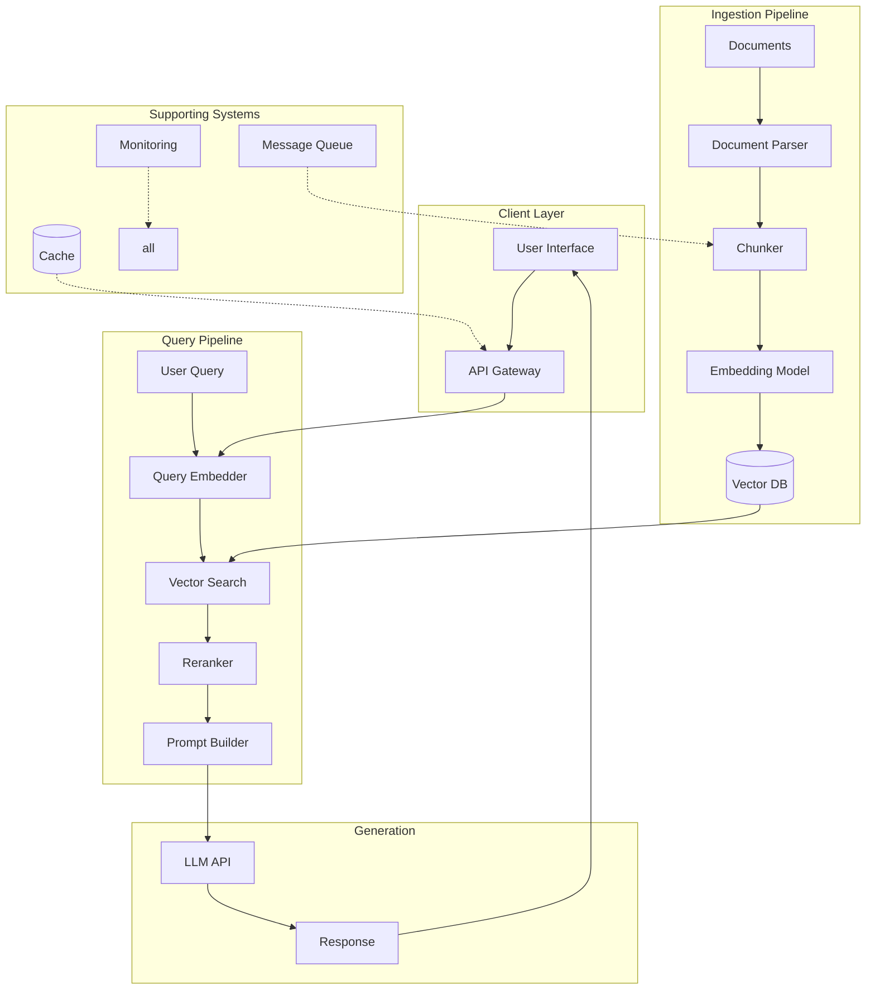
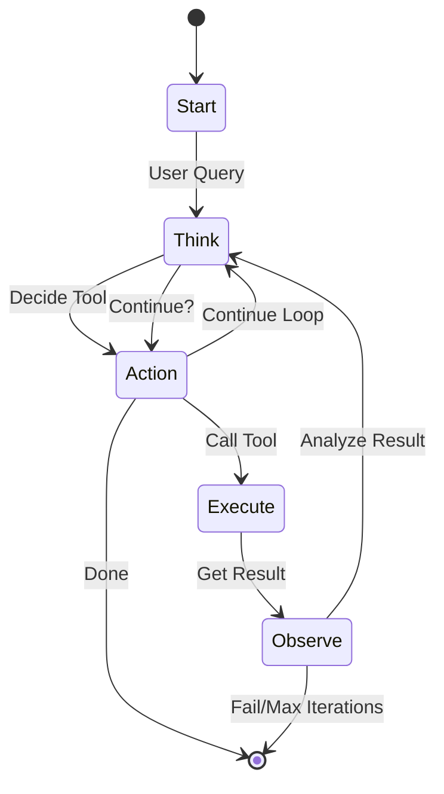
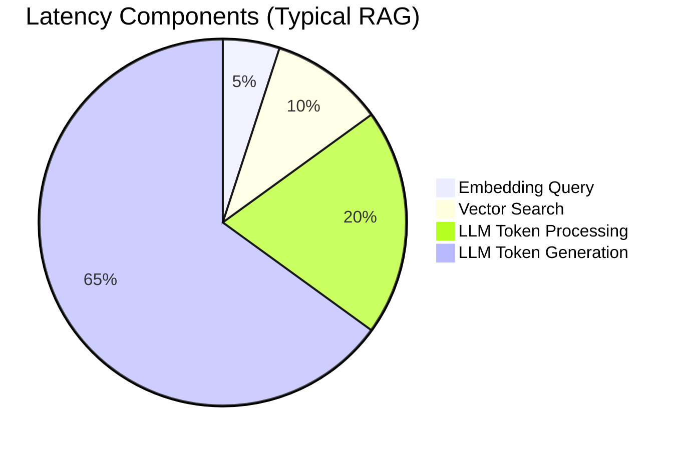

## RAG System Design

| Question | Answer |
|----------|--------|
| **Design a RAG system for Q&A over large document corpus.** | High-level: Data ingestion (parse → chunk → embed → index in vector DB). Query path (embed query → similarity search → rerank if needed → augment prompt → LLM generate). Discuss trade-offs at each layer. |
| **What are the key components of RAG?** | 1) Ingestion: document parser, chunker, embedding model, vector store. 2) Retrieval: embedding API, similarity search, optional hybrid (BM25 + vector), reranking. 3) Generation: prompt composer, LLM API, output parser. |
| **What are different chunking strategies?** | Fixed size (simple but may split semantic units), recursive (split by hierarchy), semantic (split at natural boundaries), late chunking (semantic pooling). Choice depends on document structure. |
| **How do you choose chunk size?** | Smaller = more precise retrieval, more chunks to search, more context needed. Larger = less precise, better context. Typical 256-1024 tokens. Trade-off: precision vs recall vs latency. |
| **What is hybrid search and when to use it?** | Combines dense (vector/semantic) and sparse (BM25/keyword) retrieval. Use when documents have technical terms, proper nouns, or exact phrases matter. Often outperforms pure vector search. |
| **When do you need reranking?** | When initial retrieval returns borderline results and you need higher precision. Two-stage: fast bi-encoder retrieves top 50-100, slower cross-encoder reranks to final 5-10. Trade-off: quality vs latency (+100-300ms). |
| **How do you handle multi-document queries?** | Options: pass all relevant docs to LLM (if within context), use summarization first, decompose into sub-questions and combine answers. |
| **Engineer**: How do you implement access control in RAG? | Filter by user permissions at retrieval time (metadata filtering), or pre-filter documents in the vector DB. Must apply at query time, not just index time. |
| **PM**: When is RAG better than fine-tuning?** | RAG: recent information, large documents, cost-sensitive, need citations, frequent updates. Fine-tuning: specific style/tone, task-specific patterns, offline use. Often both together is best. |

## Vector Databases

| Question | Answer |
|----------|--------|
| **How does vector search work?** | Documents embedded into vectors. Query embedded. Similarity (cosine, dot product, euclidean) finds nearest vectors. Approximate Nearest Neighbor (ANN) algorithms speed this up (HNSW, IVF). |
| **Compare pgvector, Pinecone, Weaviate, Qdrant.** | pgvector: simple if already on Postgres, good for <10M vectors. Pinecone/Weaviate/Qdrant: dedicated, better at scale, support filtering, hybrid search. |
| **What is HNSW indexing?** | Hierarchical Navigable Small World. Graph-based ANN algorithm. Fast search with good recall. Higher memory but standard for production vector DBs. |
| **What is the trade-off between recall and latency?** | Higher recall = more computation = higher latency. Can tune by adjusting search scope (ef parameter in Weaviate), using smaller k, or approximate search. |
| **How do you handle metadata filtering?** | Pre-filter (slower) vs post-filter (may return fewer than k results). Some DBs support native filtered vector search. |
| **What are embedding dimensions?** | Each vector has many dimensions (e.g., 1536 for OpenAI text-embedding-3-small). Higher = more precise but more memory/storage. |
| **Engineer**: How do you update embeddings when documents change?** | Options: re-embed entire doc, use incremental updates, store original text with embeddings and re-embed on query. Consider versioning strategy. |

## LLM System Design

| Question | Answer |
|----------|--------|
| **How would you design a low-latency LLM API?** | Use streaming responses (send tokens as generated), async processing for long requests, connection pooling, caching frequent prompts/responses, model tiering (fast/slow models). |
| **What is time-to-first-token (TTFT)?** | Time from request start to receiving first token. Depends on prompt processing + model loading + generation. Lower with caching, smaller models. |
| **What is tokens-per-second (TPS)?** | Speed of token generation. Depends on model size, GPU, batching. Higher TPS = faster perceived response. |
| **How do you handle LLM rate limits?** | Implement retry with exponential backoff, queue requests, use multiple API keys, request rate limit increases, use slower model as fallback. |
| **What is model tiering/routing?** | Use a small fast model for simple queries, premium model for complex ones. Build a router (can be a small classifier) to route to appropriate model. Can cut costs 50-70%. |
| **Engineer**: How do you estimate LLM costs?** | Cost = (input_tokens × input_price + output_tokens × output_price) per 1M tokens. Example: 1M queries × 1K tokens/query × $3/1M = $3K/month. |
| **Engineer**: What is prompt caching?** | Cache parsed prompt representations between requests. Providers like OpenAI, Anthropic support this. Can reduce latency and cost for repeated contexts. |
| **PM**: How do you manage LLM costs in production?** | Monitor per-request costs, use tiered routing, cache aggressively, implement budgets/alerts, optimize prompts to use fewer tokens. |

## Latency & Performance

| Question | Answer |
|----------|--------|
| **What causes latency in RAG systems?** | 1) Embedding query (~100ms), 2) Vector search (~50-200ms), 3) LLM token processing (~1-2s), 4) LLM token generation (depends on output length). Usually LLM dominates. |
| **How do you reduce retrieval latency?** | Use faster embedding models, tune index parameters, reduce search space with metadata filtering, pre-warm indices, use approximate vs exact search. |
| **What is streaming vs blocking responses?** | Streaming: send tokens as generated (lower perceived latency). Blocking: wait for full response then send. Streaming much better for user experience. |
| **How do you handle slow LLM responses?** | Streaming (user sees progress), optimistic UI, fallback to cached answer, use faster model with lower quality, show "thinking" state. |
| **Engineer**: How do you benchmark LLM performance?** | Measure TTFT, TPS, total latency. Track at different percentiles (P50, P95, P99). Test with various prompt lengths and output lengths. Compare across models. |

## Scalability

| Question | Answer |
|----------|--------|
| **How do you scale RAG for millions of documents?** | Partition/shard the index, use hierarchical retrieval (coarse then fine), add caching layer, use async embedding for ingestion pipeline. |
| **How do you handle high QPS?** | Horizontally scale API servers, use load balancers, implement request queuing, cache aggressively, consider async for non-real-time. |
| **What is the difference between synchronous and asynchronous RAG?** | Sync: real-time, user waits. Async: user submits, gets notification when done. Use async for batch processing, complex queries, high-latency operations. |
| **Engineer**: How do you handle embedding pipeline backpressure?** | Use message queues (SQS, Kafka) for ingestion. Scale workers based on queue depth. Set alerts for lag. Auto-scale embedding workers. |
| **Scientist**: How do you design for data freshness?** | Real-time: update embeddings on document change. Near-real-time: periodic batch updates. Trade-off between freshness and compute cost. |

## Reliability & Monitoring

| Question | Answer |
|----------|--------|
| **What do you monitor in production LLM systems?** | Latency (P50, P95, P99), error rates, token usage, cost, quality metrics (drift detection), specific failure modes (hallucination rate). |
| **How do you handle LLM failures?** | Fallback to cached response, fallback to simpler model, retry with backoff, graceful degradation (show "I couldn't find" vs hallucinate). |
| **What is model versioning?** | Track which model version handles each request. Enable rollback, A/B testing, and comparison between versions. |
| **What is canary deployment for models?** | Gradually roll out new model to small % of traffic, monitor, then full rollout. Allows detecting issues before full impact. |
| **How do you detect data drift in AI systems?** | Monitor input distribution changes, output distribution changes, quality metrics over time. Use tools like Evidently, Great Expectations. |
| **Engineer**: How do you implement circuit breakers?** | Track failure rates, temporarily stop calling failing service, use fallback, automatically recover. Prevents cascade failures. |
| **Scientist**: How do you set up A/B testing for LLMs?** | Randomize users, track metrics (engagement, task success, error rate), monitor for regressions. Use statistical significance. |

## Agentic Systems

| Question | Answer |
|----------|--------|
| **How would you design an LLM-powered agent?** | Loop: 1) LLM decides action, 2) execute action, 3) observe result, 4) repeat until goal. Tools extend capabilities beyond just text generation. |
| **What is tool use in agents?** | Agent can call external functions (search, code execution, APIs). Model outputs structured calls, system executes, returns results. |
| **What is ReAct pattern?** | Reasoning (think) → Action (call tool) → Observation (see result). Repeat. Enables structured problem solving. |
| **When would you use agents vs simple RAG?** | Agents: multi-step tasks, need external tools, complex reasoning. Simple RAG: single Q&A from documents. Often agents use RAG as a tool. |
| **How do you handle agent failures?** | Max iteration limits, retry strategies, fallback to human, clear error messages, logging for debugging. |
| **What is multi-agent architecture?** | Multiple specialized agents that collaborate. One orchestrator dispatches to specialists. Can be more robust than single agent. |
| **Engineer**: What are the cost implications of agents?** | Agents can be 2-5x more expensive than single-shot (multiple LLM calls, tools). Route to agent path only when needed. Monitor cost per task. |

## Evaluation & Quality

| Question | Answer |
|----------|--------|
| **How do you evaluate RAG quality?** | RAGAS: measures retrieval relevance, answer faithfulness to context, answer relevance to question. Also: human evaluation, LLM-as-judge. |
| **What is answer faithfulness?** | Does the answer match the retrieved context? Detect when LLM uses external knowledge instead of provided context (hallucination). |
| **How do you evaluate retrieval quality?** | Precision@K, Recall@K, MRR (Mean Reciprocal Rank). Can use relevance judgments from humans or LLM. |
| **What is LLM-as-judge?** | Use another LLM to evaluate outputs. Can rate quality, helpfulness, safety. Not perfect but scalable. |
| **How do you measure hallucination rates?** | Compare claims to source documents, use fine-tuned hallucination detectors, human review sampling. Typical enterprise RAG: 8-15%, can get to <5%. |
| **PM**: What metrics matter for AI products?** | Task completion rate, user satisfaction, error rate by severity, latency, cost per query. Tie to business outcomes. |

## Security & Privacy

| Question | Answer |
|----------|--------|
| **How do you protect against prompt injection?** | Separate user input from system instructions, validate/ sanitize inputs, use instructions that prioritize system over user input. |
| **How do you handle PII in LLM systems?** | Detect and redact PII before processing, use PII-aware models, don't send sensitive data to external APIs if possible. |
| **What is data residency for LLMs?** | Some data must stay in certain regions. Choose providers/regions accordingly. Self-hosting may be needed for strict requirements. |
| **Engineer**: How do you implement output filtering?** | Use safety classifiers, regex-based content filters, have LLM self-critique, human review for edge cases. Layer multiple approaches. |

## Cost Optimization

| Question | Answer |
|----------|--------|
| **How do you reduce LLM costs?** | Use smaller/faster models when possible, cache responses, optimize prompts to use fewer tokens, use tiered routing, batch requests. |
| **What is the trade-off between API and self-hosted?** | API: easy, latest models, pay-per-use. Self-host: control, no per-token cost at scale, requires ML ops expertise. Break-even around ~10M tokens/month. |
| **When should you fine-tune vs use base model?** | Fine-tune when you have specific patterns to learn (style, format, task). Base model often sufficient for general tasks. Fine-tune is expensive. |
| **Engineer**: How do you implement smart caching?** | Cache by prompt hash, cache embeddings, cache LLM responses with appropriate TTL, invalidate on model/prompt changes. |
| **PM**: How do you budget for AI infrastructure?** | Model costs, compute for embedding/serving, vector DB storage, monitoring/observability, human evaluation. Plan for growth. |

## Scenario-Based Questions

| Question | Answer |
|----------|--------|
| **Design a customer support chatbot.** | RAG over FAQ/docs, intent detection to route to right flow, multi-turn conversation state, escalation to human, track resolution metrics. |
| **Design a code assistant that answers questions about your codebase.** | Embed code chunks, use code-aware chunking, handle multiple files, consider code-specific embeddings, retrieval by function/file. |
| **How would you handle a sudden performance drop in production RAG?** | Check: vector DB latency, embedding model issues, LLM service health, data drift, recent changes. Isolate and rollback if needed. |
| **How would you improve RAG precision for a legal document search?** | Use domain-specific embeddings, hybrid search (keywords matter in legal), reranking, chunk by legal sections, consider cite detection. |
| **Design a system that needs <100ms latency.** | Use smaller embedding model, smaller LLM, aggressive caching, avoid reranking, pre-warm, synchronous path only. Quality trade-off likely. |

## Role-Specific Variations

| Question | Answer |
|----------|--------|
| **Engineer**: How would you handle 10x traffic growth?** | Horizontal scaling of API servers, auto-scaling based on queue depth, rate limiting, caching, consider async for non-critical paths. |
| **Engineer**: What monitoring would you add for production AI?** | Latency percentiles, token usage, error rates, quality metrics (drift), cost tracking, specific failure mode tracking (hallucination, timeouts). |
| **Scientist**: How do you debug why RAG quality dropped?** | Check retrieval (relevance of top docs), check generation (does it use context?), check for data drift in corpus, test with known queries. |
| **Scientist**: How would you optimize for a specific metric (e.g., citation accuracy)?** | Add citation enforcement in prompt, fine-tune for citation task, post-process to verify citations, evaluate with specific metric. |
| **PM**: How do you define success metrics for an AI product?** | Start with business KPIs, map to proxy ML metrics. Example: if goal is user retention → proxy could be task completion rate. Include guardrail metrics. |

## Diagrams

### End-to-End RAG Architecture

### Agent Architecture with ReAct

### Latency Breakdown in RAG

## Practice Questions

### System Design Scenarios

| Question | Time | Focus |
|----------|------|-------|
| Design a RAG system for 1M documents with <500ms latency | 30-40 min | Architecture, trade-offs |
| Design an LLM-powered customer support bot | 30-40 min | End-to-end, fallback handling |
| Design a code assistant for your codebase | 30-40 min | Chunking, code-specific challenges |
| Design an AI search for e-commerce | 30-40 min | Ranking, personalization |
| Design a multi-language RAG system | 30-40 min | Multilingual embedding, translation |

### Debugging Scenarios

| Question | What to Check |
|----------|---------------|
| RAG quality dropped 20% | Retrieval (embeddings, chunking), data drift, model changes |
| Latency spiked from 200ms to 2s | Vector DB, LLM API, network, rate limits |
| Users reporting more hallucinations | Context quality, retrieval relevance, prompt changes |
| Embedding pipeline falling behind | Queue depth, worker scaling, embedding model issues |

### Quick Design Questions

- How would you add caching to a RAG system?
- How do you implement rate limiting for LLM APIs?
- Design a system that auto-retries on LLM failures
- How would you implement access control in RAG?
- Design a system for real-time document updates

## Quick Reference Cards

### Vector Database Comparison

| DB | Best For | Limitations | Scale |
|----|----------|-------------|-------|
| **pgvector** | Already on Postgres | Limited filtering | <10M vectors |
| **Pinecone** | Managed, scale | Vendor lock-in | Unlimited |
| **Weaviate** | Hybrid search | Memory-intensive | Unlimited |
| **Qdrant** | Performance | Smaller ecosystem | Unlimited |
| **Chroma** | Prototyping | Not production-ready | <1M |

### Latency Budget for RAG

| Component | Target | Acceptable | Problematic |
|-----------|--------|------------|-------------|
| Embedding | <50ms | 50-100ms | >100ms |
| Vector Search | <50ms | 50-100ms | >100ms |
| Reranking | <100ms | 100-200ms | >200ms |
| LLM (TTFT) | <1s | 1-2s | >2s |
| LLM (generation) | <2s/token | 2-5s/token | >5s/token |

### Cost Optimization Levers

| Strategy | Impact | Effort |
|----------|--------|--------|
| Model tiering | 50-70% cost reduction | Medium |
| Prompt caching | 20-40% cost reduction | Low |
| Response caching | 30-60% cost reduction | Medium |
| Smaller chunks | 10-30% cost reduction | Low |
| Batch processing | 20-40% cost reduction | High |

## External Resources

### System Design References

- [RAG at Scale](https://newsletter.pragmaticengineer.com/p/rag-at-scale) - Production RAG patterns
- [The Engineer’s Guide to RAG](https://wandb.ai/articles/rag-evaluation) - Evaluation strategies
- [Building Production LLM Apps](https://python.langchain.com/docs/guides/production) - LangChain production guide

### Tools & Libraries

- [LangChain](https://js.langchain.com) - LLM app framework
- [LlamaIndex](https://www.llamaindex.ai) - Data framework for LLMs
- [AutoGen](https://microsoft.github.io/autogen) - Microsoft agent framework
- [OpenAI Agents SDK](https://openai.com/docs/agents-sdk) - OpenAI agent tools

### Monitoring & Observability

- [Evidently AI](https://www.evidentlyai.com) - ML monitoring
- [Great Expectations](https://greatexpectations.io) - Data quality
- [LangSmith](https://smith.langchain.com) - LLM debugging/tracing
- [Weave](https://wandb.ai/weave) - ML observability

## See Also

- [ML Fundamentals Interview Prep](/cheatsheets/ml-fundamentals-interview/)
- [LLM Interview Prep](/cheatsheets/llm-interview/)
- [Behavioral Interview Prep](/cheatsheets/behavioral-interview/)
- [AI Product Interview Prep](/cheatsheets/ai-product-interview/)
- [RAG Architecture Diagram](/diagrams/rag-architecture/)
- [Prompt Engineering Cheatsheet](/cheatsheets/prompt-engineering/)