Claude is Anthropic's family of AI models and the full platform ecosystem built around them. This section is a complete reference for technical users — covering every product, capability, API, and workflow.

## How the Ecosystem Connects

```mermaid
graph LR
    subgraph Models["Claude Models"]
        Opus["Opus 4.7<br/>Most capable<br/>1M ctx · $5/$25"]
        Sonnet["Sonnet 4.6<br/>Balanced<br/>1M ctx · $3/$15"]
        Haiku["Haiku 4.5<br/>Fastest<br/>200K ctx · $1/$5"]
    end

    subgraph API["Claude API"]
        Messages["Messages API"]
        Caching["Prompt Caching<br/>90% savings"]
        Batch["Batch API<br/>50% discount"]
        Tools["Tool Use<br/>Web, Code, Files"]
    end

    subgraph Builders["Developer Tools"]
        CC["Claude Code<br/>Terminal · IDE · Desktop · Web"]
        MCP["MCP Protocol<br/>Open standard"]
        SDKs["SDKs<br/>Python · TS · Java · Go"]
        Console["Console<br/>Dashboard"]
    end

    subgraph Products["Products"]
        Chat["claude.ai<br/>Chat + Projects"]
        Teams["Claude for Teams<br/>Enterprise"]
        Cowork["Cowork<br/>Computer use"]
        Dispatch["Dispatch<br/>Mobile → Desktop"]
    end

    Models --> API
    API --> Builders
    Builders --> Products
    API --> Products

    style Opus fill:#166534,stroke:#4ade80,color:#fff
    style Sonnet fill:#1e3a8a,stroke:#60a5fa,color:#fff
    style Haiku fill:#7c3aed,stroke:#a78bfa,color:#fff
    style CC fill:#3b82f6,stroke:#93c5fd,color:#fff
    style MCP fill:#d97706,stroke:#fcd34d,color:#fff
```



## Product Directory — At a Glance

| Product | What It Is | Who It's For | How to Access |
|---|---|---|---|
| **Claude API** | Direct model access via HTTP | Developers building AI apps | [console.anthropic.com](https://console.anthropic.com) |
| **Claude Code** | Agentic coding tool across 7 surfaces | Developers, engineering teams | [code.claude.com](https://code.claude.com) |
| **claude.ai** | Web & mobile chat interface | Everyone | [claude.ai](https://claude.ai) |
| **Claude for Teams** | Business plans with admin controls | Organizations | [claude.com/teams](https://claude.com/teams) |
| **MCP** | Open standard for tool/data connections | Developers, platform builders | [modelcontextprotocol.io](https://modelcontextprotocol.io) |
| **Agent Skills (SKILL.md)** | Packaged workflows for coding agents | Developers, teams | `.claude/skills/` — Markdown files |
| **Claude Cowork** | Autonomous computer use (research preview) | Power users, knowledge workers | Claude Max/Pro subscribers |
| **Claude Dispatch** | Mobile-to-desktop workflow layer | Max/Pro subscribers | Claude mobile app → Desktop |
| **Claude Desktop** | Standalone app for coding and tasks | Developers | Download from claude.ai |
| **Claude Platform on AWS** | Managed Claude via AWS Marketplace (CCU) | AWS-native organizations | AWS Console |
| **Amazon Bedrock / Vertex AI** | Claude on cloud platforms | Cloud-native enterprises | AWS / GCP Consoles |
| **Claude Mythos Preview** | Defensive cybersecurity research model | Invitation-only | [anthropic.com/glasswing](https://anthropic.com/glasswing) |

## Model Tiers — Quick Compare

| Model | API Price (in/out) | Context | Best For |
|---|---|---|---|
| **Claude Opus 4.7** | $5 / $25 per 1M | 1M tokens | Complex reasoning, agentic coding, long docs |
| **Claude Sonnet 4.6** | $3 / $15 per 1M | 1M tokens | Balanced speed + intelligence, most workloads |
| **Claude Haiku 4.5** | $1 / $5 per 1M | 200K tokens | Fastest, near-frontier at lowest cost |

> **Note:** Playbook previously referenced Opus at $15/$75 (Opus 4.1 pricing). Opus 4.7 dropped pricing by 67% while gaining 1M context and adaptive thinking. See [Claude Models](/claude/models) for detailed benchmarks and comparison.

## Decision Tree: Which Claude Product?

```
What do you want to do?
│
├─ Build an AI-powered application → Claude API + SDKs
├─ Write code, refactor, debug → Claude Code (Terminal or IDE)
├─ Chat, research, write, analyze → claude.ai
├─ Connect AI to my tools/data → MCP Protocol
├─ Standardize team coding workflows → Agent Skills (SKILL.md)
├─ Let AI work autonomously on my computer → Claude Cowork
├─ Send tasks from phone to desktop → Claude Dispatch
├─ Deploy to AWS infrastructure → Claude Platform on AWS or Bedrock
├─ Enterprise with admin, SSO, compliance → Claude for Teams
└─ Explore cutting-edge capabilities → See individual product pages below
```

## Where to Go Next

- Start with [Claude Models](/claude/models) to understand the model tiers
- Go to [Claude Code](/claude/claude-code) to set up the coding agent
- Read the [API & SDKs](/claude/api) guide to start building
- Explore [MCP](/claude/mcp) to connect Claude to your tools
- Check [Workflows & Best Practices](/claude/workflows) for prompt engineering and optimization
