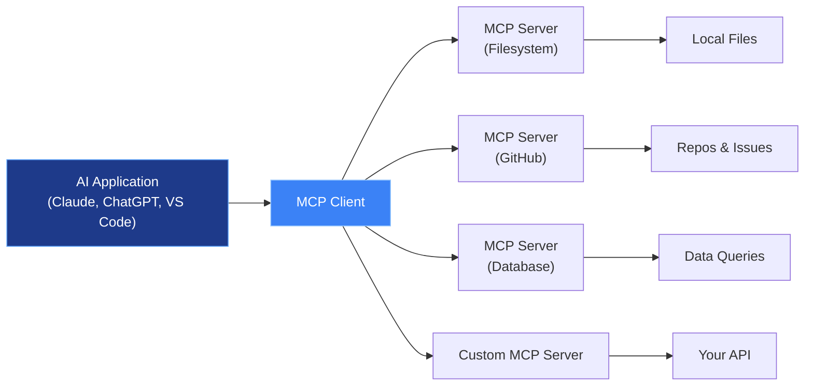

MCP (Model Context Protocol) is an **open-source standard** for connecting AI applications to external systems. Think of it like USB-C for AI — a standardized way for any AI app to connect to any data source or tool.



## Architecture

MCP uses a **client-server** model:
- **MCP Client:** Embedded in the AI application (Claude Code, claude.ai, VS Code)
- **MCP Server:** Standalone process exposing tools, resources, and prompts via JSON-RPC
- **Transport:** Stdio (local) or HTTP/SSE (remote)

Each MCP server provides:
| Primitive | Purpose | Example |
|---|---|---|
| **Tools** | Actions the AI can invoke | Search files, create issue, run query |
| **Resources** | Data the AI can read | File contents, database records, API responses |
| **Prompts** | Templated instructions | "Summarize this document" with specific format |

## Available MCP Servers

| Server | What It Connects To | Install |
|---|---|---|
| **Filesystem** | Local file system access | `npx @modelcontextprotocol/server-filesystem` |
| **GitHub** | Repos, issues, PRs | `npx @modelcontextprotocol/server-github` |
| **Slack** | Channels, messages, users | `npx @modelcontextprotocol/server-slack` |
| **Brave Search** | Web and local search | `npx @modelcontextprotocol/server-brave-search` |
| **Google Drive** | Documents and files | `npx @modelcontextprotocol/server-gdrive` |
| **Postgres** | Database read/write | `npx @modelcontextprotocol/server-postgres` |
| **Notion** | Pages and databases | Available via marketplace |
| **Figma** | Design files and assets | Available via marketplace |
| **Jira** | Issues and projects | Available via marketplace |

For the full directory of 200+ MCP servers: [modelcontextprotocol.io/servers](https://modelcontextprotocol.io/servers)

## Setting Up MCP with Claude Code

Create `.claude/mcp.json` in your project:

```json
{
  "mcpServers": {
    "filesystem": {
      "command": "npx",
      "args": ["-y", "@modelcontextprotocol/server-filesystem", "/path/to/docs"]
    },
    "github": {
      "command": "npx",
      "args": ["-y", "@modelcontextprotocol/server-github"],
      "env": {
        "GITHUB_PERSONAL_ACCESS_TOKEN": "${GITHUB_TOKEN}"
      }
    }
  }
}
```

Claude Code automatically starts these servers and connects to them. You can then ask:

```bash
claude "read the design spec in docs/ and create a GitHub issue with the implementation plan"
```

## Building a Custom MCP Server

### Python (FastMCP)

```python
from mcp.server.fastmcp import FastMCP

mcp = FastMCP("My Custom Server")

@mcp.tool()
def get_customer_info(customer_id: str) -> dict:
    """Get customer information by ID."""
    # Your database/API logic
    return {"name": "Acme Corp", "plan": "Enterprise"}

@mcp.tool()
def update_subscription(customer_id: str, tier: str) -> dict:
    """Update customer subscription tier."""
    # Your business logic
    return {"status": "updated", "tier": tier}

if __name__ == "__main__":
    mcp.run()
```

### TypeScript

```typescript
import { Server } from "@modelcontextprotocol/sdk/server/index.js";
import { StdioServerTransport } from "@modelcontextprotocol/sdk/server/stdio.js";

const server = new Server({
  name: "my-custom-server",
  version: "1.0.0",
}, {
  capabilities: { tools: {} }
});

server.setRequestHandler("tools/list", async () => ({
  tools: [{
    name: "get_customer_info",
    description: "Get customer information by ID",
    inputSchema: {
      type: "object",
      properties: { customer_id: { type: "string" } },
      required: ["customer_id"]
    }
  }]
}));

const transport = new StdioServerTransport();
await server.connect(transport);
```

## Testing & Debugging

```bash
# Use the MCP Inspector for debugging
npx @modelcontextprotocol/inspector

# Check which servers Claude Code sees
claude "list your connected MCP servers and what tools they provide"

# Debug a specific server
# Add --debug flag to your server command and check logs
```

## Security Considerations

- **Local-only servers:** Run on your machine using stdio transport — no network exposure
- **Environment variables:** Use env vars for secrets (API keys, tokens), never hardcode
- **Permission model:** Claude Code asks permission before using MCP tools on first access
- **Tool scoping:** Design server tools to expose only the minimum data needed

## Ecosystem Adoption

MCP is supported across a growing ecosystem:

| Category | Tools |
|---|---|
| **AI Assistants** | Claude, ChatGPT, VS Code Copilot |
| **IDEs** | VS Code, Cursor, JetBrains |
| **Frameworks** | LangChain, CrewAI, MCPJam |
| **Enterprise** | 200+ community-built servers for databases, APIs, and SaaS tools |

For the full list, see [modelcontextprotocol.io/clients](https://modelcontextprotocol.io/clients).
