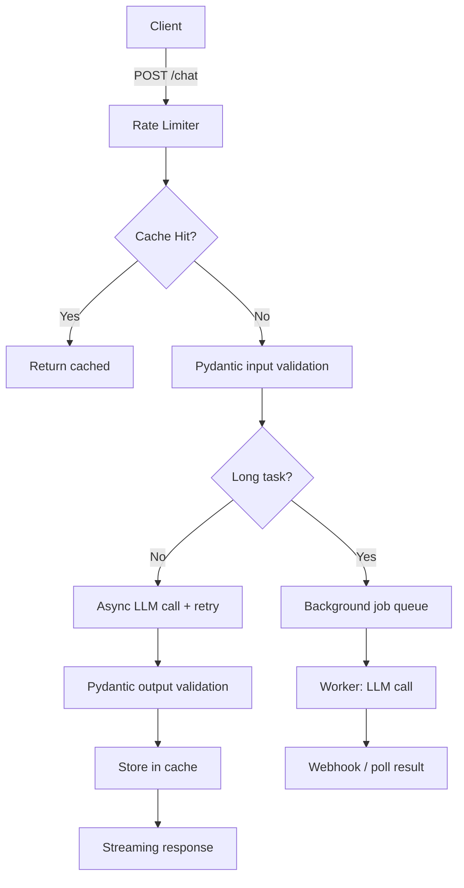

## Why LLMs Need Different Backend Patterns

Traditional API calls return in milliseconds. LLM calls take 2–30 seconds, cost money per token, fail unpredictably, and return non-deterministic text that may or may not match the format you expected. Standard synchronous, fire-and-forget backend patterns break under these conditions.

The shift required:

| Traditional API | LLM-backed endpoint |
|---|---|
| < 100ms response | 2–30s, or streaming chunks |
| Deterministic output | Probabilistic — validate every response |
| Fail fast | Retry with backoff; gracefully degrade |
| Thread-per-request | Async I/O — threads block on LLM wait |
| Cache aggressively | Cache selectively (identical prompts only) |
| Fixed cost per call | Variable cost per token |

This page covers the infrastructure patterns that handle these realities.

---

## FastAPI and Async Endpoints

**FastAPI** has become the default Python framework for LLM APIs because it was built for async I/O — the right model for workloads that spend most of their time waiting on external services.

### Why async matters

In a synchronous server, each request occupies a thread while it waits for the LLM response. With 10 concurrent requests each taking 5 seconds, you need 10 threads sitting idle. Async I/O releases the thread during the wait, so one thread can interleave dozens of in-flight requests.

```python
# Synchronous — blocks a thread for 5+ seconds per request
@app.post("/chat")
def chat(request: ChatRequest):
    response = openai.chat.completions.create(...)  # thread is blocked here
    return response

# Async — releases thread during the LLM wait
@app.post("/chat")
async def chat(request: ChatRequest):
    response = await openai.chat.completions.create(...)  # thread is free here
    return response
```

The difference compounds at scale: async servers handle 10–100× more concurrent LLM requests with the same resources.

### Streaming responses

Users perceive a streaming response (first token in < 1 second) as significantly faster than waiting for the full response. Implement with Server-Sent Events (SSE):

```python
from fastapi.responses import StreamingResponse

@app.post("/chat/stream")
async def chat_stream(request: ChatRequest):
    async def generate():
        async for chunk in await client.chat(stream=True, ...):
            if chunk.choices[0].delta.content:
                yield f"data: {chunk.choices[0].delta.content}\n\n"
        yield "data: [DONE]\n\n"

    return StreamingResponse(generate(), media_type="text/event-stream")
```

Streaming is almost always worth the complexity for user-facing features.

---

## Pydantic and Structured Outputs

LLMs return text. Applications need structured data. Pydantic bridges this gap by defining the schema you expect and validating that the LLM's output matches it.

### The core problem

Asking an LLM to "return JSON with fields X, Y, Z" works sometimes. It fails when the model:
- Wraps JSON in markdown code fences
- Omits required fields
- Returns a slightly different key name
- Produces malformed JSON under load

Pydantic, combined with a structured output approach, eliminates this class of failure.

### Defining output schemas

```python
from pydantic import BaseModel, Field

class SentimentAnalysis(BaseModel):
    sentiment: Literal["positive", "negative", "neutral"]
    confidence: float = Field(ge=0, le=1)
    key_phrases: list[str] = Field(max_length=5)
    reasoning: str
```

With modern LLM APIs (OpenAI's `response_format`, Anthropic's tool use), you pass this schema and the model is constrained to return valid JSON matching it. Libraries like **Instructor** wrap this pattern for any provider.

### Why structured outputs matter for reliability

- **Validation at the boundary** — Pydantic raises an error immediately if the LLM returns unexpected data, rather than letting malformed data propagate.
- **Retry on parse failure** — structured output libraries automatically retry with the validation error as feedback, getting the model to correct itself.
- **Type safety downstream** — the rest of your application works with typed objects, not strings.
- **Prompt simplification** — you describe what you want in schema form rather than in prose, which is more reliable.

### Nested schemas and complex outputs

Pydantic handles arbitrarily nested structures — useful for extracting entities, generating structured documents, or routing agent decisions:

```python
class Entity(BaseModel):
    name: str
    type: Literal["person", "org", "location", "date"]
    span: tuple[int, int]

class ExtractionResult(BaseModel):
    entities: list[Entity]
    summary: str
    confidence: float
```

---

## Background Jobs and Task Queues

Some LLM tasks don't fit in an HTTP response cycle: batch document processing, report generation, multi-step agent workflows. These belong in background jobs.

### The pattern

```
Client → POST /jobs {input}  →  202 Accepted {job_id}
                                     ↓
                             Task Queue (Redis/RabbitMQ)
                                     ↓
                             Worker process: run LLM task
                                     ↓
Client → GET /jobs/{id}  →   200 {status: "complete", result: ...}
```

The API immediately returns a job ID. The client polls for completion (or gets notified via webhook).

### Task queue options

| Tool | Language | Best for |
|---|---|---|
| **Celery** | Python | High throughput, mature ecosystem, Redis/RabbitMQ backends |
| **RQ (Redis Queue)** | Python | Simple setup, small teams, Redis-only |
| **ARQ** | Python | Async-native, FastAPI integration, Redis |
| **BullMQ** | Node.js | High concurrency, priority queues |

For most LLM applications, **RQ or ARQ** are the right starting points — Celery's power comes with configuration complexity that usually isn't needed until you have many worker types and strict priority requirements.

### When to use background jobs

- Generation takes > 5 seconds (report writing, long documents)
- The result is consumed asynchronously (email, dashboard refresh)
- You need retries with backoff across worker restarts
- You're processing batches (nightly embeddings, bulk classification)

---

## Caching

LLM API calls are expensive and often repetitive. Caching eliminates redundant calls.

### Exact caching

Cache responses keyed on the exact prompt. Hits are free; misses call the LLM. Works well for:
- System prompts + fixed user messages (FAQ bots)
- Repeated lookups (entity extraction for the same text)
- Development and testing (avoid burning tokens on the same inputs)

Use **Redis** with a TTL. The key is a hash of (model, system prompt, user message, temperature):

```python
cache_key = sha256(f"{model}:{system}:{user}:{temperature}".encode()).hexdigest()
```

### Semantic caching

Cache responses keyed on embedding similarity — if a new query is semantically close to a cached one, return the cached response.

- Embed the incoming query
- Search a vector store for near-identical cached queries (cosine similarity > 0.97)
- If found: return cached response immediately
- If not: call LLM, store response + embedding

Tools: **GPTCache**, **Langfuse caching layer**, or roll your own with pgvector/Qdrant.

**Trade-off:** Semantic caching saves cost but risks returning stale or slightly wrong answers for subtly different questions. Use a high similarity threshold (0.97+) and short TTLs for anything factual.

### What not to cache

Personalized responses, anything with a timestamp or "current" in the query, multi-turn conversations where context changes the answer.

---

## Rate Limiting

Rate limiting protects your costs and ensures fair access across users.

### Token budgets (cost control)

LLM cost scales with tokens, not requests. Implement per-user or per-feature token budgets:

```
user_tokens_used_today = get(f"tokens:{user_id}:{today}")
if user_tokens_used_today + estimated_tokens > daily_limit:
    raise HTTPException(429, "Daily token limit reached")
```

Track actual tokens from the API response and accumulate in Redis with a 24-hour TTL.

### Request rate limiting

Use a token bucket or sliding window algorithm to cap requests per minute per user. Libraries like **slowapi** integrate directly into FastAPI:

```python
from slowapi import Limiter
limiter = Limiter(key_func=get_remote_address)

@app.post("/chat")
@limiter.limit("10/minute")
async def chat(request: Request, body: ChatRequest):
    ...
```

### Upstream rate limiting

LLM providers impose their own TPM (tokens per minute) and RPM (requests per minute) limits. When you hit them you get 429s. Handle upstream rate limits with:
- Exponential backoff with jitter
- Request queuing at the edge
- Multiple API keys spread across accounts (check provider ToS)
- Provider load balancing (route between Anthropic, OpenAI, etc.)

---

## Retry Logic and Circuit Breakers

### Retry with exponential backoff

LLM APIs fail transiently — network issues, provider overload, model errors. Always retry with exponential backoff:

```
Attempt 1 → fail → wait 1s
Attempt 2 → fail → wait 2s
Attempt 3 → fail → wait 4s
Attempt 4 → fail → give up
```

Add **jitter** (randomness) to the backoff to avoid thundering herd when many clients retry simultaneously. Libraries: **tenacity** (Python), **retry** (Node.js).

Only retry on transient errors (429, 500, 502, 503). Do not retry 400 (your request is malformed) or 401 (auth failure).

### Circuit breakers

A circuit breaker tracks failure rates over a time window. When failures exceed a threshold, it "opens" and all requests fail immediately (without calling the LLM) for a cooldown period. This prevents cascading failures when a provider is down.

```
State: CLOSED → (5 failures in 60s) → OPEN → (30s cooldown) → HALF-OPEN
                                                                     ↓
                                              (1 success) → CLOSED / (failure) → OPEN
```

Libraries: **pybreaker** (Python), **opossum** (Node.js). LLM gateway tools like **LiteLLM** have this built in.

**When circuit breakers shine:** Multi-provider setups where you want to automatically failover from Anthropic to OpenAI when one provider degrades.

---

## Docker for AI Applications

### Why Docker matters more for AI

- **GPU access** — production inference often needs NVIDIA drivers; containers ensure consistent GPU environment
- **Dependency hell** — ML libraries (PyTorch, CUDA) have complex version matrices; containers pin everything
- **Reproducibility** — "works on my machine" disappears when the environment is containerized

### Key patterns

**Multi-stage builds** keep images small:
```dockerfile
# Stage 1: build
FROM python:3.11-slim AS builder
RUN pip install poetry
COPY pyproject.toml .
RUN poetry export -f requirements.txt > requirements.txt

# Stage 2: runtime
FROM python:3.11-slim
COPY --from=builder requirements.txt .
RUN pip install -r requirements.txt
COPY src/ src/
CMD ["uvicorn", "src.main:app", "--host", "0.0.0.0"]
```

**Secrets management** — never bake API keys into images. Use environment variables injected at runtime:
```bash
docker run -e ANTHROPIC_API_KEY=$ANTHROPIC_API_KEY my-llm-app
```

**GPU containers** — use the `nvidia/cuda` base image and the `--gpus all` runtime flag for self-hosted model inference.

### Docker Compose for local development

Run your FastAPI app, Redis (for caching/queues), and a worker process together:

```yaml
services:
  api:
    build: .
    ports: ["8000:8000"]
    environment:
      - ANTHROPIC_API_KEY=${ANTHROPIC_API_KEY}
      - REDIS_URL=redis://redis:6379
    depends_on: [redis]
  worker:
    build: .
    command: rq worker
    depends_on: [redis]
  redis:
    image: redis:7-alpine
```

---

## Putting It Together

A production LLM backend typically layers these patterns:



Each layer handles a specific failure mode:
- **Rate limiting** — protects cost and fairness
- **Caching** — eliminates redundant calls
- **Async** — handles concurrent slow requests
- **Pydantic** — catches bad LLM outputs early
- **Retry / circuit breaker** — tolerates provider failures
- **Background jobs** — decouples long tasks from HTTP cycles
