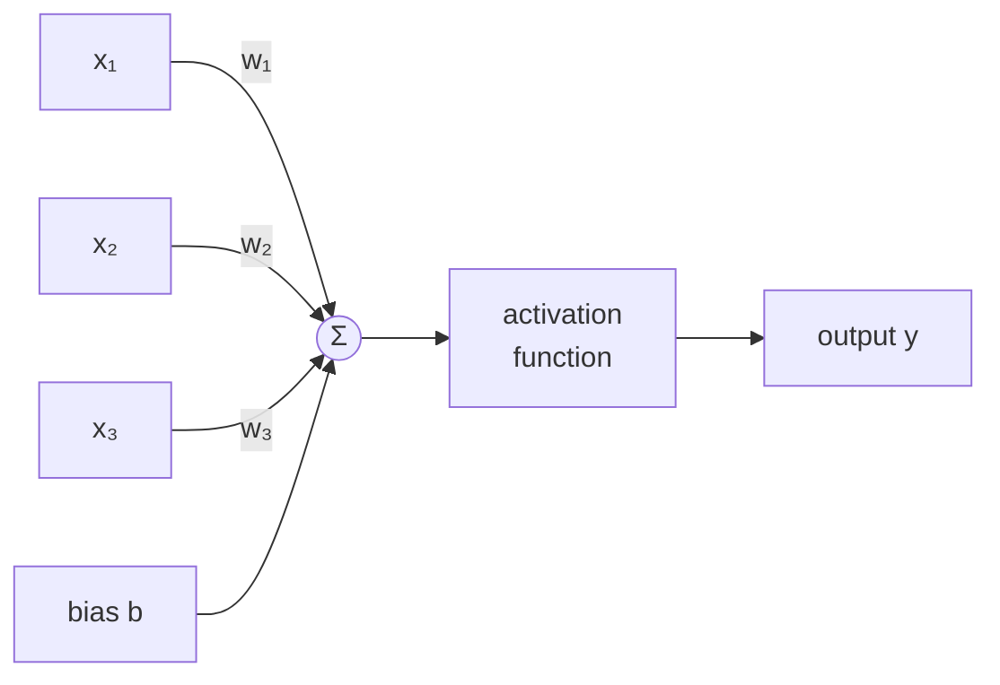
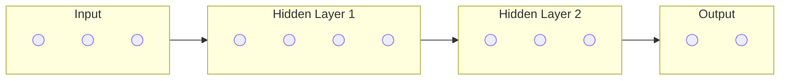

## The Core Idea

A neural network is not trying to simulate a brain. It is a mathematical function — one that takes numbers in, does a lot of arithmetic, and produces numbers out. The clever part is that the arithmetic is *learnable*: the network adjusts its internal parameters until its outputs match what you want.

That's it. Everything else — GPT-4, image recognition, AlphaGo — is this idea applied at scale.

---

## Part 1: Conceptual

### A Single Neuron

Think of a neuron as a dial that measures "how much does this input matter?"

It takes several inputs, multiplies each by a weight (how important it is), adds them up, adds a bias (a constant offset), then squashes the result through an activation function to decide how strongly it "fires."

**Weights** control which inputs the neuron pays attention to. A high weight on x₁ means "x₁ matters a lot." A negative weight means "when x₁ is high, fire less."

**Bias** shifts the whole activation up or down — it lets the neuron fire even when all inputs are zero, or stay quiet even when they're strong.

**Activation function** introduces non-linearity. Without it, stacking layers would just be multiplying matrices — no matter how many layers you added, the whole network would still only compute a linear function. Non-linearity is what lets deep networks learn curves, spirals, and complex decision boundaries.

---

### Layers

One neuron can't learn much. But connect thousands of them in layers and something remarkable happens: each layer learns increasingly abstract representations.

In an image classifier:
- **Layer 1** learns to detect edges and colours
- **Layer 2** combines edges into shapes and textures
- **Layer 3** combines shapes into object parts
- **Final layer** combines parts into "cat" vs. "dog"

In a language model:
- **Early layers** learn grammar and word relationships
- **Middle layers** learn syntax and phrase structure
- **Late layers** learn semantics, reasoning, world knowledge

This hierarchy is why depth matters — shallow networks struggle to represent complex concepts because they can't build up abstractions step by step.

---

### How Networks Learn

The network starts with random weights. Its predictions are terrible. Learning is the process of making them less terrible.

**Step 1 — Forward pass:** Feed the network an input, compute the output.

**Step 2 — Compute loss:** Compare the output to the correct answer using a loss function. Loss is a single number measuring how wrong the network was. Lower is better.

**Step 3 — Backward pass (backpropagation):** Figure out, for each weight in the network, which direction to nudge it to reduce the loss. This uses the chain rule of calculus, flowing the error signal backwards through every layer.

**Step 4 — Update weights:** Nudge every weight a small amount in the direction that reduces the loss (gradient descent).

**Repeat** millions of times on millions of examples. The weights gradually converge to values that make the network good at the task.

---

### Why "Deep" Learning?

Shallow networks (1–2 hidden layers) can approximate any function in theory, but in practice they need exponentially more neurons to do what a deep network does easily. Depth lets networks reuse learned features across many computations — much more efficient and much better at generalising.

The flip side: deep networks are harder to train. Gradients shrink as they flow backwards through many layers (the *vanishing gradient* problem), meaning early layers learn very slowly. Modern techniques — residual connections, normalisation layers, better activation functions — are all solutions to this problem.

---

## Part 2: The Math

### Neuron Output

A single neuron with $n$ inputs computes:

$$
y = \sigma\!\left(\sum_{i=1}^{n} w_i x_i + b\right) = \sigma(\mathbf{w}^\top \mathbf{x} + b)
$$

Where:
- $\mathbf{x} \in \mathbb{R}^n$ — input vector
- $\mathbf{w} \in \mathbb{R}^n$ — weight vector
- $b \in \mathbb{R}$ — bias scalar
- $\sigma$ — activation function

A full layer of $m$ neurons in matrix form:

$$
\mathbf{y} = \sigma(W\mathbf{x} + \mathbf{b}), \quad W \in \mathbb{R}^{m \times n}
$$

A deep network with $L$ layers is just this equation applied $L$ times:

$$
\mathbf{h}^{(l)} = \sigma\!\left(W^{(l)}\mathbf{h}^{(l-1)} + \mathbf{b}^{(l)}\right), \quad l = 1, \ldots, L
$$

---

### Activation Functions

| Function | Formula | Range | Common use |
|---|---|---|---|
| **ReLU** | $\max(0, x)$ | $[0, \infty)$ | Hidden layers (default) |
| **GELU** | $x \cdot \Phi(x)$ | $(-\infty, \infty)$ | Transformers / LLMs |
| **Sigmoid** | $\frac{1}{1+e^{-x}}$ | $(0, 1)$ | Binary output |
| **Tanh** | $\frac{e^x - e^{-x}}{e^x + e^{-x}}$ | $(-1, 1)$ | RNNs |
| **Softmax** | $\frac{e^{x_i}}{\sum_j e^{x_j}}$ | $(0,1)$, sums to 1 | Multi-class output |

**ReLU** (Rectified Linear Unit) is the most widely used. It's fast to compute and avoids the vanishing gradient problem that plagued Sigmoid and Tanh in deep networks. If input is negative, output is zero; otherwise it passes through unchanged.

**GELU** (Gaussian Error Linear Unit) is what most modern transformers use — a smooth approximation of ReLU that performs better in practice for language tasks.

---

### Loss Function

The loss $\mathcal{L}$ measures how wrong the network is. Common choices:

**Mean Squared Error** (regression):
$$
\mathcal{L} = \frac{1}{N}\sum_{i=1}^{N}(y_i - \hat{y}_i)^2
$$

**Cross-Entropy Loss** (classification, language models):
$$
\mathcal{L} = -\frac{1}{N}\sum_{i=1}^{N} y_i \log(\hat{y}_i)
$$

Language models minimise cross-entropy over next-token prediction — the model outputs a probability distribution over the vocabulary, and the loss penalises putting low probability on the correct next token.

---

### Backpropagation

Backprop computes $\frac{\partial \mathcal{L}}{\partial w}$ — the gradient of the loss with respect to every weight — using the chain rule.

For a simple two-layer network:

$$
\frac{\partial \mathcal{L}}{\partial W^{(1)}} = \frac{\partial \mathcal{L}}{\partial \mathbf{h}^{(2)}} \cdot \frac{\partial \mathbf{h}^{(2)}}{\partial \mathbf{h}^{(1)}} \cdot \frac{\partial \mathbf{h}^{(1)}}{\partial W^{(1)}}
$$

Each term is computed using the derivative of the activation function at that layer. The chain rule chains these together: the error at the output is multiplied back through each layer's Jacobian to reach the weights far from the output.

**Vanishing gradients** occur when activation derivatives are consistently less than 1 — repeated multiplication shrinks the gradient to near-zero before it reaches early layers. ReLU avoids this: its derivative is 1 for positive inputs (gradient passes through unchanged) and 0 for negative inputs (neuron is simply "off").

---

### Gradient Descent

Once gradients are known, each weight is updated:

$$
w \leftarrow w - \eta \frac{\partial \mathcal{L}}{\partial w}
$$

Where $\eta$ (eta) is the **learning rate** — how large a step to take. Too large: the update overshoots and training diverges. Too small: training is slow and may get stuck.

**Stochastic Gradient Descent (SGD)** computes the gradient on a random mini-batch of examples rather than the full dataset — much faster per step, and the noise actually helps escape local minima.

**Adam** (Adaptive Moment Estimation) is the dominant optimiser in deep learning. It maintains a running average of past gradients and their squared values, effectively adapting the learning rate per parameter:

$$
m_t = \beta_1 m_{t-1} + (1-\beta_1)g_t \quad \text{(momentum)}
$$
$$
v_t = \beta_2 v_{t-1} + (1-\beta_2)g_t^2 \quad \text{(squared gradient)}
$$
$$
w \leftarrow w - \eta \frac{\hat{m}_t}{\sqrt{\hat{v}_t} + \epsilon}
$$

This makes Adam robust across a wide range of problems without careful learning rate tuning.

---

## From Neural Networks to LLMs

| Concept | In a basic neural network | In an LLM (Transformer) |
|---|---|---|
| Input | Fixed-size vector | Sequence of token embeddings |
| Layers | Dense (fully connected) | Attention + feedforward blocks |
| Activation | ReLU | GELU |
| Output | Single vector | Probability over vocabulary (softmax) |
| Loss | MSE / cross-entropy | Cross-entropy (next token) |
| Optimiser | SGD / Adam | AdamW with learning rate warmup |
| Scale | Thousands of params | Billions of params |

The transformer is a neural network. It uses the same neurons, the same backprop, the same gradient descent. What makes it powerful is the **attention mechanism** — a way for every position in a sequence to directly attend to every other position, capturing long-range dependencies that earlier architectures (RNNs) struggled with.

Everything in LLMs — RLHF, fine-tuning, quantisation — builds on top of this foundation.
