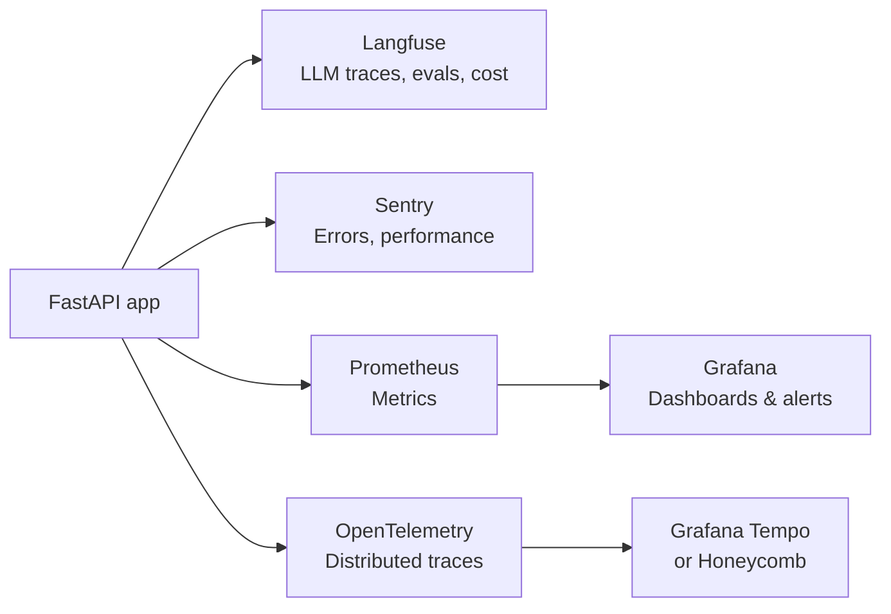

## Why Observability Is Different for LLM Apps

Traditional software fails in discrete ways: an exception is thrown, a query times out, a service returns 500. LLMs fail in soft ways: they return an answer that's wrong, slightly off-topic, or confidently incorrect. No exception is raised. The HTTP status is 200. The cost was charged.

This creates a new observability challenge: **you can't just watch for errors — you have to watch for quality**.

At the same time, LLM apps have the same operational concerns as any distributed system: latency, uptime, cost, and throughput. You need both layers.

---

## The Three Pillars

### Logs

Structured records of discrete events. Logs answer **"what happened?"**

For LLM apps, log:
- Every request and response (with truncation for long outputs)
- Prompt version used
- Model selected, temperature, max_tokens
- Token counts and estimated cost
- User ID and session ID (for attribution)
- Any downstream tool calls or retrieval steps

Use **structured logging** (JSON) rather than free-form strings so logs are queryable in tools like Datadog, Loki, or CloudWatch.

### Metrics

Numeric aggregations over time. Metrics answer **"how much / how often?"**

Key LLM metrics:

| Metric | What it tells you |
|---|---|
| **P50/P95/P99 latency** | Distribution of response times — P99 catches the tail |
| **Time to first token (TTFT)** | User-perceived responsiveness for streaming |
| **Tokens per request** | Input vs. output token breakdown |
| **Cost per request / per user** | Spend attribution and budget alerting |
| **Error rate** | 4xx (bad requests) vs. 5xx (provider failures) |
| **Token budget utilization** | % of context window used |
| **Cache hit rate** | Efficiency of semantic/exact caching |
| **Queue depth** | Backlog of background jobs |
| **Retry rate** | Frequency of transient failures to the LLM provider |

### Traces

A trace follows a single request through every service and function it touches. Traces answer **"where did the time go, and what did each step do?"**

For a RAG (retrieval-augmented generation) query, a trace might show:

```
Trace: user-query-abc123 (total: 3.2s)
  ├── input_validation         5ms
  ├── embed_query              80ms
  ├── vector_search            120ms   ← 3 chunks retrieved
  ├── prompt_construction      2ms
  ├── llm_call                 2900ms  ← most of the time
  │     ├── TTFT: 450ms
  │     └── total_tokens: 1840
  └── response_formatting      5ms
```

Without traces, you can only see that the request took 3.2 seconds. With traces, you can see exactly where to optimise.

---

## OpenTelemetry

**OpenTelemetry (OTel)** is the open standard for generating and exporting telemetry data — traces, metrics, and logs — from any application to any backend. It's vendor-neutral: instrument once, export to Jaeger, Grafana, Datadog, Honeycomb, or any OTel-compatible backend.

### Core concepts

- **Span** — a single unit of work with a name, start time, duration, and attributes. A trace is a tree of spans.
- **Trace ID** — a unique identifier that flows through every service handling a request, linking all spans together.
- **Context propagation** — passing the trace ID via HTTP headers (`traceparent`) so distributed systems can build a unified trace tree.
- **Exporter** — the component that ships telemetry to a backend (OTLP over HTTP/gRPC is the standard protocol).
- **Instrumentation library** — auto-instruments frameworks like FastAPI, SQLAlchemy, requests without code changes.

### In practice

Most teams auto-instrument their framework and add manual spans for the LLM call:

```python
from opentelemetry import trace

tracer = trace.get_tracer(__name__)

with tracer.start_as_current_span("llm_call") as span:
    span.set_attribute("model", "claude-sonnet-4-6")
    span.set_attribute("input_tokens", prompt_tokens)
    response = await client.messages.create(...)
    span.set_attribute("output_tokens", response.usage.output_tokens)
    span.set_attribute("cost_usd", calculate_cost(response.usage))
```

OpenAI and Anthropic SDKs have community-maintained OTel integrations that auto-instrument LLM calls.

---

## Langfuse

**Langfuse** is the de-facto observability platform purpose-built for LLM applications. It adds the layer that generic OTel backends lack: understanding of prompts, model outputs, evaluations, and cost attribution.

### What Langfuse provides

**Traces and spans** — same concept as OTel, but with LLM-aware visualisation. Each LLM call shows the full prompt, the full response, token counts, latency, and cost in a readable UI.

**Prompt management** — version and deploy prompts from Langfuse. Your code fetches the active prompt version at runtime:
```python
prompt = langfuse.get_prompt("my-system-prompt", version=3)
```
This decouples prompt iteration from code deploys.

**Evaluations** — score outputs to measure quality over time:
- **Human evaluations** — send samples to reviewers via Langfuse's annotation UI
- **LLM-as-judge** — automatically score outputs using a second LLM call with a rubric
- **Custom metrics** — track domain-specific quality signals (citation accuracy, format compliance, relevance)

**Cost attribution** — per-user, per-feature, per-prompt-version breakdowns. Answer "which feature is spending the most on tokens?"

**Session tracking** — group traces by user session to see a full conversation and its total cost.

**A/B testing** — route a percentage of traffic to a new prompt version, compare quality metrics and cost.

### What to track in Langfuse

At minimum: every LLM call with `user_id`, `session_id`, `prompt_version`, token counts, and latency. Add evaluations once you want to measure quality, not just operational metrics.

---

## Sentry

**Sentry** handles the error monitoring and performance side — the traditional observability concerns that LLM apps still have.

### What Sentry provides for LLM apps

**Error tracking** — captures exceptions with full stack traces, request context, and user information. Particularly useful for:
- Pydantic validation failures on LLM output
- Provider API errors (timeouts, auth failures)
- Any exception in your backend or worker processes

**Performance monitoring** — transaction tracing similar to OTel but with Sentry's dashboards and alerting. Captures slow endpoints, N+1 queries, and slow external API calls.

**Session replay** — records user sessions in the browser, so you can see exactly what a user did before they hit an error. Valuable for debugging chat UI issues.

**Alerts** — spike in error rate, latency regression, new exception type. Integrates with Slack and PagerDuty.

### Langfuse vs Sentry — when to use which

They're complementary, not competing:

| Concern | Tool |
|---|---|
| LLM call quality, prompt management, cost | Langfuse |
| Exceptions, crashes, performance regressions | Sentry |
| Infrastructure metrics (CPU, memory, queue depth) | Prometheus + Grafana |
| Full distributed traces across microservices | OpenTelemetry → Grafana Tempo or Honeycomb |

Most production LLM apps run all of these.

---

## Infrastructure Metrics: Prometheus and Grafana

**Prometheus** scrapes numeric metrics from your services on a configurable interval and stores them as time-series data. **Grafana** visualises them in dashboards with alert rules.

For LLM apps, Prometheus tracks:
- Request rate and error rate (RED method)
- Latency histograms
- Worker queue depth
- Redis memory usage and cache hit rate
- GPU utilisation (for self-hosted models)

FastAPI exposes Prometheus metrics via the `prometheus-fastapi-instrumentator` library — zero additional code for basic metrics.

---

## Sampling Strategies

Tracing every request at scale is expensive. Sampling reduces volume while preserving signal.

**Head-based sampling** — decide at the start of a trace whether to record it (e.g., 10% of all requests). Simple, but misses rare errors in the 90%.

**Tail-based sampling** — collect all spans, then decide at trace completion whether to keep the trace. Keep 100% of traces with errors or high latency; sample the rest at 5%. More accurate but requires buffering.

**Priority sampling** — always record traces that are slow (> P95), contain errors, or involve specific users (e.g., paid tier). Discard fast, successful traces from anonymous users.

For most LLM apps: tail-based sampling with "always keep errors and slow traces" is the right default.

---

## Prompt Versioning and A/B Testing

As your application matures, you'll iterate on prompts. Observability supports this safely.

**Version every prompt** — never overwrite. Label deployments by prompt version so you can compare metrics across versions.

**Shadow testing** — run the new prompt on real traffic but don't show the output to users yet. Compare quality offline.

**Gradual rollout** — route 5% of traffic to the new prompt version, monitor quality metrics, increase if stable.

**Rollback triggers** — define thresholds: if quality score drops > 10% from baseline, automatically revert to the last known-good prompt version.

Langfuse and LaunchDarkly both support this pattern.

---

## What to Alert On

Not everything needs a page. Tier your alerts:

**Page immediately (production down):**
- LLM provider error rate > 10% for 5 minutes
- Background job queue not draining (worker crash)
- API error rate > 5%

**Notify (investigate soon):**
- P99 latency > 15 seconds
- Daily token spend > 120% of budget
- Cache hit rate drops > 20 percentage points (possible prompt change)

**Dashboard only (review weekly):**
- Average quality score trend
- Token cost per feature over time
- Most common failure modes from LLM-judge evaluations

---

## A Practical Observability Stack



Start with **Langfuse + Sentry** — they give you the most signal for the least setup and cover the LLM-specific concerns that generic tools miss. Add Prometheus/Grafana when you have infrastructure to monitor. Add OTel/Tempo when you have multiple services and need cross-service traces.
