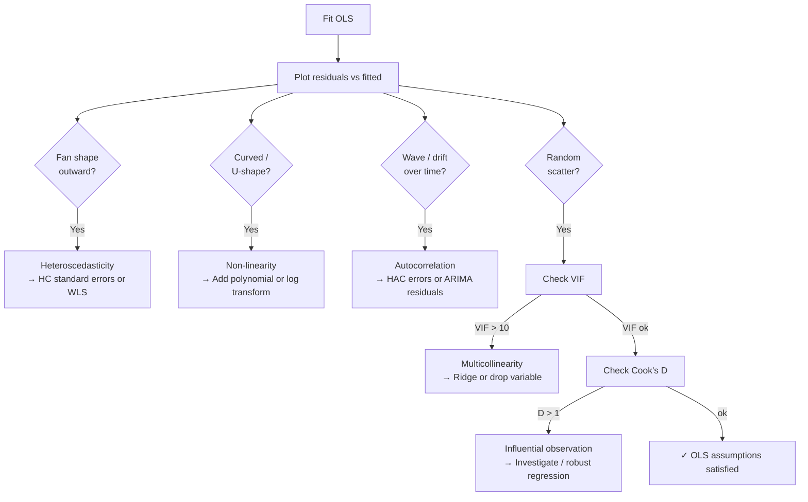
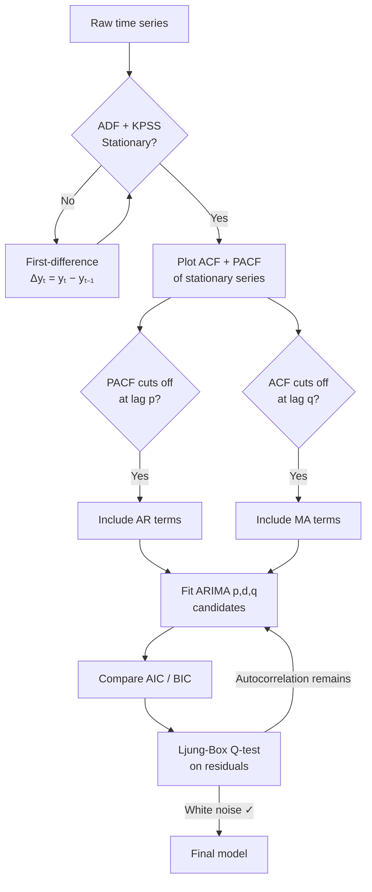
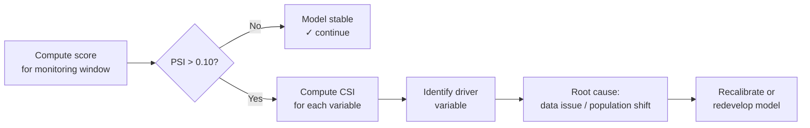

## The Core Idea

Linear regression models the relationship between a response variable $y$ and one or more predictors $\mathbf{x}$ as a linear function, then estimates that function from data by minimising prediction error. It is the workhorse of quantitative analytics — directly useful for modelling returns, risk factors, and economic relationships, and the conceptual foundation for nearly every more complex method.

---

## Part 1: Ordinary Least Squares (OLS)

### The Model

The population regression model assumes:

$$
y_i = \beta_0 + \beta_1 x_{i1} + \beta_2 x_{i2} + \cdots + \beta_k x_{ik} + \varepsilon_i
$$

In matrix form with $n$ observations and $k$ predictors:

$$
\mathbf{y} = X\boldsymbol{\beta} + \boldsymbol{\varepsilon}
$$

Where:
- $\mathbf{y} \in \mathbb{R}^n$ — response vector
- $X \in \mathbb{R}^{n \times (k+1)}$ — design matrix (first column is a vector of ones for the intercept)
- $\boldsymbol{\beta} \in \mathbb{R}^{k+1}$ — coefficient vector (what we estimate)
- $\boldsymbol{\varepsilon} \in \mathbb{R}^n$ — error vector (unobservable)

### OLS Derivation

OLS minimises the residual sum of squares:

$$
\text{RSS}(\boldsymbol{\beta}) = \sum_{i=1}^n (y_i - \mathbf{x}_i^\top \boldsymbol{\beta})^2 = (\mathbf{y} - X\boldsymbol{\beta})^\top(\mathbf{y} - X\boldsymbol{\beta})
$$

Taking the derivative with respect to $\boldsymbol{\beta}$ and setting it to zero:

$$
\frac{\partial \text{RSS}}{\partial \boldsymbol{\beta}} = -2X^\top(\mathbf{y} - X\boldsymbol{\beta}) = 0
$$

This gives the **normal equations**: $X^\top X \boldsymbol{\beta} = X^\top \mathbf{y}$

Solving (when $X^\top X$ is invertible):

$$
\boxed{\hat{\boldsymbol{\beta}} = (X^\top X)^{-1} X^\top \mathbf{y}}
$$

This is the OLS estimator. It has a closed-form solution — no iteration required.

**Intuition:** OLS projects $\mathbf{y}$ orthogonally onto the column space of $X$. The fitted values $\hat{\mathbf{y}} = X\hat{\boldsymbol{\beta}}$ are the point in that column space closest to $\mathbf{y}$ under the Euclidean norm.

<svg viewBox="0 0 460 305" xmlns="http://www.w3.org/2000/svg" style="max-width:520px;width:100%;display:block;margin:1.5rem auto">
  <g stroke="#888" stroke-opacity="0.15" stroke-width="1">
    <line x1="55" y1="217" x2="428" y2="217"/><line x1="55" y1="169" x2="428" y2="169"/>
    <line x1="55" y1="121" x2="428" y2="121"/><line x1="55" y1="73" x2="428" y2="73"/>
    <line x1="129" y1="25" x2="129" y2="265"/><line x1="203" y1="25" x2="203" y2="265"/>
    <line x1="277" y1="25" x2="277" y2="265"/><line x1="351" y1="25" x2="351" y2="265"/>
  </g>
  <line x1="55" y1="234" x2="428" y2="64" stroke="#f87171" stroke-width="2.5" stroke-linecap="round"/>
  <line x1="148" y1="167" x2="148" y2="192" stroke="#fbbf24" stroke-width="1.5" stroke-dasharray="3,2"/>
  <line x1="222" y1="126" x2="222" y2="158" stroke="#fbbf24" stroke-width="1.5" stroke-dasharray="3,2"/>
  <line x1="314" y1="92" x2="314" y2="116" stroke="#fbbf24" stroke-width="1.5" stroke-dasharray="3,2"/>
  <g fill="#818cf8">
    <circle cx="92" cy="214" r="4.5"/><circle cx="129" cy="198" r="4.5"/>
    <circle cx="148" cy="167" r="4.5"/><circle cx="166" cy="172" r="4.5"/>
    <circle cx="203" cy="164" r="4.5"/><circle cx="222" cy="126" r="4.5"/>
    <circle cx="240" cy="143" r="4.5"/><circle cx="277" cy="114" r="4.5"/>
    <circle cx="296" cy="128" r="4.5"/><circle cx="314" cy="92" r="4.5"/>
    <circle cx="351" cy="95" r="4.5"/><circle cx="388" cy="78" r="4.5"/>
    <circle cx="406" cy="52" r="4.5"/>
  </g>
  <text x="154" y="183" font-size="11" fill="#fbbf24" font-style="italic" font-family="inherit">ε</text>
  <text x="228" y="146" font-size="11" fill="#fbbf24" font-style="italic" font-family="inherit">ε</text>
  <text x="320" y="107" font-size="11" fill="#fbbf24" font-style="italic" font-family="inherit">ε</text>
  <line x1="55" y1="265" x2="428" y2="265" stroke="#888" stroke-width="1.5"/>
  <line x1="55" y1="25" x2="55" y2="265" stroke="#888" stroke-width="1.5"/>
  <g font-size="11" fill="currentColor" fill-opacity="0.45" text-anchor="middle" font-family="inherit">
    <text x="55" y="280">0</text><text x="129" y="280">2</text><text x="203" y="280">4</text>
    <text x="277" y="280">6</text><text x="351" y="280">8</text><text x="428" y="280">10</text>
  </g>
  <g font-size="11" fill="currentColor" fill-opacity="0.45" text-anchor="end" font-family="inherit">
    <text x="50" y="269">0</text><text x="50" y="221">2</text><text x="50" y="173">4</text>
    <text x="50" y="125">6</text><text x="50" y="77">8</text><text x="50" y="29">10</text>
  </g>
  <text x="241" y="298" text-anchor="middle" font-size="12" fill="currentColor" fill-opacity="0.55" font-family="inherit">Predictor x</text>
  <text x="16" y="145" text-anchor="middle" font-size="12" fill="currentColor" fill-opacity="0.55" font-family="inherit" transform="rotate(-90,16,145)">Response y</text>
  <g font-size="11" font-family="inherit">
    <circle cx="265" cy="250" r="4" fill="#818cf8"/>
    <text x="275" y="254" fill="currentColor" fill-opacity="0.65">observed</text>
    <line x1="330" y1="250" x2="350" y2="250" stroke="#f87171" stroke-width="2.5"/>
    <text x="356" y="254" fill="currentColor" fill-opacity="0.65">ŷ = β₀+β₁x</text>
  </g>
</svg>

### The Gauss-Markov Theorem

Under five assumptions, OLS is the **Best Linear Unbiased Estimator (BLUE)** — it has the smallest variance among all linear unbiased estimators.

| Assumption | Statement | What breaks it |
|---|---|---|
| **L** Linearity | $y = X\beta + \varepsilon$ is correctly specified | Omitted variables, wrong functional form |
| **I** Independence | Observations are independent | Time series autocorrelation, clustered data |
| **H** Homoscedasticity | $\text{Var}(\varepsilon_i) = \sigma^2$ (constant) | Volatility clustering in financial returns |
| **N** Normality | $\varepsilon \sim \mathcal{N}(0, \sigma^2 I)$ | Fat tails, outliers (needed for exact inference, not BLUE) |
| **E** Exogeneity | $\mathbb{E}[\varepsilon | X] = 0$ | Endogeneity, reverse causality, omitted variable bias |

When these hold, $\hat{\boldsymbol{\beta}}$ is unbiased ($\mathbb{E}[\hat{\boldsymbol{\beta}}] = \boldsymbol{\beta}$) and efficient.

---

## Part 2: Inference and Model Evaluation

### Coefficient Standard Errors

The variance-covariance matrix of $\hat{\boldsymbol{\beta}}$ under homoscedasticity:

$$
\text{Var}(\hat{\boldsymbol{\beta}}) = \sigma^2 (X^\top X)^{-1}
$$

Since $\sigma^2$ is unknown, replace it with the unbiased estimator:

$$
\hat{\sigma}^2 = \frac{\text{RSS}}{n - k - 1} = \frac{\sum_i \hat{\varepsilon}_i^2}{n-k-1}
$$

The standard error of $\hat{\beta}_j$ is $\text{SE}(\hat{\beta}_j) = \hat{\sigma} \sqrt{[(X^\top X)^{-1}]_{jj}}$

### Hypothesis Testing

**t-test for individual coefficients:**

$$
t_j = \frac{\hat{\beta}_j}{\text{SE}(\hat{\beta}_j)} \sim t_{n-k-1} \quad \text{under } H_0: \beta_j = 0
$$

**F-test for joint significance:**

$$
F = \frac{(\text{RSS}_\text{restricted} - \text{RSS}_\text{unrestricted})/q}{\text{RSS}_\text{unrestricted}/(n-k-1)} \sim F_{q,\, n-k-1}
$$

Where $q$ is the number of restrictions. Tests whether a group of coefficients are jointly zero.

### Goodness of Fit

**R² (coefficient of determination):**

$$
R^2 = 1 - \frac{\text{RSS}}{\text{TSS}} = 1 - \frac{\sum_i \hat{\varepsilon}_i^2}{\sum_i (y_i - \bar{y})^2}
$$

R² measures the fraction of total variance in $y$ explained by the model. It never decreases when you add predictors — regardless of whether they're useful.

**Adjusted R²** penalises for adding irrelevant predictors:

$$
\bar{R}^2 = 1 - \frac{(1-R^2)(n-1)}{n-k-1}
$$

**AIC and BIC** — information criteria for model selection:

$$
\text{AIC} = 2k - 2\ln(\hat{L}), \quad \text{BIC} = k\ln(n) - 2\ln(\hat{L})
$$

Lower is better. BIC penalises complexity more heavily than AIC and tends to select simpler models.

### Confidence Intervals

A 95% confidence interval for $\beta_j$:

$$
\hat{\beta}_j \pm t_{n-k-1,\, 0.025} \cdot \text{SE}(\hat{\beta}_j)
$$

**Interpretation:** If you repeated the experiment many times and computed this interval each time, 95% of intervals would contain the true $\beta_j$. It is NOT "95% probability that the true parameter is in this interval" (that's the Bayesian credible interval).

---

## Part 3: Regression Diagnostics

Diagnostics test whether the Gauss-Markov assumptions hold. Violating them doesn't always invalidate the regression — but it changes what you can conclude.

### Residual Analysis

Always start with residual plots:
- **Residuals vs. fitted values** — should be random scatter. Patterns indicate heteroscedasticity or non-linearity.
- **Q-Q plot** — residuals vs. theoretical normal quantiles. Deviations at tails indicate non-normality (common in financial data).
- **Scale-location plot** — $\sqrt{|\hat{\varepsilon}_i|}$ vs. fitted values. Increasing spread = heteroscedasticity.
- **Residuals vs. time** — for time-ordered data. Patterns indicate autocorrelation.

Each pattern tells you something different and has a different fix:

<svg viewBox="0 0 510 370" xmlns="http://www.w3.org/2000/svg" style="max-width:580px;width:100%;display:block;margin:1.5rem auto">
  <!-- Panel titles -->
  <text x="140" y="22" text-anchor="middle" font-size="12" font-weight="600" fill="#22c55e" font-family="inherit">✓ Good — random scatter</text>
  <text x="370" y="22" text-anchor="middle" font-size="12" font-weight="600" fill="#f87171" font-family="inherit">✗ Heteroscedastic — fan shape</text>
  <text x="140" y="215" text-anchor="middle" font-size="12" font-weight="600" fill="#f87171" font-family="inherit">✗ Non-linear — curved pattern</text>
  <text x="370" y="215" text-anchor="middle" font-size="12" font-weight="600" fill="#f87171" font-family="inherit">✗ Autocorrelated — wave pattern</text>
  <!-- Zero lines (dashed) -->
  <line x1="60" y1="100" x2="220" y2="100" stroke="#888" stroke-opacity="0.4" stroke-dasharray="4,3" stroke-width="1"/>
  <line x1="290" y1="100" x2="450" y2="100" stroke="#888" stroke-opacity="0.4" stroke-dasharray="4,3" stroke-width="1"/>
  <line x1="60" y1="285" x2="220" y2="285" stroke="#888" stroke-opacity="0.4" stroke-dasharray="4,3" stroke-width="1"/>
  <line x1="290" y1="285" x2="450" y2="285" stroke="#888" stroke-opacity="0.4" stroke-dasharray="4,3" stroke-width="1"/>
  <!-- Panel axes -->
  <line x1="60" y1="45" x2="60" y2="155" stroke="#888" stroke-width="1"/>
  <line x1="60" y1="155" x2="220" y2="155" stroke="#888" stroke-width="1"/>
  <line x1="290" y1="45" x2="290" y2="155" stroke="#888" stroke-width="1"/>
  <line x1="290" y1="155" x2="450" y2="155" stroke="#888" stroke-width="1"/>
  <line x1="60" y1="235" x2="60" y2="335" stroke="#888" stroke-width="1"/>
  <line x1="60" y1="335" x2="220" y2="335" stroke="#888" stroke-width="1"/>
  <line x1="290" y1="235" x2="290" y2="335" stroke="#888" stroke-width="1"/>
  <line x1="290" y1="335" x2="450" y2="335" stroke="#888" stroke-width="1"/>
  <!-- "Fitted values →" labels -->
  <text x="140" y="167" text-anchor="middle" font-size="10" fill="currentColor" fill-opacity="0.4" font-family="inherit">Fitted values →</text>
  <text x="370" y="167" text-anchor="middle" font-size="10" fill="currentColor" fill-opacity="0.4" font-family="inherit">Fitted values →</text>
  <text x="140" y="347" text-anchor="middle" font-size="10" fill="currentColor" fill-opacity="0.4" font-family="inherit">Fitted values →</text>
  <text x="370" y="347" text-anchor="middle" font-size="10" fill="currentColor" fill-opacity="0.4" font-family="inherit">Fitted values →</text>
  <!-- TL: Good residuals (random) -->
  <g fill="#818cf8">
    <circle cx="68" cy="84" r="4"/><circle cx="84" cy="124" r="4"/><circle cx="100" cy="70" r="4"/>
    <circle cx="116" cy="110" r="4"/><circle cx="132" cy="136" r="4"/><circle cx="148" cy="58" r="4"/>
    <circle cx="164" cy="106" r="4"/><circle cx="180" cy="80" r="4"/><circle cx="196" cy="128" r="4"/>
    <circle cx="212" cy="86" r="4"/>
  </g>
  <!-- TR: Heteroscedastic (fan) -->
  <g fill="#f87171">
    <circle cx="298" cy="96" r="4"/><circle cx="314" cy="106" r="4"/><circle cx="330" cy="84" r="4"/>
    <circle cx="346" cy="110" r="4"/><circle cx="362" cy="60" r="4"/><circle cx="378" cy="130" r="4"/>
    <circle cx="394" cy="64" r="4"/><circle cx="410" cy="148" r="4"/><circle cx="426" cy="44" r="4"/>
    <circle cx="442" cy="154" r="4"/>
  </g>
  <!-- BL: Non-linear (inverted U) -->
  <g fill="#f87171">
    <circle cx="68" cy="325" r="4"/><circle cx="84" cy="301" r="4"/><circle cx="100" cy="269" r="4"/>
    <circle cx="116" cy="249" r="4"/><circle cx="132" cy="235" r="4"/><circle cx="148" cy="239" r="4"/>
    <circle cx="164" cy="255" r="4"/><circle cx="180" cy="281" r="4"/><circle cx="196" cy="311" r="4"/>
    <circle cx="212" cy="329" r="4"/>
  </g>
  <!-- BR: Autocorrelated (wave) -->
  <g fill="#f87171">
    <circle cx="298" cy="245" r="4"/><circle cx="314" cy="235" r="4"/><circle cx="330" cy="241" r="4"/>
    <circle cx="346" cy="265" r="4"/><circle cx="362" cy="295" r="4"/><circle cx="378" cy="325" r="4"/>
    <circle cx="394" cy="335" r="4"/><circle cx="410" cy="329" r="4"/><circle cx="426" cy="305" r="4"/>
    <circle cx="442" cy="275" r="4"/>
  </g>
  <!-- "0" zero line labels -->
  <g font-size="10" fill="currentColor" fill-opacity="0.4" text-anchor="end" font-family="inherit">
    <text x="57" y="103">0</text><text x="287" y="103">0</text>
    <text x="57" y="288">0</text><text x="287" y="288">0</text>
  </g>
</svg>

### Heteroscedasticity

When $\text{Var}(\varepsilon_i) = \sigma_i^2$ varies across observations, OLS is still unbiased but no longer efficient. Standard errors are wrong — t-tests and confidence intervals are invalid.

**Detection:**
- **Breusch-Pagan test** — regress squared residuals on the predictors. Significant F-stat = heteroscedasticity.
- **White test** — more general, includes squared terms and cross-products.

**Fixes:**
- **Heteroscedasticity-consistent (HC) standard errors** (White standard errors) — correct the standard errors without changing $\hat{\boldsymbol{\beta}}$.
- **Weighted Least Squares (WLS)** — weight observations by the inverse of their error variance when the variance structure is known.
- **Generalised Least Squares (GLS)** — the general fix when the error covariance structure $\Sigma$ is known: $\hat{\boldsymbol{\beta}}_\text{GLS} = (X^\top \Sigma^{-1} X)^{-1} X^\top \Sigma^{-1} \mathbf{y}$

### Autocorrelation

When errors are correlated across time ($\text{Cov}(\varepsilon_t, \varepsilon_{t-s}) \neq 0$), OLS standard errors are too small — you over-reject the null.

**Detection:**
- **Durbin-Watson statistic** — tests for first-order autocorrelation. DW ≈ 2 means no autocorrelation; DW < 2 means positive autocorrelation (very common in financial time series).
- **Ljung-Box Q-test** — tests for autocorrelation at multiple lags simultaneously.
- **ACF/PACF plots** of residuals — visual inspection of autocorrelation structure.

**Fixes:**
- Newey-West standard errors (HAC — heteroscedasticity and autocorrelation consistent)
- Explicitly model the autocorrelation structure (ARIMA residuals)
- Include lagged dependent variable as a predictor (Cochrane-Orcutt)

### Multicollinearity

When predictors are highly correlated, $(X^\top X)^{-1}$ becomes unstable. Coefficients have large standard errors and wrong signs — individual coefficients can't be trusted even when the overall fit is good.

**Detection:**
- **Variance Inflation Factor (VIF):** $\text{VIF}_j = \frac{1}{1 - R_j^2}$ where $R_j^2$ is the R² from regressing $x_j$ on all other predictors. VIF > 10 (or > 5 conservatively) indicates a problem.
- **Condition number** of $X^\top X$ — above 30 indicates moderate, above 100 indicates severe multicollinearity.
- **Correlation matrix** — pairwise correlations above 0.8 are a warning sign.

**Fixes:** Ridge regression (shrinks coefficients), PCA regression (transforms to orthogonal predictors), removing one of the collinear variables.

### Influential Observations

**Leverage** measures how far an observation's $x$-values are from the mean. High-leverage points have outsized influence on the regression line regardless of their $y$-value.

$$
h_{ii} = [X(X^\top X)^{-1}X^\top]_{ii}
$$

**Cook's Distance** combines leverage and residual size into a single influence measure:

$$
D_i = \frac{\hat{\varepsilon}_i^2}{(k+1)\hat{\sigma}^2} \cdot \frac{h_{ii}}{(1-h_{ii})^2}
$$

$D_i > 1$ is a common threshold for "influential." Examine these observations: data errors, legitimate outliers, or regime changes.

### Diagnostic Decision Tree

---

## Part 4: Regularised Regression

When predictors are numerous or collinear, OLS over-fits. Regularisation adds a penalty term to the loss function, shrinking coefficients toward zero.

### Ridge Regression (L2)

$$
\hat{\boldsymbol{\beta}}_\text{ridge} = \arg\min_{\boldsymbol{\beta}} \left\{ \sum_i (y_i - \mathbf{x}_i^\top \boldsymbol{\beta})^2 + \lambda \sum_j \beta_j^2 \right\}
$$

Closed-form solution:

$$
\hat{\boldsymbol{\beta}}_\text{ridge} = (X^\top X + \lambda I)^{-1} X^\top \mathbf{y}
$$

Adding $\lambda I$ makes the matrix invertible even under perfect multicollinearity. Ridge shrinks all coefficients toward zero but never exactly to zero — it does not perform variable selection. Choose $\lambda$ via cross-validation.

### Lasso Regression (L1)

$$
\hat{\boldsymbol{\beta}}_\text{lasso} = \arg\min_{\boldsymbol{\beta}} \left\{ \sum_i (y_i - \mathbf{x}_i^\top \boldsymbol{\beta})^2 + \lambda \sum_j |\beta_j| \right\}
$$

The L1 penalty produces **sparse solutions** — it drives some coefficients exactly to zero. Lasso does automatic variable selection. No closed-form solution (solved with coordinate descent or LARS algorithm).

### Elastic Net

Combines L1 and L2:

$$
\hat{\boldsymbol{\beta}}_\text{enet} = \arg\min_{\boldsymbol{\beta}} \left\{ \text{RSS} + \lambda_1 \sum_j |\beta_j| + \lambda_2 \sum_j \beta_j^2 \right\}
$$

Useful when predictors number in the thousands (genomics, factor zoo in finance) — Lasso tends to select only one variable from a correlated group; Elastic Net can include all of them with reduced coefficients.

| Method | Penalty | Selects variables? | Handles multicollinearity? |
|---|---|---|---|
| OLS | None | No | No |
| Ridge | $\lambda \|\boldsymbol{\beta}\|_2^2$ | No | Yes |
| Lasso | $\lambda \|\boldsymbol{\beta}\|_1$ | Yes | Partially |
| Elastic Net | Both | Yes | Yes |

As $\lambda$ increases from 0, Ridge shrinks all coefficients smoothly toward (but never to) zero. Lasso drives coefficients to **exactly zero** at different thresholds — automatic variable selection:

<svg viewBox="0 0 500 245" xmlns="http://www.w3.org/2000/svg" style="max-width:560px;width:100%;display:block;margin:1.5rem auto">
  <!-- Panel labels -->
  <text x="135" y="16" text-anchor="middle" font-size="13" font-weight="600" fill="currentColor" fill-opacity="0.8" font-family="inherit">Ridge (L2)</text>
  <text x="365" y="16" text-anchor="middle" font-size="13" font-weight="600" fill="currentColor" fill-opacity="0.8" font-family="inherit">Lasso (L1)</text>
  <!-- Zero lines -->
  <line x1="55" y1="140" x2="215" y2="140" stroke="#888" stroke-opacity="0.3" stroke-dasharray="4,3" stroke-width="1"/>
  <line x1="275" y1="140" x2="435" y2="140" stroke="#888" stroke-opacity="0.3" stroke-dasharray="4,3" stroke-width="1"/>
  <!-- Axes -->
  <line x1="55" y1="20" x2="55" y2="200" stroke="#888" stroke-width="1.5"/>
  <line x1="55" y1="200" x2="215" y2="200" stroke="#888" stroke-width="1.5"/>
  <line x1="275" y1="20" x2="275" y2="200" stroke="#888" stroke-width="1.5"/>
  <line x1="275" y1="200" x2="435" y2="200" stroke="#888" stroke-width="1.5"/>
  <!-- Ridge: 4 smooth curves (coefficients shrink asymptotically) -->
  <!-- β1=2.5 (red) -->
  <polyline points="55,40 89,98 122,118 155,128 188,133 215,135" fill="none" stroke="#f87171" stroke-width="2" stroke-linejoin="round"/>
  <!-- β2=1.5 (indigo) -->
  <polyline points="55,80 89,111 122,124 155,130 188,135 215,137" fill="none" stroke="#818cf8" stroke-width="2" stroke-linejoin="round"/>
  <!-- β3=-1.0 (emerald) -->
  <polyline points="55,180 89,156 122,147 155,143 188,141 215,141" fill="none" stroke="#34d399" stroke-width="2" stroke-linejoin="round"/>
  <!-- β4=0.8 (amber) -->
  <polyline points="55,108 89,127 122,132 155,136 188,138 215,139" fill="none" stroke="#fbbf24" stroke-width="2" stroke-linejoin="round"/>
  <!-- Lasso: coefficients hit exactly zero (kinks) -->
  <!-- β1=2.5 → 0 at λ=0.88 -->
  <polyline points="275,40 419,140 435,140" fill="none" stroke="#f87171" stroke-width="2" stroke-linejoin="round"/>
  <!-- β2=1.5 → 0 at λ=0.62 -->
  <polyline points="275,80 374,140 435,140" fill="none" stroke="#818cf8" stroke-width="2" stroke-linejoin="round"/>
  <!-- β3=-1.0 → 0 at λ=0.50 -->
  <polyline points="275,180 355,140 435,140" fill="none" stroke="#34d399" stroke-width="2" stroke-linejoin="round"/>
  <!-- β4=0.8 → 0 at λ=0.35 -->
  <polyline points="275,108 331,140 435,140" fill="none" stroke="#fbbf24" stroke-width="2" stroke-linejoin="round"/>
  <!-- Axis labels -->
  <text x="135" y="213" text-anchor="middle" font-size="11" fill="currentColor" fill-opacity="0.5" font-family="inherit">Regularisation strength (λ) →</text>
  <text x="365" y="213" text-anchor="middle" font-size="11" fill="currentColor" fill-opacity="0.5" font-family="inherit">Regularisation strength (λ) →</text>
  <text x="20" y="110" text-anchor="middle" font-size="11" fill="currentColor" fill-opacity="0.5" font-family="inherit" transform="rotate(-90,20,110)">Coefficient β̂</text>
  <!-- Y tick labels (left panel) -->
  <g font-size="10" fill="currentColor" fill-opacity="0.4" text-anchor="end" font-family="inherit">
    <text x="50" y="43">3</text><text x="50" y="83">1.5</text>
    <text x="50" y="143">0</text><text x="50" y="183">−1</text>
  </g>
  <!-- X tick labels -->
  <g font-size="10" fill="currentColor" fill-opacity="0.4" text-anchor="middle" font-family="inherit">
    <text x="55" y="210">0</text><text x="135" y="210">0.5</text><text x="215" y="210">1</text>
    <text x="275" y="210">0</text><text x="355" y="210">0.5</text><text x="435" y="210">1</text>
  </g>
  <!-- "β→0 but never zero" label for Ridge -->
  <text x="175" y="120" font-size="9" fill="currentColor" fill-opacity="0.45" font-family="inherit">shrinks but</text>
  <text x="175" y="130" font-size="9" fill="currentColor" fill-opacity="0.45" font-family="inherit">never zero</text>
  <!-- "exact zeros" label for Lasso -->
  <text x="390" y="127" font-size="9" fill="currentColor" fill-opacity="0.45" font-family="inherit">exact</text>
  <text x="390" y="137" font-size="9" fill="currentColor" fill-opacity="0.45" font-family="inherit">zeros →</text>
  <!-- Legend -->
  <g font-size="10" font-family="inherit" fill="currentColor" fill-opacity="0.6">
    <line x1="55" y1="232" x2="72" y2="232" stroke="#f87171" stroke-width="2"/><text x="75" y="235">β₁</text>
    <line x1="95" y1="232" x2="112" y2="232" stroke="#818cf8" stroke-width="2"/><text x="115" y="235">β₂</text>
    <line x1="135" y1="232" x2="152" y2="232" stroke="#34d399" stroke-width="2"/><text x="155" y="235">β₃</text>
    <line x1="175" y1="232" x2="192" y2="232" stroke="#fbbf24" stroke-width="2"/><text x="195" y="235">β₄</text>
  </g>
</svg>

### Quantile Regression

Standard OLS estimates the **conditional mean** of $y$ given $X$. Quantile regression estimates any conditional quantile — the median, the 5th percentile, the 95th percentile.

Minimises the asymmetric loss function (pinball loss):

$$
\hat{\boldsymbol{\beta}}_\tau = \arg\min_{\boldsymbol{\beta}} \sum_i \rho_\tau(y_i - \mathbf{x}_i^\top \boldsymbol{\beta})
$$

Where $\rho_\tau(u) = u(\tau - \mathbf{1}[u < 0])$ and $\tau \in (0,1)$ is the quantile.

**Why it matters in finance:** Asset returns have fat tails. OLS ignores tail behaviour. Quantile regression at $\tau = 0.05$ directly models Value-at-Risk; at $\tau = 0.95$ models upside potential. No normality assumption required.

---

## Part 5: Panel Data and Fixed Effects

Panel data has both a cross-sectional dimension ($i$, e.g., stocks) and a time dimension ($t$). Standard OLS ignores the panel structure.

The panel model:

$$
y_{it} = \mathbf{x}_{it}^\top \boldsymbol{\beta} + \alpha_i + \varepsilon_{it}
$$

Where $\alpha_i$ is an **individual fixed effect** — a time-invariant, unit-specific unobservable (e.g., a company's management quality).

### Fixed Effects (Within) Estimator

Demean each variable within its unit:

$$
\tilde{y}_{it} = y_{it} - \bar{y}_i, \quad \tilde{\mathbf{x}}_{it} = \mathbf{x}_{it} - \bar{\mathbf{x}}_i
$$

Then regress $\tilde{y}$ on $\tilde{\mathbf{x}}$. This eliminates $\alpha_i$ entirely — fixed effects are controlled for regardless of whether they're correlated with $\mathbf{x}_{it}$ (no endogeneity from time-invariant confounders).

### Random Effects

Assumes $\alpha_i \sim \mathcal{N}(0, \sigma_\alpha^2)$ and $\text{Cov}(\alpha_i, \mathbf{x}_{it}) = 0$. More efficient than fixed effects when the assumption holds, but biased when it doesn't.

**Hausman test** — tests whether random effects is consistent (i.e., whether $\alpha_i$ is uncorrelated with $\mathbf{x}_{it}$). Significant → use fixed effects. Not significant → random effects is valid and more efficient.

---

## Part 6: Time Series

OLS assumes independent observations. Financial time series violates this — returns and prices are autocorrelated. Time series methods model the temporal dependence explicitly.

### Stationarity

A time series $\{y_t\}$ is **weakly stationary** if:
- $\mathbb{E}[y_t] = \mu$ (constant mean)
- $\text{Var}(y_t) = \sigma^2$ (constant variance)
- $\text{Cov}(y_t, y_{t-s})$ depends only on $s$, not on $t$

Non-stationary series (trending prices, unit root processes) produce **spurious regressions** — high R² and significant t-stats between unrelated variables.

**Testing for stationarity:**
- **ADF (Augmented Dickey-Fuller) test** — $H_0$: unit root (non-stationary). Reject = stationary.
- **KPSS test** — $H_0$: stationary. Reject = non-stationary.
- Run both: if ADF rejects and KPSS doesn't reject, strong evidence of stationarity.

**Transformations to achieve stationarity:**
- First-difference: $\Delta y_t = y_t - y_{t-1}$ (removes trend)
- Log transformation: stabilises variance
- Log-difference: $\ln(y_t/y_{t-1})$ — log returns in finance, typically stationary

### ACF and PACF

**Autocorrelation function (ACF):** $\rho(s) = \text{Corr}(y_t, y_{t-s})$ — correlation between the series and its $s$-period lag. Decays slowly for AR processes, cuts off sharply for MA processes.

**Partial autocorrelation function (PACF):** correlation between $y_t$ and $y_{t-s}$ after removing the effects of $y_{t-1}, \ldots, y_{t-s+1}$. Cuts off sharply for AR processes, decays slowly for MA.

Use ACF/PACF plots to identify model order before fitting ARIMA.

The chart below shows an AR(1) process with $\phi = 0.7$. ACF decays geometrically (never cuts off); PACF has a single spike at lag 1 then drops to zero — the diagnostic signature of a pure AR(1):

<svg viewBox="0 0 460 260" xmlns="http://www.w3.org/2000/svg" style="max-width:520px;width:100%;display:block;margin:1.5rem auto">
  <!-- Panel labels -->
  <text x="120" y="15" text-anchor="middle" font-size="12" font-weight="600" fill="currentColor" fill-opacity="0.75" font-family="inherit">ACF — geometric decay</text>
  <text x="350" y="15" text-anchor="middle" font-size="12" font-weight="600" fill="currentColor" fill-opacity="0.75" font-family="inherit">PACF — cuts off at lag 1</text>
  <!-- Confidence bounds (dashed blue) -->
  <!-- ACF panel -->
  <line x1="30" y1="79" x2="210" y2="79" stroke="#60a5fa" stroke-opacity="0.5" stroke-dasharray="5,3" stroke-width="1"/>
  <line x1="30" y1="138" x2="210" y2="138" stroke="#60a5fa" stroke-opacity="0.5" stroke-dasharray="5,3" stroke-width="1"/>
  <!-- PACF panel -->
  <line x1="250" y1="79" x2="430" y2="79" stroke="#60a5fa" stroke-opacity="0.5" stroke-dasharray="5,3" stroke-width="1"/>
  <line x1="250" y1="138" x2="430" y2="138" stroke="#60a5fa" stroke-opacity="0.5" stroke-dasharray="5,3" stroke-width="1"/>
  <!-- Baseline (zero) -->
  <line x1="30" y1="108" x2="210" y2="108" stroke="#888" stroke-width="1.2"/>
  <line x1="250" y1="108" x2="430" y2="108" stroke="#888" stroke-width="1.2"/>
  <!-- Axes -->
  <line x1="30" y1="20" x2="30" y2="180" stroke="#888" stroke-width="1.5"/>
  <line x1="30" y1="180" x2="212" y2="180" stroke="#888" stroke-width="1.5"/>
  <line x1="250" y1="20" x2="250" y2="180" stroke="#888" stroke-width="1.5"/>
  <line x1="250" y1="180" x2="432" y2="180" stroke="#888" stroke-width="1.5"/>
  <!-- ACF bars: lags 0-7, ACF(k)=0.7^k -->
  <!-- yScale: 0 at y=108, 1.0 at y=20, scale=88px/unit -->
  <!-- k=0: 1.0→y=20; k=1: 0.70→y=47; k=2: 0.49→y=65; k=3: 0.34→y=78; k=4: 0.24→y=87; k=5: 0.17→y=93; k=6: 0.12→y=98; k=7: 0.08→y=101 -->
  <!-- xSlot = 30 + (k+0.5)*22.5, bar width=14 -->
  <g fill="#818cf8" fill-opacity="0.85">
    <rect x="24" y="20" width="14" height="88"/><rect x="46" y="47" width="14" height="61"/>
    <rect x="69" y="65" width="14" height="43"/><rect x="91" y="78" width="14" height="30"/>
    <rect x="114" y="87" width="14" height="21"/><rect x="136" y="93" width="14" height="15"/>
    <rect x="159" y="98" width="14" height="10"/><rect x="181" y="101" width="14" height="7"/>
  </g>
  <!-- PACF bars: lag 0: skip, lag 1: 0.70, lags 2-7: ~0 -->
  <g fill="#818cf8" fill-opacity="0.85">
    <rect x="244" y="20" width="14" height="88"/>
    <rect x="266" y="47" width="14" height="61"/>
    <!-- lags 2-7: near zero (noise within confidence band) -->
    <rect x="289" y="103" width="14" height="5"/><rect x="311" y="105" width="14" height="3"/>
    <rect x="334" y="104" width="14" height="4"/><rect x="356" y="106" width="14" height="2"/>
    <rect x="379" y="105" width="14" height="3"/><rect x="401" y="104" width="14" height="4"/>
  </g>
  <!-- X labels (lag numbers) -->
  <g font-size="10" fill="currentColor" fill-opacity="0.45" text-anchor="middle" font-family="inherit">
    <text x="31" y="193">0</text><text x="53" y="193">1</text><text x="76" y="193">2</text>
    <text x="98" y="193">3</text><text x="121" y="193">4</text><text x="143" y="193">5</text>
    <text x="166" y="193">6</text><text x="188" y="193">7</text>
    <text x="251" y="193">0</text><text x="273" y="193">1</text><text x="296" y="193">2</text>
    <text x="318" y="193">3</text><text x="341" y="193">4</text><text x="363" y="193">5</text>
    <text x="386" y="193">6</text><text x="408" y="193">7</text>
  </g>
  <!-- X axis labels -->
  <text x="120" y="205" text-anchor="middle" font-size="11" fill="currentColor" fill-opacity="0.45" font-family="inherit">Lag</text>
  <text x="340" y="205" text-anchor="middle" font-size="11" fill="currentColor" fill-opacity="0.45" font-family="inherit">Lag</text>
  <!-- Y labels -->
  <g font-size="10" fill="currentColor" fill-opacity="0.4" text-anchor="end" font-family="inherit">
    <text x="26" y="23">1.0</text><text x="26" y="111">0</text><text x="26" y="141">−0.3</text>
  </g>
  <!-- Confidence band label -->
  <text x="215" y="77" font-size="9" fill="#60a5fa" fill-opacity="0.8" font-family="inherit">±1.96/√n</text>
  <!-- Annotation: "cuts off" -->
  <text x="340" y="38" font-size="10" fill="currentColor" fill-opacity="0.5" font-family="inherit">cuts off</text>
  <text x="340" y="49" font-size="10" fill="currentColor" fill-opacity="0.5" font-family="inherit">after lag 1 →</text>
</svg>

| Pattern | ACF | PACF | Model |
|---|---|---|---|
| Geometric decay | Geometric decay | Cuts off at lag p | AR(p) |
| Cuts off at lag q | Geometric decay | Geometric decay | MA(q) |
| Both decay slowly | Both decay slowly | — | ARMA(p,q) |

### ARIMA

**AR(p) — Autoregressive:**

$$
y_t = c + \phi_1 y_{t-1} + \phi_2 y_{t-2} + \cdots + \phi_p y_{t-p} + \varepsilon_t
$$

Current value is a linear function of $p$ past values. ACF decays geometrically; PACF cuts off at lag $p$.

**MA(q) — Moving Average:**

$$
y_t = \mu + \varepsilon_t + \theta_1 \varepsilon_{t-1} + \cdots + \theta_q \varepsilon_{t-q}
$$

Current value is a linear combination of $q$ past shocks. ACF cuts off at lag $q$; PACF decays geometrically.

**ARIMA(p, d, q):** Apply AR($p$) and MA($q$) to the $d$-times differenced series. $d=1$ handles a linear trend; $d=2$ handles a quadratic trend.

**Model selection:**

### GARCH (Volatility Modelling)

Financial return series exhibit **volatility clustering** — large moves follow large moves. ARIMA models the conditional mean; GARCH models the conditional variance.

**GARCH(1,1):**

$$
\sigma_t^2 = \omega + \alpha \varepsilon_{t-1}^2 + \beta \sigma_{t-1}^2
$$

Where $\sigma_t^2$ is today's variance, $\varepsilon_{t-1}^2$ is yesterday's squared shock (ARCH term), and $\sigma_{t-1}^2$ is yesterday's variance (GARCH term). Stationarity requires $\alpha + \beta < 1$.

GARCH is the standard model for VaR, option pricing (implied vol dynamics), and risk management.

### VAR (Vector Autoregression)

Extends AR to multiple time series, each equation regressing on lags of all variables:

$$
\mathbf{y}_t = \mathbf{c} + A_1 \mathbf{y}_{t-1} + A_2 \mathbf{y}_{t-2} + \cdots + A_p \mathbf{y}_{t-p} + \boldsymbol{\varepsilon}_t
$$

Useful for modelling interdependencies between variables (e.g., macro factors). Key tools:
- **Granger causality** — does $x$ help predict $y$ beyond $y$'s own history?
- **Impulse response functions (IRF)** — trace the effect of a shock in one variable through the system over time
- **Forecast error variance decomposition (FEVD)** — what fraction of variable $i$'s forecast error variance is attributable to shocks from variable $j$?

### Cointegration

Two non-stationary series $y_t$ and $x_t$ are **cointegrated** if there exists a linear combination $y_t - \gamma x_t$ that is stationary — they share a common stochastic trend and move together in the long run.

**Engle-Granger test:** Regress $y_t$ on $x_t$; test residuals for stationarity. If stationary, the series are cointegrated with cointegrating vector $(1, -\hat{\gamma})$.

**Error Correction Model (ECM):** When series are cointegrated, model short-run dynamics and long-run equilibrium together:

$$
\Delta y_t = \alpha_0 + \alpha_1 (y_{t-1} - \gamma x_{t-1}) + \beta \Delta x_{t-1} + \varepsilon_t
$$

The term $(y_{t-1} - \gamma x_{t-1})$ is the **error correction term** — it measures how far the system deviated from long-run equilibrium last period, and $\alpha_1$ determines the speed of mean reversion back.

Applications: pairs trading (equity or fixed income), purchasing power parity, yield curve dynamics.

---

## Part 7: Principal Component Analysis (PCA)

PCA finds directions of maximum variance in high-dimensional data. It's used for dimensionality reduction, factor construction, and dealing with multicollinearity.

### The Math

Given a centred data matrix $X \in \mathbb{R}^{n \times p}$ (zero mean columns), compute the sample covariance matrix:

$$
S = \frac{1}{n-1} X^\top X
$$

Decompose via eigendecomposition:

$$
S = V \Lambda V^\top
$$

Where $V$ contains eigenvectors (principal components) and $\Lambda = \text{diag}(\lambda_1, \ldots, \lambda_p)$ contains eigenvalues in decreasing order. Equivalently, via SVD of $X$: $X = U D V^\top$.

Project onto the first $k$ components:

$$
Z = X V_k \in \mathbb{R}^{n \times k}
$$

The fraction of variance explained by the first $k$ components is $\sum_{i=1}^k \lambda_i / \sum_{i=1}^p \lambda_i$.

### Interpretation in Finance

The first principal component of a set of stock returns often approximates the market factor. The second and third components often capture sector or style effects. PCA on the yield curve typically extracts:
- **PC1** — level (parallel shift, ~90% of variance)
- **PC2** — slope (short vs. long rates)
- **PC3** — curvature (butterfly)

### PCA Regression

When predictors are collinear, regress on the first $k$ principal components instead of the original variables. Eliminates multicollinearity by construction (PCs are orthogonal). Trade-off: PCs may lack intuitive interpretation.

---

## Part 8: Factor Models

Factor models decompose returns into systematic and idiosyncratic components:

$$
r_i = \alpha_i + \beta_{i1} F_1 + \beta_{i2} F_2 + \cdots + \beta_{ik} F_k + \varepsilon_i
$$

Where $F_j$ are common factors, $\beta_{ij}$ are factor loadings, and $\varepsilon_i$ is idiosyncratic risk.

### CAPM (Single Factor)

$$
r_i - r_f = \alpha_i + \beta_i (r_m - r_f) + \varepsilon_i
$$

$\beta_i$ measures systematic (market) risk. $\alpha_i$ is Jensen's alpha — excess return above what CAPM predicts. Estimated by OLS regression of excess returns on excess market returns.

### Fama-French Three-Factor Model

$$
r_i - r_f = \alpha_i + \beta_1 \text{MKT} + \beta_2 \text{SMB} + \beta_3 \text{HML} + \varepsilon_i
$$

Where SMB (Small Minus Big) captures the size premium and HML (High Minus Low) captures the value premium. The Carhart four-factor model adds MOM (momentum). Fama-French five-factor adds RMW (profitability) and CMA (investment).

### Barra-Style Risk Models

Multi-factor risk models used by risk management:
- **Style factors**: value, momentum, quality, size, low volatility
- **Industry factors**: GICS sector exposures
- **Country/currency factors**: for global portfolios

The factor return covariance matrix $\Sigma$ decomposes portfolio risk:

$$
\text{Var}(\mathbf{r}_p) = \mathbf{w}^\top \Sigma \mathbf{w} = \mathbf{w}^\top (B \Sigma_F B^\top + D) \mathbf{w}
$$

Where $B$ is the factor exposure matrix, $\Sigma_F$ is the factor covariance matrix, and $D$ is the diagonal idiosyncratic variance matrix.

---

## Part 9: Statistical Testing Framework

### Hypothesis Testing

1. State $H_0$ (null) and $H_1$ (alternative)
2. Choose a test statistic and its null distribution
3. Compute the p-value: probability of observing a test statistic at least as extreme as the one computed, given $H_0$ is true
4. Compare p-value to significance level $\alpha$ (typically 0.05)

**Type I error** (false positive): Rejecting $H_0$ when it is true. Probability = $\alpha$.
**Type II error** (false negative): Failing to reject $H_0$ when it is false. Probability = $\beta$.
**Power** = $1 - \beta$: probability of correctly rejecting a false null.

**The p-value is not** the probability that $H_0$ is true. It is the probability of the data (or more extreme) given $H_0$.

### Multiple Testing

When testing $m$ hypotheses simultaneously, the probability of at least one false positive explodes:

$$
P(\text{at least one false positive}) = 1 - (1-\alpha)^m
$$

For $m=20$ tests at $\alpha=0.05$: $1 - 0.95^{20} \approx 64\%$ chance of a false positive.

**Bonferroni correction** — divide $\alpha$ by $m$: test each hypothesis at $\alpha/m$. Conservative (controls family-wise error rate).

**Benjamini-Hochberg (FDR)** — controls the **false discovery rate** (expected proportion of false positives among rejections). Less conservative than Bonferroni; preferred when testing many hypotheses:
1. Order p-values: $p_{(1)} \leq p_{(2)} \leq \cdots \leq p_{(m)}$
2. Find the largest $k$ such that $p_{(k)} \leq \frac{k}{m} \alpha$
3. Reject all hypotheses with $p \leq p_{(k)}$

In finance this matters enormously — Harvey, Liu & Zhu (2016) showed most published factor discoveries fail to survive multiple testing corrections.

### Key Tests Reference

| Test | Null hypothesis | Use when |
|---|---|---|
| **t-test (one sample)** | $\mu = \mu_0$ | Testing if mean return differs from zero |
| **t-test (two sample)** | $\mu_1 = \mu_2$ | Comparing means of two groups |
| **F-test** | $\beta_{j} = \cdots = \beta_k = 0$ | Joint significance of predictors |
| **Jarque-Bera** | Normality ($\text{skew}=0$, $\text{kurt}=3$) | Testing normality of returns |
| **Breusch-Pagan** | Homoscedasticity | Testing for heteroscedasticity |
| **Durbin-Watson** | No first-order autocorrelation | Time series residual checking |
| **Ljung-Box** | No autocorrelation up to lag $h$ | Residual diagnostics |
| **ADF** | Unit root (non-stationary) | Pre-testing time series |
| **KPSS** | Stationarity | Pre-testing time series |
| **Hausman** | RE consistent ($\alpha_i \perp X$) | Fixed vs. random effects choice |
| **Granger causality** | $x$ does not Granger-cause $y$ | VAR causal inference |
| **Chow test** | No structural break | Testing regime changes |

---

## Part 10: Distribution Statistics

Before running regressions or tests, understanding the shape of your data's distribution matters — especially in finance where returns are decidedly non-normal.

### Moments

The first four moments of a distribution describe its shape completely:

| Moment | Formula | What it measures |
|---|---|---|
| **Mean** | $\mu = \mathbb{E}[X]$ | Central tendency |
| **Variance** | $\sigma^2 = \mathbb{E}[(X-\mu)^2]$ | Spread |
| **Skewness** | $\gamma_1 = \mathbb{E}\!\left[\left(\frac{X-\mu}{\sigma}\right)^3\right]$ | Asymmetry |
| **Kurtosis** | $\gamma_2 = \mathbb{E}\!\left[\left(\frac{X-\mu}{\sigma}\right)^4\right]$ | Tail heaviness |

**Skewness:** Zero = symmetric. Positive = right tail (large positive outliers). Negative = left tail (crash risk in equity returns — large negative outliers dominate).

**Kurtosis:** Normal distribution has kurtosis = 3. **Excess kurtosis** = kurtosis − 3. Positive excess kurtosis means **fat tails** — extreme events are far more common than a normal distribution predicts.

Financial returns typically show: negative skew + excess kurtosis > 0. This is why the Gaussian assumption in Black-Scholes systematically underprices out-of-the-money options.

### Fat Tails vs Normal

<svg viewBox="0 0 400 230" xmlns="http://www.w3.org/2000/svg" style="max-width:460px;width:100%;display:block;margin:1.5rem auto">
  <!-- Shaded tail areas (fat-tailed, shown first so curves render on top) -->
  <polygon points="40,199 65,180 90,164 40,200" fill="#f87171" fill-opacity="0.25"/>
  <polygon points="315,180 340,199 340,200 315,200" fill="#f87171" fill-opacity="0.25"/>
  <!-- Baseline -->
  <line x1="40" y1="200" x2="340" y2="200" stroke="#888" stroke-width="1.2"/>
  <line x1="40" y1="20" x2="40" y2="200" stroke="#888" stroke-width="1.2"/>
  <!-- Normal distribution curve (blue) -->
  <polyline points="40,199 65,193 90,178 115,148 140,103 165,59 190,40 215,59 240,103 265,148 290,178 315,193 340,199"
    fill="none" stroke="#818cf8" stroke-width="2.5" stroke-linejoin="round"/>
  <!-- Fat-tailed distribution (red, t₃) -->
  <polyline points="40,180 65,173 90,164 115,142 140,118 165,80 190,53 215,80 240,118 265,142 290,164 315,173 340,180"
    fill="none" stroke="#f87171" stroke-width="2.5" stroke-linejoin="round"/>
  <!-- Tail risk annotations -->
  <text x="42" y="172" font-size="10" fill="#f87171" font-family="inherit" font-weight="600">Tail</text>
  <text x="42" y="183" font-size="10" fill="#f87171" font-family="inherit" font-weight="600">risk</text>
  <text x="318" y="172" font-size="10" fill="#f87171" font-family="inherit" font-weight="600">Tail</text>
  <text x="318" y="183" font-size="10" fill="#f87171" font-family="inherit" font-weight="600">risk</text>
  <!-- X axis labels -->
  <g font-size="11" fill="currentColor" fill-opacity="0.45" text-anchor="middle" font-family="inherit">
    <text x="40" y="215">−3σ</text><text x="90" y="215">−2σ</text><text x="140" y="215">−1σ</text>
    <text x="190" y="215">0</text>
    <text x="240" y="215">+1σ</text><text x="290" y="215">+2σ</text><text x="340" y="215">+3σ</text>
  </g>
  <!-- Legend -->
  <g font-size="11" font-family="inherit">
    <line x1="100" y1="18" x2="120" y2="18" stroke="#818cf8" stroke-width="2.5"/>
    <text x="125" y="22" fill="currentColor" fill-opacity="0.65">Normal (excess kurtosis = 0)</text>
    <line x1="100" y1="34" x2="120" y2="34" stroke="#f87171" stroke-width="2.5"/>
    <text x="125" y="38" fill="currentColor" fill-opacity="0.65">Fat-tailed (excess kurtosis > 0)</text>
  </g>
</svg>

The **Jarque-Bera test** tests jointly for zero skewness and zero excess kurtosis:

$$
JB = \frac{n}{6}\left(\gamma_1^2 + \frac{\gamma_2^2}{4}\right) \sim \chi^2_2 \quad \text{under normality}
$$

---

## Part 11: Inequality and Concentration Measures

### Gini Coefficient

The Gini coefficient measures inequality in a distribution — how concentrated values are among a subset of the population. It ranges from 0 (perfect equality) to 1 (perfect inequality).

**Construction via the Lorenz Curve:**

The Lorenz curve plots the cumulative share of total income (or wealth) held by the bottom $x\%$ of the population:

$$
L(F) = \frac{\int_0^F Q(p)\, dp}{\int_0^1 Q(p)\, dp}
$$

Where $Q(p)$ is the quantile function (inverse CDF). Perfect equality means $L(F) = F$ — the bottom 50% holds 50% of income.

The Gini coefficient is twice the area between the perfect equality line and the Lorenz curve:

$$
G = 1 - 2\int_0^1 L(F)\, dF = \frac{\text{Area between diagonal and Lorenz curve}}{\text{Total area under diagonal}}
$$

<svg viewBox="0 0 320 300" xmlns="http://www.w3.org/2000/svg" style="max-width:360px;width:100%;display:block;margin:1.5rem auto">
  <!-- Shaded area between equality line and Lorenz curves -->
  <!-- Gini area for high inequality curve (darker shade) -->
  <polygon points="40,260 84,260 128,254 172,232 216,170 260,40 216,107 172,168 128,210 84,233 40,260"
    fill="#f87171" fill-opacity="0.12"/>
  <!-- Gini area for moderate inequality (lighter) -->
  <polygon points="40,260 84,233 128,210 172,168 216,107 260,40 216,107 172,168 128,210 84,233 40,260"
    fill="none"/>
  <!-- Perfect equality line -->
  <line x1="40" y1="260" x2="260" y2="40" stroke="#888" stroke-opacity="0.5" stroke-dasharray="5,3" stroke-width="1.5"/>
  <!-- Axes -->
  <line x1="40" y1="260" x2="262" y2="260" stroke="#888" stroke-width="1.5"/>
  <line x1="40" y1="38" x2="40" y2="262" stroke="#888" stroke-width="1.5"/>
  <!-- Moderate inequality Lorenz curve (L≈x^2.2) -->
  <polyline points="40,260 84,233 128,210 172,168 216,107 260,40"
    fill="none" stroke="#818cf8" stroke-width="2.5" stroke-linejoin="round"/>
  <!-- High inequality Lorenz curve (L≈x^4) -->
  <polyline points="40,260 84,260 128,254 172,232 216,170 260,40"
    fill="none" stroke="#f87171" stroke-width="2.5" stroke-linejoin="round"/>
  <!-- Gini annotation arrow -->
  <text x="145" y="210" font-size="10" fill="#f87171" fill-opacity="0.7" font-family="inherit">Gini = 2 ×</text>
  <text x="145" y="222" font-size="10" fill="#f87171" fill-opacity="0.7" font-family="inherit">shaded area</text>
  <!-- Axis labels -->
  <g font-size="11" fill="currentColor" fill-opacity="0.45" text-anchor="middle" font-family="inherit">
    <text x="150" y="278">Cumulative % of population</text>
    <text x="40" y="275">0%</text><text x="150" y="275">50%</text><text x="260" y="275">100%</text>
  </g>
  <text x="14" y="152" text-anchor="middle" font-size="11" fill="currentColor" fill-opacity="0.45" font-family="inherit" transform="rotate(-90,14,152)">Cumulative % of income</text>
  <g font-size="10" fill="currentColor" fill-opacity="0.4" text-anchor="end" font-family="inherit">
    <text x="36" y="263">0%</text><text x="36" y="152">50%</text><text x="36" y="43">100%</text>
  </g>
  <!-- Legend -->
  <g font-size="11" font-family="inherit">
    <line x1="45" y1="22" x2="65" y2="22" stroke="#888" stroke-width="1.5" stroke-dasharray="5,3"/>
    <text x="70" y="26" fill="currentColor" fill-opacity="0.65">Perfect equality (G=0)</text>
    <line x1="45" y1="38" x2="65" y2="38" stroke="#818cf8" stroke-width="2.5"/>
    <text x="70" y="42" fill="currentColor" fill-opacity="0.65">Moderate inequality (G≈0.35)</text>
    <line x1="45" y1="54" x2="65" y2="54" stroke="#f87171" stroke-width="2.5"/>
    <text x="70" y="58" fill="currentColor" fill-opacity="0.65">High inequality (G≈0.60)</text>
  </g>
</svg>

### Gini in Model Validation (Credit Scoring)

The Gini coefficient has a second life in quantitative model evaluation — particularly in credit risk. A credit model ranks borrowers by predicted default probability; the Gini measures how well it separates defaulters from non-defaulters.

The relationship to the **AUC (Area Under the ROC Curve)**:

$$
\text{Gini} = 2 \times \text{AUC} - 1
$$

A random model has AUC = 0.5, Gini = 0. A perfect model has AUC = 1, Gini = 1. In practice, credit scorecards with Gini > 0.4 are considered good; > 0.6 is excellent.

### Herfindahl-Hirschman Index (HHI)

HHI measures market concentration — how dominant the largest players are:

$$
\text{HHI} = \sum_{i=1}^n s_i^2
$$

Where $s_i$ is firm $i$'s market share (as a fraction). Ranges from $1/n$ (perfectly equal shares) to 1 (monopoly).

- HHI < 0.15: unconcentrated market
- 0.15–0.25: moderate concentration
- HHI > 0.25: highly concentrated (US DOJ merger review threshold)

Used in: antitrust analysis, portfolio concentration risk, factor concentration in quant portfolios.

---

## Part 12: Non-parametric Methods

Non-parametric methods make no assumptions about the underlying distribution. Essential when data is ordinal, heavily skewed, or has fat tails.

### Rank Correlations

**Pearson correlation** measures linear dependence between two variables. It can be misleading when relationships are monotonic but non-linear, or when outliers distort the picture.

**Spearman's $\rho$** replaces values with their ranks, then computes Pearson correlation on the ranks:

$$
\rho_s = 1 - \frac{6 \sum_i d_i^2}{n(n^2-1)}
$$

Where $d_i = \text{rank}(x_i) - \text{rank}(y_i)$. Captures any monotonic relationship, not just linear.

**Kendall's $\tau$** counts concordant vs discordant pairs:

$$
\tau = \frac{C - D}{\binom{n}{2}}
$$

Where $C$ = concordant pairs (both $x$ and $y$ rank the same way) and $D$ = discordant pairs. More robust than Spearman to small samples and tied values.

| Method | Measures | Sensitive to outliers? | Use when |
|---|---|---|---|
| Pearson | Linear dependence | Yes | Normal data, linear relationship |
| Spearman | Monotonic dependence | No | Ordinal data, non-linear monotone |
| Kendall | Ordinal association | No | Small samples, many ties |

### Bootstrap

The bootstrap estimates the sampling distribution of any statistic by resampling with replacement from the observed data. No distributional assumptions required.

**Algorithm:**
1. Draw $B$ bootstrap samples of size $n$ from the data (with replacement)
2. Compute the statistic $\hat{\theta}^*_b$ on each sample
3. The distribution of $\{\hat{\theta}^*_1, \ldots, \hat{\theta}^*_B\}$ approximates the sampling distribution of $\hat{\theta}$

**Bootstrap confidence interval (percentile method):**

$$
\text{CI}_{95\%} = [\hat{\theta}^*_{(0.025)},\; \hat{\theta}^*_{(0.975)}]
$$

The bootstrap is invaluable when:
- The statistic has no closed-form sampling distribution (e.g., Sharpe ratio, Gini)
- The data is clearly non-normal
- You want robust standard errors for complex estimators

**In finance:** Bootstrap is used to test whether a backtest's Sharpe ratio is statistically significant, controlling for look-ahead bias and non-normality.

### Kernel Density Estimation (KDE)

KDE estimates the probability density function of a dataset without assuming a parametric form:

$$
\hat{f}(x) = \frac{1}{nh} \sum_{i=1}^n K\!\left(\frac{x - x_i}{h}\right)
$$

Where $K$ is a kernel function (usually Gaussian) and $h$ is the **bandwidth** — the smoothing parameter.

- Small $h$: wiggly, overfits to noise
- Large $h$: over-smoothed, loses shape detail
- Optimal $h$ (Silverman's rule of thumb): $h = 1.06 \hat{\sigma} n^{-1/5}$

KDE is used to visualise return distributions, compare empirical vs theoretical densities, and detect multimodality (e.g., bimodal return distributions suggesting regime changes).

---

## Part 13: Logistic Regression and Classification

Linear regression predicts a continuous outcome. When the outcome is binary — default or no-default, fraud or not, churn or not — logistic regression is the standard tool.

### The Model

Instead of modelling $y$ directly, logistic regression models the log-odds of the event:

$$
\log\frac{P(y=1|\mathbf{x})}{1 - P(y=1|\mathbf{x})} = \boldsymbol{\beta}^\top \mathbf{x}
$$

Solving for the probability:

$$
P(y=1|\mathbf{x}) = \frac{1}{1+e^{-\boldsymbol{\beta}^\top \mathbf{x}}} = \sigma(\boldsymbol{\beta}^\top \mathbf{x})
$$

The sigmoid function $\sigma$ maps any real number to $(0,1)$, giving a valid probability.

<svg viewBox="0 0 400 240" xmlns="http://www.w3.org/2000/svg" style="max-width:460px;width:100%;display:block;margin:1.5rem auto">
  <!-- Grid -->
  <g stroke="#888" stroke-opacity="0.12" stroke-width="1">
    <line x1="50" y1="200" x2="350" y2="200"/><line x1="50" y1="110" x2="350" y2="110"/>
    <line x1="50" y1="20" x2="350" y2="20"/>
    <line x1="200" y1="20" x2="200" y2="210"/>
  </g>
  <!-- Decision threshold line -->
  <line x1="50" y1="110" x2="350" y2="110" stroke="#fbbf24" stroke-opacity="0.6" stroke-dasharray="5,3" stroke-width="1.5"/>
  <!-- Sigmoid curve -->
  <polyline points="50,199 80,197 110,192 140,178 170,152 200,110 230,68 260,42 290,29 320,23 350,21"
    fill="none" stroke="#818cf8" stroke-width="3" stroke-linejoin="round" stroke-linecap="round"/>
  <!-- Sample data points: non-defaults (y=0) -->
  <g fill="#22c55e" fill-opacity="0.8">
    <circle cx="90" cy="205" r="4"/><circle cx="115" cy="205" r="4"/>
    <circle cx="130" cy="205" r="4"/><circle cx="155" cy="205" r="4"/>
  </g>
  <!-- Sample data points: defaults (y=1) -->
  <g fill="#f87171" fill-opacity="0.8">
    <circle cx="255" cy="15" r="4"/><circle cx="275" cy="15" r="4"/>
    <circle cx="305" cy="15" r="4"/><circle cx="325" cy="15" r="4"/>
  </g>
  <!-- Axes -->
  <line x1="50" y1="20" x2="50" y2="212" stroke="#888" stroke-width="1.5"/>
  <line x1="50" y1="210" x2="352" y2="210" stroke="#888" stroke-width="1.5"/>
  <!-- Labels -->
  <text x="200" y="225" text-anchor="middle" font-size="12" fill="currentColor" fill-opacity="0.5" font-family="inherit">Linear predictor β₀ + β₁x₁ + …</text>
  <text x="14" y="115" text-anchor="middle" font-size="12" fill="currentColor" fill-opacity="0.5" font-family="inherit" transform="rotate(-90,14,115)">P(default)</text>
  <g font-size="10" fill="currentColor" fill-opacity="0.4" text-anchor="end" font-family="inherit">
    <text x="46" y="23">1.0</text><text x="46" y="113">0.5</text><text x="46" y="203">0.0</text>
  </g>
  <text x="210" y="105" font-size="10" fill="#fbbf24" fill-opacity="0.8" font-family="inherit">threshold = 0.5</text>
  <!-- Legend -->
  <g font-size="11" font-family="inherit">
    <circle cx="165" cy="232" r="4" fill="#22c55e" fill-opacity="0.8"/>
    <text x="175" y="236" fill="currentColor" fill-opacity="0.6">non-default (y=0)</text>
    <circle cx="270" cy="232" r="4" fill="#f87171" fill-opacity="0.8"/>
    <text x="280" y="236" fill="currentColor" fill-opacity="0.6">default (y=1)</text>
  </g>
</svg>

### Estimation: Maximum Likelihood

Logistic regression has no closed-form solution. Parameters are found by maximising the log-likelihood:

$$
\ell(\boldsymbol{\beta}) = \sum_{i=1}^n \left[ y_i \log \hat{p}_i + (1-y_i) \log(1-\hat{p}_i) \right]
$$

Solved iteratively with Newton-Raphson or gradient descent.

### Interpreting Coefficients

A one-unit increase in $x_j$ multiplies the odds by $e^{\beta_j}$:

$$
\text{OR}_j = e^{\beta_j}
$$

- $\beta_j > 0$ → higher $x_j$ increases default probability
- $\beta_j < 0$ → higher $x_j$ decreases default probability
- $|\beta_j|$ → effect size (on the log-odds scale)

Unlike OLS, marginal effects on the probability scale depend on the values of all other variables — they are not constant.

### Model Performance Metrics

| Metric | Formula | Interpretation |
|---|---|---|
| **AUC** | Area under ROC curve | 0.5 = random; 1.0 = perfect |
| **Gini** | $2 \times \text{AUC} - 1$ | 0 = random; 1 = perfect |
| **KS Statistic** | $\max\|F_1(x) - F_0(x)\|$ | Max separation between default/non-default CDFs |
| **Log-loss** | $-\ell(\hat{\boldsymbol{\beta}})/n$ | Lower is better; measures calibration |
| **Brier Score** | $\frac{1}{n}\sum(y_i - \hat{p}_i)^2$ | Mean squared error of probability forecasts |

In credit risk, **Gini > 0.4** is typically the minimum acceptable threshold; **Gini > 0.6** is strong.

---

## Part 14: Scorecard Development — WoE and Information Value

Credit scorecards translate continuous and categorical predictors into integer points. The standard preprocessing pipeline uses **Weight of Evidence (WoE)** encoding.

### Weight of Evidence (WoE)

For a predictor binned into groups, WoE for bin $i$ is:

$$
\text{WoE}_i = \ln\left(\frac{\text{Distribution of Events}_i}{\text{Distribution of Non-Events}_i}\right) = \ln\left(\frac{P(\text{event in bin } i)}{P(\text{non-event in bin } i)}\right)
$$

- **Positive WoE** → bin has a higher proportion of defaults than the overall population (risky)
- **Negative WoE** → bin has lower proportion of defaults (safe)
- **WoE = 0** → bin default rate equals the population average

WoE transforms all variables to a common, interpretable scale and handles non-linearity and missing values naturally.

### Information Value (IV)

IV summarises a variable's predictive power across all its bins:

$$
\text{IV} = \sum_i (\text{Events}_i\% - \text{Non-Events}_i\%) \times \text{WoE}_i
$$

| IV | Predictive Power |
|---|---|
| < 0.02 | Useless |
| 0.02–0.1 | Weak |
| 0.1–0.3 | Medium |
| 0.3–0.5 | Strong |
| > 0.5 | Suspicious (check for data leakage) |

IV is the primary variable selection criterion in scorecard development. Variables with IV < 0.02 are typically dropped; IV > 0.5 triggers a data quality review.

### From WoE to Scorecard Points

Once logistic regression is fit on WoE-transformed variables, scorecard points are assigned by scaling coefficients to an integer range (e.g., 300–850 for consumer credit):

$$
\text{Points}_j = -\left(\beta_j \times \text{WoE}_{ij} + \frac{\beta_0}{k}\right) \times \text{Factor} + \text{Offset}
$$

Where Factor and Offset are chosen to anchor the score to a target odds at a target score (e.g., odds of 50:1 at score 600).

The final score is additive across characteristics — easy to explain to regulators and customers.

---

## Part 15: Survival Analysis

Survival analysis models the time until an event occurs — time to default, time to prepayment, time to customer churn. Unlike logistic regression (which asks "will it happen?"), survival analysis asks "when will it happen?"

### Core Functions

**Survival function** $S(t)$ — probability the event has not occurred by time $t$:

$$
S(t) = P(T > t), \quad S(0) = 1, \quad S(\infty) = 0
$$

**Hazard function** $h(t)$ — instantaneous rate of the event at time $t$, given survival to $t$:

$$
h(t) = \lim_{\Delta t \to 0} \frac{P(t \leq T < t+\Delta t \mid T \geq t)}{\Delta t} = -\frac{S'(t)}{S(t)}
$$

**Cumulative hazard** $H(t) = \int_0^t h(s)\, ds = -\ln S(t)$

### Kaplan-Meier Estimator

The non-parametric estimate of $S(t)$ from censored data:

$$
\hat{S}(t) = \prod_{t_i \leq t} \left(1 - \frac{d_i}{n_i}\right)
$$

Where $d_i$ is the number of events and $n_i$ is the number at risk at time $t_i$. Censored observations (e.g., loans that were paid off before defaulting) are handled naturally — they contribute to the risk set up to their exit time, then drop out.

### Cox Proportional Hazards Model

The Cox model is the standard regression approach for survival data. It relates covariates to the hazard without specifying the baseline hazard shape (semi-parametric):

$$
h(t|\mathbf{x}) = h_0(t) \cdot \exp(\boldsymbol{\beta}^\top \mathbf{x})
$$

Where $h_0(t)$ is an unspecified baseline hazard. The **proportional hazards assumption**: the hazard ratio between two individuals with different covariates is constant over time.

**Hazard ratio (HR):** $\text{HR}_j = e^{\beta_j}$ — a one-unit increase in $x_j$ multiplies the hazard by $e^{\beta_j}$. HR > 1 means higher risk; HR < 1 means lower risk.

**Estimated with partial likelihood** — the baseline hazard cancels out, making estimation tractable without specifying it.

**Applications in credit:**
- Probability of default over a 12-month horizon (IFRS 9 Stage migration)
- Lifetime probability of default (IFRS 9 ECL)
- Time to repayment / prepayment modelling

---

## Part 16: Model Monitoring and Validation

Models degrade over time as the population they're applied to drifts away from the development sample. Model monitoring is a regulatory requirement (SR 11-7, PRA SS1/23) and a risk management necessity.

### Population Stability Index (PSI)

PSI measures how much a variable's distribution has shifted between the development (reference) period and a monitoring period:

$$
\text{PSI} = \sum_i \left(A_i - E_i\right) \times \ln\left(\frac{A_i}{E_i}\right)
$$

Where $A_i$ = actual proportion in bin $i$ (monitoring), $E_i$ = expected proportion in bin $i$ (development).

| PSI | Interpretation |
|---|---|
| < 0.10 | No significant shift — model still valid |
| 0.10–0.25 | Moderate shift — investigate |
| > 0.25 | Major shift — model may need redevelopment |

PSI is computed on the **score distribution** (overall stability) and on each input characteristic (Characteristic Stability Index, CSI). A high PSI on one characteristic identifies which variable is driving the drift.

### Characteristic Stability Index (CSI)

CSI applies the same formula as PSI but to individual input variables. Workflow:

### Performance Monitoring

Track discrimination and calibration separately — a model can remain discriminatory (Gini stable) while becoming poorly calibrated (predicted rates diverge from actuals):

| Metric | Monitors | Alert threshold |
|---|---|---|
| **Gini / AUC** | Discrimination (rank ordering) | Drop > 5 pp from development Gini |
| **KS Statistic** | Separation between default/non-default | Drop > 5 pp |
| **Predicted vs Actual Default Rate** | Calibration | Predicted/Actual ratio outside 0.8–1.2 |
| **Hosmer-Lemeshow test** | Calibration (formal) | p-value < 0.05 across score bands |
| **PSI** | Population drift | > 0.25 on score or key characteristic |

### Backtesting

For through-the-cycle models (PD, LGD), backtesting compares predicted values against realised outcomes:

**Binomial test for PD:** Under $H_0$ that predicted PD is correct, the number of defaults in a cohort follows a Binomial distribution. Test whether actual defaults are consistent with predicted.

**Traffic light framework (Basel):**
- Green zone: actual defaults within expected range
- Amber zone: borderline — increase monitoring
- Red zone: model materially over/underpredicts — regulatory notification required

---

## Part 17: Risk Metrics — VaR and Expected Shortfall

### Value at Risk (VaR)

VaR is the loss not exceeded with probability $1-\alpha$ over a given horizon:

$$
P(L > \text{VaR}_\alpha) = \alpha
$$

Equivalently, VaR$_\alpha$ is the $\alpha$-quantile of the loss distribution (e.g., 99th percentile for 1% VaR).

**Three estimation approaches:**

| Method | How | Assumptions |
|---|---|---|
| **Historical simulation** | Sort past P&L; read off percentile | Distribution-free; captures fat tails and correlations |
| **Parametric (variance-covariance)** | Assume normal returns; $\text{VaR} = \mu + z_\alpha \sigma$ | Fast; underestimates tail risk for non-normal returns |
| **Monte Carlo** | Simulate thousands of scenarios from a model | Flexible; computationally expensive |

**Limitations of VaR:**
- Not subadditive — a portfolio of two positions can have higher VaR than the sum of their individual VaRs (violates diversification intuition)
- Tells you nothing about the magnitude of losses beyond the threshold

### Expected Shortfall (CVaR / ES)

Expected Shortfall is the expected loss conditional on exceeding VaR:

$$
\text{ES}_\alpha = \mathbb{E}[L \mid L > \text{VaR}_\alpha] = \frac{1}{\alpha} \int_{1-\alpha}^1 \text{VaR}_u\, du
$$

ES is the average of all losses in the tail beyond VaR. It is:
- **Subadditive** — always rewards diversification
- **More sensitive to tail shape** — captures the severity, not just the threshold
- **The regulatory standard under Basel IV (FRTB)** — replaced VaR at the 97.5th percentile

### Duration and DV01 (Fixed Income Risk)

For fixed income portfolios, interest rate sensitivity is measured by:

**Modified Duration:**
$$
D_\text{mod} = -\frac{1}{P}\frac{dP}{dy} \approx \frac{\Delta P / P}{\Delta y}
$$

A bond with modified duration of 5 loses approximately 5% in value for a 1% (100bp) rise in yield.

**DV01 (Dollar Value of a Basis Point):**
$$
\text{DV01} = -\frac{dP}{dy} \times 0.0001 \approx D_\text{mod} \times P \times 0.0001
$$

DV01 is the P&L change for a 1 basis point (0.01%) move in yield. The standard unit for expressing interest rate risk on a trading desk.

**Convexity** measures the curvature of the price-yield relationship (duration is the first-order approximation; convexity is the second-order correction):

$$
\Delta P \approx -D_\text{mod} \cdot P \cdot \Delta y + \frac{1}{2} \cdot C \cdot P \cdot (\Delta y)^2
$$

Positive convexity (standard bonds) means the bond gains more when yields fall than it loses when yields rise by the same amount.

### Expected Credit Loss (ECL — IFRS 9)

Under IFRS 9, banks must recognise lifetime expected credit losses on all financial instruments:

$$
\text{ECL} = \text{PD} \times \text{LGD} \times \text{EAD} \times \text{DF}
$$

Where:
- **PD** — Probability of Default (from logistic/survival model)
- **LGD** — Loss Given Default (fraction of exposure lost; modelled via beta regression or OLS on logit-transformed LGD)
- **EAD** — Exposure at Default (outstanding balance at time of default)
- **DF** — Discount factor (to present value)

**Staging under IFRS 9:**
- **Stage 1** — 12-month ECL (no significant credit deterioration since origination)
- **Stage 2** — Lifetime ECL (significant increase in credit risk)
- **Stage 3** — Lifetime ECL, credit-impaired

The transition between stages is the critical modelling decision — typically driven by PD relative to origination PD, delinquency triggers, or watchlist flags.

---

## Common Pitfalls

| Pitfall | What happens | Fix |
|---|---|---|
| Omitted variable bias | $\hat{\boldsymbol{\beta}}$ is biased and inconsistent | Add the variable; use IV or FE |
| Spurious regression | Fake significance between unrelated non-stationary series | Test stationarity; difference or use ECM |
| Look-ahead bias | Future data leaks into predictors | Align data carefully; use lagged values |
| P-hacking | Testing many models, reporting the best | Pre-register hypothesis; correct for multiple testing |
| Overfitting | Model fits in-sample noise | Cross-validate; use regularisation; hold-out test set |
| Ignoring autocorrelation | Standard errors too small; over-rejection | Use HAC standard errors or model residuals |
| Reverse causality | Causal direction is ambiguous | Instrumental variables; Granger causality |
