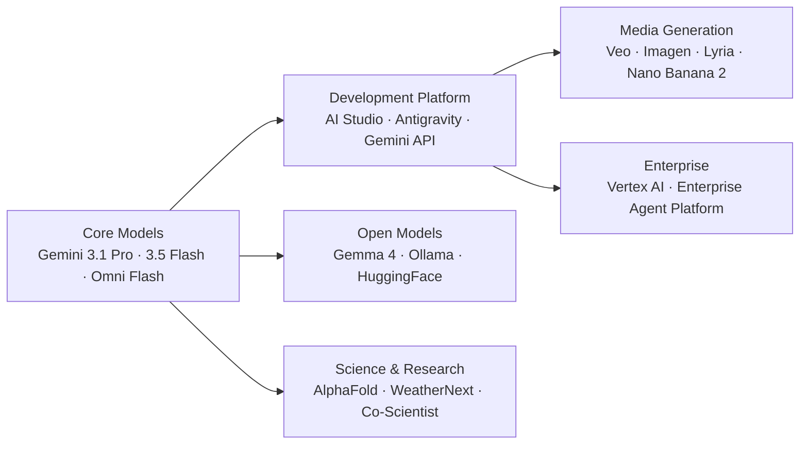

Google DeepMind is the AI research lab behind Gemini, AlphaFold, and a broad portfolio of frontier models, media generation tools, and scientific AI systems. This section focuses on DeepMind's AI, LLM, and GenAI products — not basic Google tools.

## How the Ecosystem Connects



## Product Directory — At a Glance

| Product | What It Is | Who It's For | How to Access |
|---|---|---|---|
| **Gemini 3.1 Pro** (preview) | Frontier reasoning + agentic depth | Developers, enterprises | [aistudio.google.com](https://aistudio.google.com) |
| **Gemini 3.5 Flash** (stable) | Frontier performance at Flash speed | Developers, production agents | [aistudio.google.com](https://aistudio.google.com) |
| **Gemini Omni Flash** | Natively multimodal — video, image, text, audio | Creators, developers | [gemini.google.com](https://gemini.google.com), Google Flow |
| **Nano Banana 2** | Pro-level image generation and editing (= Gemini 3.1 Flash Image) | Designers, creators | Gemini app, AI Studio |
| **Gemini 3.1 Flash Live + TTS** | Real-time voice and speech synthesis | Voice/audio developers | Live API, AI Studio |
| **Google AI Studio** | Free developer IDE for Gemini | Developers | [aistudio.google.com](https://aistudio.google.com) |
| **Google Antigravity 2.0** | Agentic development platform | Developers, teams | [antigravity.google](https://antigravity.google) |
| **Google Flow** | Creative multimodal tool (Omni) | Creators | [flow.google](https://flow.google) |
| **Veo** | Cinematic video generation | Video creators | Gemini app, Flow, AI Studio |
| **Imagen** | High-quality image generation | Designers, creators | Gemini app, API |
| **Lyria 3** | Music generation with vocals | Musicians, creators | Gemini app, AI Studio |
| **Gemma 4** | Open models (multiple sizes) | Developers, self-hosters | [Hugging Face](https://huggingface.co), Ollama |
| **Vertex AI** | Enterprise API with Google Cloud | Enterprises | Google Cloud Console |
| **Gemini Enterprise Agent Platform** | Managed enterprise agents | Enterprises | Google Cloud Console |
| **AlphaFold** | Protein structure prediction | Scientists, researchers | [deepmind.google](https://deepmind.google) |
| **WeatherNext** | AI weather forecasting | Meteorologists, researchers | Google Research |
| **Co-Scientist** | Multi-agent AI research partner | Scientists | DeepMind research |
| **NotebookLM** | AI-powered research notebook | Everyone | [notebooklm.google.com](https://notebooklm.google.com) |

## Model Tiers — Quick Compare

| Model | Best For | Access |
|---|---|---|
| **Gemini 3.1 Pro** | Maximum reasoning, complex agents | Gemini API, AI Studio, Vertex AI |
| **Gemini 3.5 Flash** | Production agents, sustained coding | Gemini API, AI Studio, Vertex AI |
| **Gemini 3.1 Flash-Lite** | High-volume, classification, routing | Gemini API, AI Studio |
| **Gemini Omni Flash** | Native multimodal — video/audio/image/text | Gemini app, Google Flow |
| **Nano Banana 2** | Image generation and editing | Gemini app, AI Studio |
| **Gemma 4** | Open-weights, self-hosted, on-device | Ollama, Hugging Face |

## Decision Tree: Which DeepMind Product?

```
What do you want to do?
│
├─ Build AI applications → Gemini API + AI Studio (free tier)
├─ Agentic development → Google Antigravity 2.0
├─ Chat with AI → Gemini app (gemini.google.com)
├─ Generate video → Veo (Gemini app, Flow, or AI Studio)
├─ Generate images → Nano Banana 2 / Imagen
├─ Generate music → Lyria 3
├─ Real-time voice/audio → Gemini 3.1 Flash Live + Live API
├─ Create multimodal content → Gemini Omni Flash + Google Flow
├─ Research & science → AlphaFold, WeatherNext, Co-Scientist
├─ Deploy open models → Gemma 4 (Ollama, Hugging Face)
├─ Enterprise deployment → Vertex AI + Enterprise Agent Platform
└─ Learn by experimenting → NotebookLM (free)
```

## Where to Go Next

- Start with [Gemini Models](/deepmind/models) to understand model tiers
- Read the [API & AI Studio](/deepmind/api) guide to start building
- Explore [Antigravity & Flow](/deepmind/antigravity) for agentic development
- Check [Media & Creative](/deepmind/media) for video, image, music generation
- See [Gemma — Open Models](/deepmind/gemma) for self-hosted deployment
