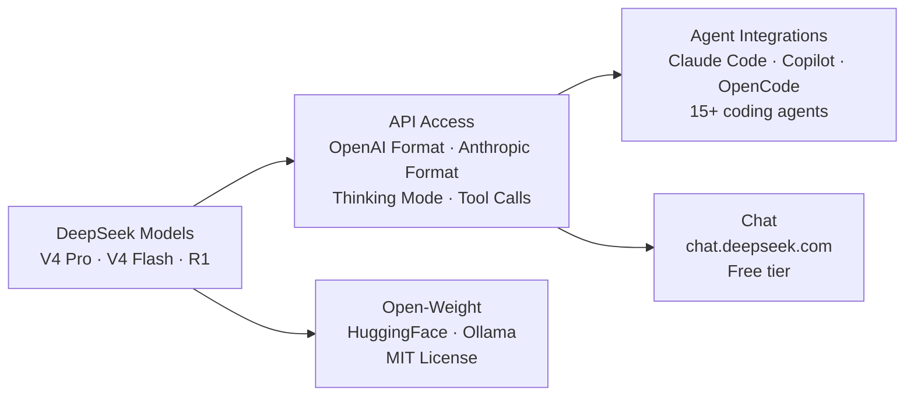

DeepSeek (founded 2023, Hangzhou) has reshaped the AI industry with a simple proposition: frontier-quality models at 10-100x lower cost, with open-weight access and dual API compatibility.

## How the Ecosystem Connects



## Product Directory — At a Glance

| Product | What It Is | Who It's For | Cost |
|---|---|---|---|
| **DeepSeek V4 Pro** | Most capable model with thinking mode | Complex reasoning, coding, production | $1.74/$3.48 per 1M (75% promo: $0.435/$0.87) |
| **DeepSeek V4 Flash** | Cost-optimized with near-Pro quality | High-volume, cost-sensitive workloads | $0.14/$0.28 per 1M (cache hits: $0.0028). FREE unlimited on OpenCode |
| **DeepSeek R1** | Dedicated chain-of-thought reasoning model | Complex math, hard coding, scientific reasoning | $1.74/$3.48 per 1M (promo: $0.435/$0.87) |
| **Chat Interface** | Free web chat at chat.deepseek.com | Everyone | Free, unlimited |
| **API (OpenAI format)** | Drop-in replacement via `api.deepseek.com` | Developers using OpenAI SDKs | Per-token |
| **API (Anthropic format)** | Drop-in replacement via `api.deepseek.com/anthropic` | Developers using Anthropic SDKs and Claude Code | Per-token |
| **Agent Integrations** | Use DeepSeek as backend for 15+ coding agents | Developers using Claude Code, Copilot, etc. | Per-token (via API key) |
| **Open-Weight Models** | Download V4 Flash and Pro for self-hosting | Privacy-sensitive, high-volume users | Free (MIT license) |

## Model Tiers — Quick Compare

| Model | API Price (in/out) | Cache Hit | Context | Best For |
|---|---|---|---|---|
| **DeepSeek V4 Pro** | $0.435/$0.87* ($1.74/$3.48 normally) | $0.0036 | 1M tokens | Complex reasoning, coding, thinking mode |
| **DeepSeek V4 Flash** | $0.14/$0.28 | $0.0028 | 1M tokens | High-volume, cost-sensitive, chat. FREE on OpenCode |
| **DeepSeek R1** | $0.435/$0.87* ($1.74/$3.48 normally) | $0.0036 | 1M tokens | Complex math, hard coding, scientific reasoning |

*\*75% promotional pricing until May 31, 2026*

## Decision Tree: Which DeepSeek Product?

```
What do you want to do?
│
├─ Build AI apps → DeepSeek API (OpenAI or Anthropic format)
├─ Use Claude Code/GitHub Copilot → Agent Integration (replace backend model)
├─ Self-host for privacy/cost → Open-weight models (Ollama, HuggingFace)
├─ Chat for free → chat.deepseek.com
├─ Complex reasoning, coding → V4 Pro + Thinking Mode
├─ Complex math, hard coding → DeepSeek R1 (dedicated reasoning)
├─ High-volume, cost-sensitive → V4 Flash
├─ Compare costs vs Claude/GPT → See Comparison & Migration page
└─ Explore Chinese AI ecosystem → See /research/china-ecosystem/
```

## Where to Go Next

- Start with [DeepSeek Models](/deepseek/models) to understand tiers
- Read [API & SDKs](/deepseek/api) for both API formats with code examples
- Explore [Agent Integrations](/deepseek/agents) to replace Claude/GPT in your coding tools
- Check [Comparison & Migration](/deepseek/comparison) for cost analysis and switching guides
