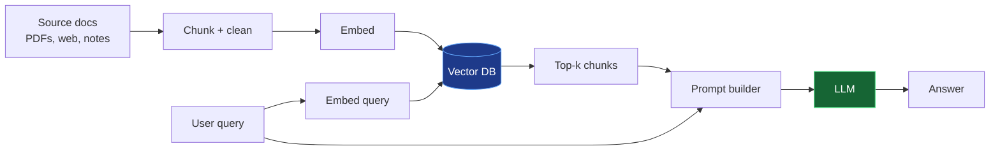
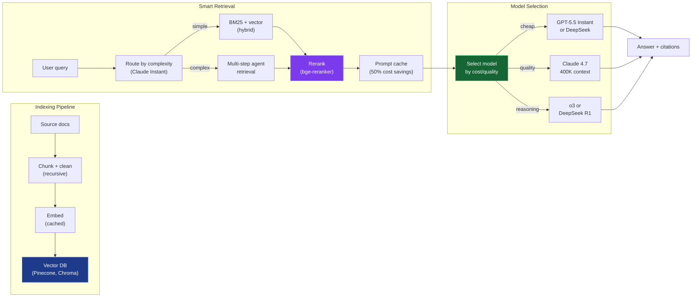
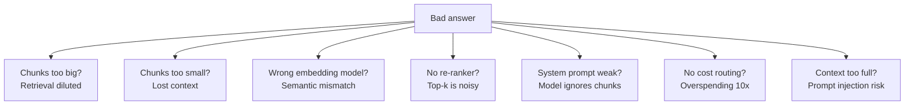

A minimal RAG system has four moving parts: **ingest**, **index**, **retrieve**, and **generate**. By May 2026, most production systems add cost routing, agentic retrieval, and caching.

### Basic RAG (Minimal)

### Production RAG (May 2026)

## Common failure modes

For a comprehensive guide to building RAG systems — including cost optimization, quality improvements, agentic RAG, and production safeguards — see the [RAG Architecture deep dive](/deep-dive/rag-architecture/).

## Evaluation & Benchmarking

- [Ragas](https://github.com/explodinggradients/ragas)  -  evaluate retrieval + generation quality with metrics
- [LangSmith](https://smith.langchain.com)  -  trace, debug, evaluate LLM chains
- A/B test: chunking strategies, embedding models, rerankers, routing policies
- Golden dataset: 20-50 real queries + expected answers for regression testing
