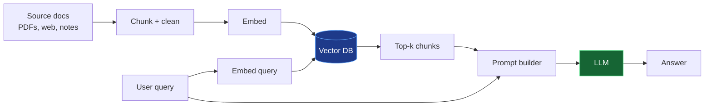
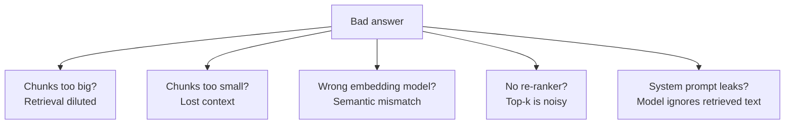

A minimal RAG system has four moving parts: **ingest**, **index**, **retrieve**, and **generate**.

## What each stage is really doing

1. **Chunk + clean** — the unglamorous 80% of the work. Bad chunks = bad answers.
2. **Embed** — turns text into vectors. Pick a model whose dimensions fit your DB.
3. **Retrieve** — top-k by cosine similarity, optionally re-ranked.
4. **Prompt builder** — packs chunks into the context with a system prompt.
5. **LLM** — generates the final answer. Cite chunks back to the user.

## Common failure modes

## Next level

- Add a **re-ranker** (e.g. Cohere Rerank, bge-reranker) between retrieval and prompt building.
- Add **query rewriting** — use a small model to expand the user's query before retrieval.
- Evaluate with [Ragas](https://github.com/explodinggradients/ragas) so you can improve it with numbers, not vibes.
