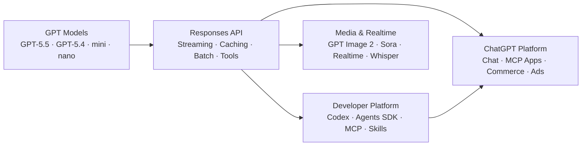

OpenAI's platform is the most expansive AI ecosystem — spanning frontier models, agentic coding, realtime voice/video, image generation, and an application platform within ChatGPT itself.

## How the Ecosystem Connects



## Product Directory — At a Glance

| Product | What It Is | Who It's For | How to Access |
|---|---|---|---|
| **GPT-5.5** | Flagship model for complex reasoning/coding | Advanced developers, R&D | [platform.openai.com](https://platform.openai.com) |
| **GPT-5.4 / 5.4 mini / 5.4 nano** | Affordable tier across three sizes | Most production workloads | [platform.openai.com](https://platform.openai.com) |
| **Codex** | Agentic coding platform across 7 surfaces | Developers, engineering teams | [codex.openai.com](https://codex.openai.com) |
| **ChatGPT** | Web/mobile/desktop chat interface | Everyone | [chatgpt.com](https://chatgpt.com) |
| **Responses API** | Primary API endpoint (replaces Chat Completions) | Developers | [platform.openai.com](https://platform.openai.com) |
| **Agents SDK** | Build and orchestrate AI agents | Developers, platform teams | `openai` Python/TS SDK |
| **Realtime API** | Voice agents, live translation, speech | Voice/audio developers | WebRTC, WebSocket, SIP |
| **GPT Image 2** | State-of-the-art image generation | Designers, creators, apps | API + ChatGPT |
| **Sora** | Cinematic video generation | Video creators | ChatGPT / API |
| **Whisper / TTS** | Speech-to-text and text-to-speech | Transcription, voice apps | API |
| **MCP & Connectors** | Connect AI to external tools and data | Developers, platform builders | [platform.openai.com](https://platform.openai.com) |
| **ChatGPT Apps SDK** | Build MCP apps that run inside ChatGPT | App developers | [developers.openai.com](https://developers.openai.com) |
| **ChatGPT Commerce** | Shopping and commerce flows in ChatGPT | Retailers, merchants | [openai.com/commerce](https://openai.com/commerce) |
| **ChatGPT Enterprise** | Business plans, SSO, admin controls | Organizations | [openai.com/enterprise](https://openai.com/enterprise) |
| **ChatGPT Ads** | Advertise within ChatGPT | Advertisers | [openai.com/ads](https://openai.com/ads) |

## Model Tiers — Quick Compare

| Model | API Price (in/out) | Context | Best For |
|---|---|---|---|
| **GPT-5.5** | $5 / $30 per 1M | 1M tokens | Complex reasoning, agentic coding, professional work |
| **GPT-5.4** | $2.50 / $15 per 1M | 1M tokens | Affordable coding, most production workloads |
| **GPT-5.4 mini** | $0.75 / $4.50 per 1M | 400K tokens | Coding, computer use, subagents |
| **GPT-5.4 nano** | ~$0.15 / ~$0.60 per 1M | 400K tokens | Fastest, cheapest, high-throughput |

> **Note:** Playbook previously listed GPT-5.5 at $2/$8. The current official pricing is $5/$30 per 1M tokens. GPT-5.5 has reasoning capabilities (none/low/medium/high/xhigh). See [GPT Models](/openai/models) for the full comparison.

## Decision Tree: Which OpenAI Product?

```
What do you want to do?
│
├─ Build AI-powered applications → Responses API + SDKs
├─ Write code, refactor, debug → Codex (Desktop, IDE, or CLI)
├─ Chat, research, generate images → ChatGPT (chatgpt.com)
├─ Add voice/audio to your app → Realtime API (WebRTC/WebSocket)
├─ Generate images programmatically → GPT Image 2 API
├─ Build custom AI agents → Agents SDK
├─ Deploy an app inside ChatGPT → ChatGPT Apps SDK (MCP)
├─ Standardize team coding workflows → Agent Skills (SKILL.md)
├─ Sell products through ChatGPT → ChatGPT Commerce
├─ Enterprise SSO, admin, compliance → ChatGPT Enterprise
└─ Explore cutting-edge → See individual pages below
```

## Where to Go Next

- Start with [GPT Models](/openai/models) to understand model tiers
- Go to [Codex](/openai/codex) to set up the coding agent
- Read the [API & SDKs](/openai/api) guide to start building
- Explore [MCP & Integrations](/openai/mcp) to connect OpenAI to your tools
- Check [Realtime, Image & Media](/openai/realtime) for voice, image, and video
