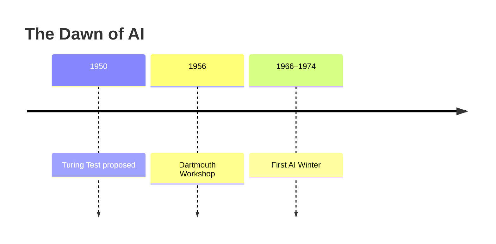
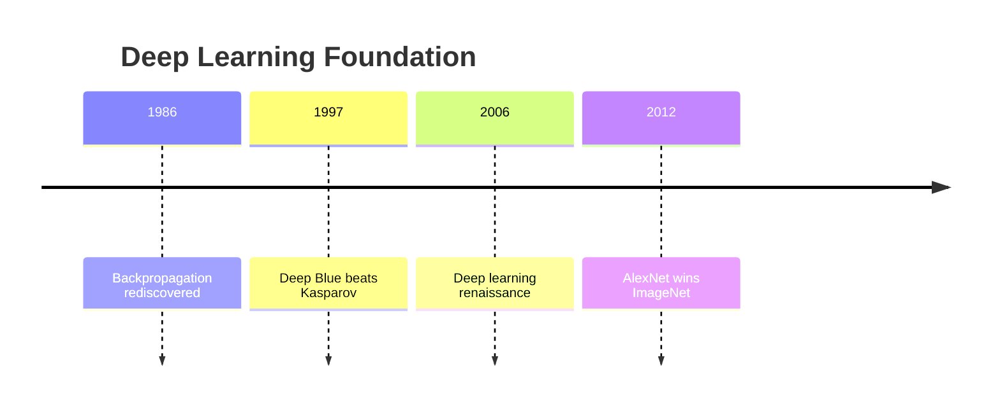
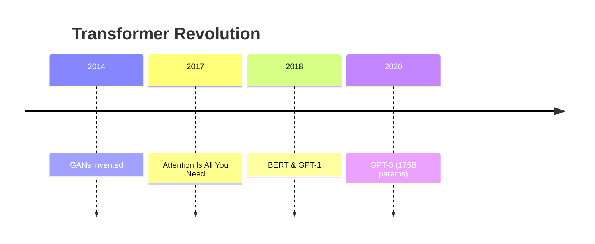
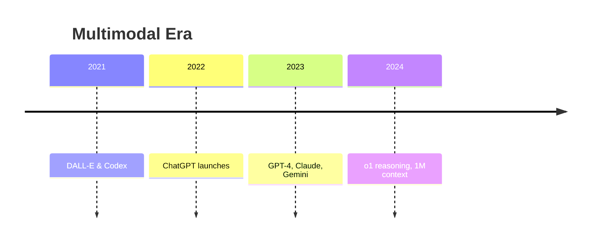
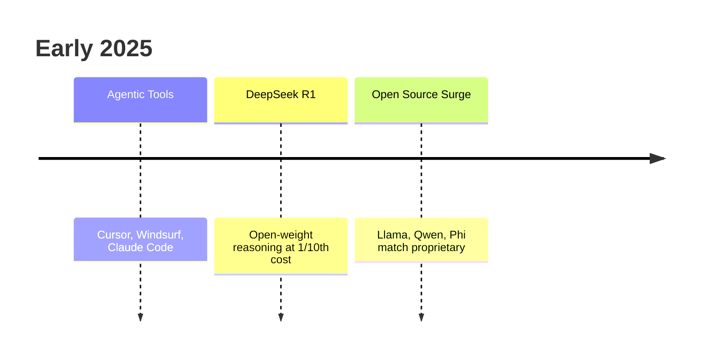
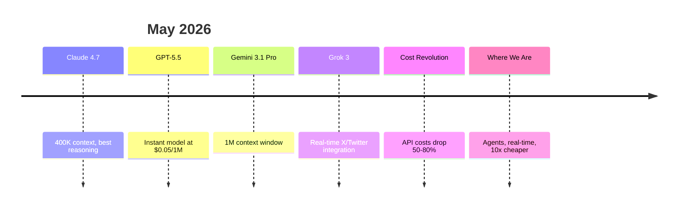
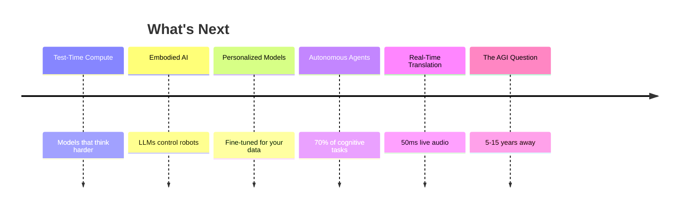

import { Card, CardGrid, Badge } from '@astrojs/starlight/components';

Key milestones from the birth of the field to today's frontier. Updated through May 2026.

---

## The Dawn of AI (1950–1970)

---

## The Deep Learning Foundation (1986–2012)

---

## The Transformer Revolution (2014–2020)

---

## The Multimodal Era (2021–2023)

---

## The Agentic AI Era (2025–Present)

---

## The Next Frontier (2026+)

---

## What's Remarkable About 2025–2026

1. **Frontier model quality = open source quality.** Llama 4, Qwen 3.5, DeepSeek now rival proprietary models. The moat has shrunk from 2 years to weeks.

2. **Agents are real.** Not hype. Cursor, Claude Code, and custom agents are replacing human workflows today — not hypothetically.

3. **Cost collapsed.** A query that cost $1 in 2023 costs $0.01 in 2026. This unlocks use cases that were economically impossible.

4. **Context windows exploded.** Processing entire codebases (1M+ tokens) in one prompt is now possible. Changes how we architect AI systems.

5. **Speed matters now.** Instant models, speculative decoding, and prompt caching mean latency isn't an excuse anymore. Real-time AI is achievable.

6. **Privacy is back in play.** Local inference with Ollama + competitive open models means organizations don't have to send data to API providers anymore.

---

## The Pattern

Each era had a breakthrough:
- **1986:** Backprop made deep learning possible
- **2012:** GPUs made deep learning practical
- **2017:** Transformers made language possible  
- **2022:** ChatGPT made AI accessible
- **2025–2026:** Agents and efficiency made AI economical at scale

The frontier keeps moving. What was impossible 2 years ago is now commodity.
