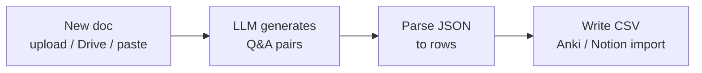

Feed in a doc, article, or your own notes; get back clean question/answer flashcards you can import into Anki (or drop into Notion) for spaced repetition. Great for turning the deep-dives on this site into study decks.

## How it works



## You'll need

- A source document (PDF, Markdown, Google Doc, or pasted text)
- An LLM key — **Sonnet 4.6** or **GPT-5.4** (better questions than the cheapest tier)
- Anki (CSV import) or Notion

## Build it in n8n

1. **Trigger** → manual, a Webhook, or Drive "new file".
2. *(If a file)* **Extract from File** → plain text. For long docs, add a **Split** step to chunk by heading.
3. **HTTP Request** → the [AI transform node](/resources/automations/#the-reusable-ai-transform-node-n8n), `input = {{ $json.text }}`, system prompt below, `max_tokens: 1500`.
4. **Code** node → `return JSON.parse($json.content[0].text).cards` to get an array.
5. **Split Out** → one item per card.
6. **Convert to File (CSV)** node → columns `front`, `back` → download/save. (Anki: File → Import → map columns. Or use a **Notion** node to create one DB row per card.)

## The AI prompt

**System prompt:**

```text
You create study flashcards from a document. Make atomic, recall-style cards.

Return ONLY valid JSON, no prose:
{"cards": [{"front": "<question>", "back": "<concise answer>"}]}

Rules:
- One idea per card. Prefer "why/how" questions over trivia.
- The answer must be fully supported by the document — never invent facts.
- 8-15 cards per ~1000 words. Skip filler and headings.
```

## Zapier alternative

**Trigger** (Drive/Form) → **Formatter → Extract text** → **Anthropic → Send Prompt** (system prompt above) → **Formatter → Parse JSON** → **Looping by Zapier** → **Google Sheets → Create Row** (`front`, `back`). Export the sheet as CSV for Anki, or keep it as your deck.

## Cost

A 1,500-word doc ≈ 2.5K input + ~1K output tokens. On Sonnet 4.6 ($3/$15 per 1M) that's about **$0.02 per document**.

## Variations

- Point it at a **playbook deep-dive** URL (add an HTTP fetch step) to auto-build a deck for [How LLMs Work](/deep-dive/how-llms-work) or [RAG](/deep-dive/rag-architecture).
- Generate **cloze deletions** (`{{c1::...}}`) instead of Q&A for Anki cloze cards.
- Add a difficulty tag and filter to "hard" cards only for exam crunch.
