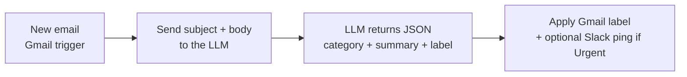

Every new email gets classified (Urgent / Action / FYI / Newsletter / Spam), summarized in one line, and labeled automatically. You open your inbox already sorted.

## How it works



## You'll need

- Gmail (or any IMAP inbox)
- An LLM API key — **Haiku 4.5 / Flash / DeepSeek Flash** are ideal (cheap, fast, run on every email)
- n8n or Zapier

## Build it in n8n

1. **Gmail Trigger** node → "On message received" (or poll every N minutes).
2. **HTTP Request** node → the [reusable AI transform node](/resources/automations/#the-reusable-ai-transform-node-n8n). Set its `input` to:
   `Subject: {{ $json.subject }}\n\nBody: {{ $json.snippet }}`
   and paste the system prompt below.
3. **Code** node → `return JSON.parse($json.content[0].text)` to get `{category, summary, label}` as fields.
4. **Gmail** node → "Add label" using `{{ $json.label }}` (create the labels once in Gmail first).
5. *(Optional)* **IF** node → if `category == "Urgent"`, a **Slack** node posts the summary to your DMs.

## The AI prompt

**System prompt** (paste into the HTTP node's `system`):

```text
You triage email. Given a subject and body, classify it and summarize it.

Categories:
- Urgent: needs a reply or action within 24h (deadlines, outages, the boss)
- Action: needs me to do something, but not urgent
- FYI: informational, no action needed
- Newsletter: marketing, digests, automated updates
- Spam: junk or phishing

Respond with ONLY valid JSON, no prose:
{"category": "...", "summary": "<one sentence, <=15 words>", "label": "<category>"}
```

## Zapier alternative

Trigger **Gmail → New Email** → action **OpenAI/Anthropic → Send Prompt** (paste the same system prompt + the email as the message) → **Formatter → Utilities (parse JSON)** → **Gmail → Add Label**. Add a **Filter** before a Slack step to ping only on `Urgent`.

## Cost

~250 input + ~40 output tokens per email. On Haiku 4.5 ($1/$5 per 1M) that's roughly **$0.0005/email** — about 15¢ for 300 emails. On DeepSeek V4 Flash it's ~10× cheaper.

## Variations

- **Auto-draft replies** for the "Action" bucket (draft only — never auto-send; let a human approve).
- Add a **sender allow-list** so known contacts skip triage.
- Route by project: extend the categories to your actual labels (e.g. "Invoices", "Recruiting").
