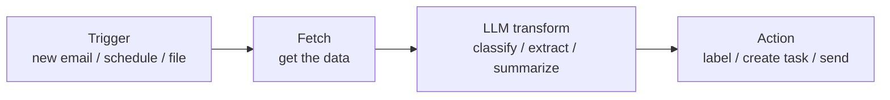

Practical, copy-deploy automations that drop an LLM into a real workflow. Each recipe is a small pipeline you can build in **n8n** (open-source, self-host or cloud) or **Zapier** (hosted, no-code) in 15–30 minutes.

These are blueprints, not one-click installs — you'll wire your own credentials. But every recipe gives you the exact node sequence and the exact prompt to paste, so there's no guesswork.

## The pattern behind every recipe

Almost every useful AI automation is the same four-step shape:



The LLM step is just an HTTP request (or a native AI node) that sends a prompt and parses the JSON it returns. Master that one node and every recipe below is a variation.

## You'll need

- An **LLM API key** — Anthropic, OpenAI, or Groq. For high-volume automations, use a **cheap, fast model**: Claude Haiku 4.5, Gemini 3.5 Flash, or DeepSeek V4 Flash (see the [Models Decision Guide](/decide/models/guide) and [Cost Calculator](/decide/cost-calculator)).
- An **n8n instance** (cloud trial or `npx n8n`) **or** a **Zapier** account.
- API keys for whatever you're connecting (Gmail, Slack, Notion, etc.).

## The reusable "AI transform" node (n8n)

Every recipe calls an LLM via an HTTP Request node. Here's the core config — set it once, reuse it everywhere:

```json
{
  "method": "POST",
  "url": "https://api.anthropic.com/v1/messages",
  "headers": {
    "x-api-key": "={{ $env.ANTHROPIC_API_KEY }}",
    "anthropic-version": "2023-06-01",
    "content-type": "application/json"
  },
  "body": {
    "model": "claude-haiku-4-5-20251001",
    "max_tokens": 1024,
    "system": "<paste the recipe's system prompt here>",
    "messages": [
      { "role": "user", "content": "={{ $json.input }}" }
    ]
  }
}
```

The model replies in `content[0].text`. Ask it for **JSON** in the system prompt so the next node can parse fields directly. (Swap the URL/model for OpenAI or Groq — both are OpenAI-compatible at `/v1/chat/completions`.)

> **Tip — make output parseable.** End every system prompt with: *"Respond with ONLY valid JSON, no prose."* Then add an n8n **Code** node (`JSON.parse($json.content[0].text)`) or Zapier **Formatter** to turn it into fields.

## The recipes

| Recipe | Trigger | What the LLM does |
|---|---|---|
| [Inbox Triage](/resources/automations/inbox-triage) | New email | Classify priority + summarize + suggest a label |
| [Meeting Notes → Action Items](/resources/automations/meeting-notes-to-actions) | New transcript | Extract owners, tasks, due dates, decisions |
| [RSS → Daily Digest](/resources/automations/rss-to-digest) | Schedule (daily) | Summarize + group new items into one digest |
| [Doc → Flashcards](/resources/automations/doc-to-flashcards) | New document | Generate Q&A flashcards (Anki-ready) |

## Cost & safety notes

- **Cost:** these run on per-token API pricing with no daily cap. At Haiku/Flash rates a triaged email or summarized article costs a fraction of a cent — but a runaway loop can add up. Cap `max_tokens`, and test on a few items before enabling the live trigger.
- **Don't auto-send.** For anything outward-facing (replies, posts), have the automation **draft** and a human approve. Use the LLM to triage and prepare, not to act unsupervised.
- **Privacy:** these pipelines send your data to a model provider. For sensitive content, use a self-hosted model (Ollama + Llama/DeepSeek) behind the same HTTP node.
