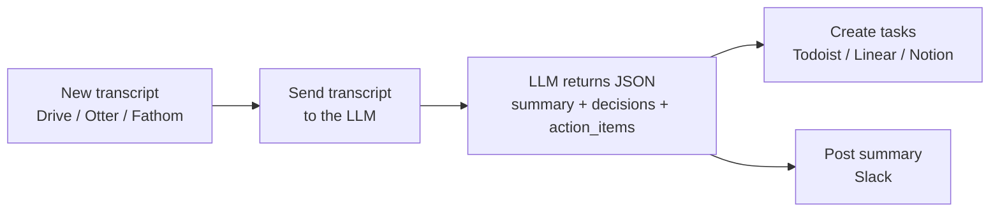

Drop in a transcript; get back a clean summary, the decisions made, and a list of action items (with owner + due date) — automatically created as tasks and posted to your team channel.

## How it works



## You'll need

- A transcript source — Google Drive file, Otter.ai, Fathom, or a manual paste
- A task tool — Todoist, Linear, Notion, Asana
- An LLM key — **Sonnet 4.6** or **GPT-5.4** (transcripts are long; mid-tier quality helps extraction accuracy)

## Build it in n8n

1. **Trigger** → Google Drive "New file in folder" (your transcripts folder), or a Webhook you POST the text to.
2. *(If a file)* **Extract from File** node → get plain text.
3. **HTTP Request** → the [AI transform node](/resources/automations/#the-reusable-ai-transform-node-n8n) with `input = {{ $json.text }}`, model `claude-sonnet-4-6`, `max_tokens: 1500`, and the system prompt below.
4. **Code** node → `return JSON.parse($json.content[0].text)`.
5. **Split Out** node → split `action_items` into one item per task.
6. **Todoist / Linear / Notion** node → create a task per item: title `{{ $json.task }}`, assignee `{{ $json.owner }}`, due `{{ $json.due }}`.
7. **Slack** node → post `{{ $json.summary }}` + the decisions list to the channel.

## The AI prompt

**System prompt:**

```text
You extract structured outcomes from a meeting transcript.

Return ONLY valid JSON, no prose:
{
  "summary": "<3-4 sentence overview>",
  "decisions": ["<decision 1>", "..."],
  "action_items": [
    {"owner": "<name or 'unassigned'>", "task": "<imperative phrasing>", "due": "<YYYY-MM-DD or 'none'>"}
  ]
}

Rules:
- Only include action items that were actually agreed to, not vague ideas.
- If an owner or due date wasn't stated, use "unassigned" / "none". Do not invent.
```

## Zapier alternative

**Trigger** (Drive/Otter) → **Anthropic → Send Prompt** (system prompt above) → **Formatter → Parse JSON** → **Looping by Zapier** over `action_items` → **Todoist/Notion → Create Task** → **Slack → Send Channel Message** with the summary.

## Cost

A 30-minute meeting ≈ 4–6K input tokens + ~500 output. On Sonnet 4.6 ($3/$15 per 1M) that's roughly **$0.02–0.03 per meeting**. Cheap enough to run on every call.

## Variations

- Add a **calendar trigger** so it runs automatically when a recording lands after each meeting.
- Append the summary to a running **Notion meeting log** keyed by date.
- Add a second LLM pass that drafts the **follow-up email** to attendees (draft, human-approved).
