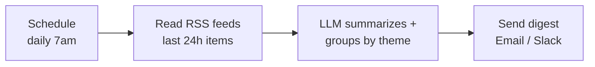

Stop doom-scrolling feeds. Each morning, this pulls new items from your RSS sources, has an LLM summarize and group them by theme, and sends you one digest — 2 minutes of reading instead of 20 tabs.

## How it works



## You'll need

- A few RSS feed URLs (blogs, newsletters, arXiv, Hacker News, a subreddit's `.rss`)
- An LLM key — **Flash / Haiku / DeepSeek Flash** (runs once a day over many short items)
- Email (SMTP/Gmail) or Slack

## Build it in n8n

1. **Schedule Trigger** → daily at your time.
2. **RSS Read** node (one per feed, or loop a list) → fetch items.
3. **Filter** node → keep items where `isoDate` is within the last 24h.
4. **Aggregate** node → combine titles + links + snippets into one text blob.
5. **HTTP Request** → the [AI transform node](/resources/automations/#the-reusable-ai-transform-node-n8n), `input` = the aggregated blob, system prompt below, `max_tokens: 1200`.
6. **Code** node → parse the JSON.
7. **Send Email** / **Slack** node → format `themes` into a readable digest (a Code node can build simple HTML/markdown).

## The AI prompt

**System prompt:**

```text
You build a daily reading digest from a list of articles (title, link, snippet).

Return ONLY valid JSON, no prose:
{
  "tldr": "<2-sentence overview of today's themes>",
  "themes": [
    {
      "theme": "<short theme name>",
      "items": [
        {"title": "<title>", "url": "<link>", "why": "<one line: why it matters>"}
      ]
    }
  ]
}

Rules:
- Group related items under a shared theme; drop near-duplicates.
- Keep "why" to one concrete sentence. Don't editorialize or invent facts.
```

## Zapier alternative

**Schedule by Zapier** (daily) → **RSS by Zapier → New items in feed** → **Formatter → Text** (combine) → **Anthropic → Send Prompt** → **Formatter → Parse JSON** → **Email/Slack** with the formatted digest. (Zapier's RSS trigger fires per-item; collect with a Digest step or run per feed.)

## Cost

10–20 short items ≈ 3–5K input + ~800 output tokens once a day. On Gemini 3.5 Flash ($1.50/$9 per 1M) that's well under **$0.10/day** (~$2–3/month).

## Variations

- **Weekly** instead of daily for slower feeds.
- Add a **relevance filter**: tell the model your interests and have it drop off-topic items.
- Pipe the digest into **Notebook/Notion** as a dated note instead of email.
